---
## Author
author:
  name: Авдадаев Джамал Геланиевич
  email: 1032230169@rudn.ru
  affiliation:
    - name: Российский университет дружбы народов
      country: Российская Федерация
      city: Москва
      address: ул. Миклухо-Маклая, д. 6

## Title
title: "Отчёт по лабораторной работе №1"
subtitle: "Подготовка стенда"
license: "CC BY"
---

# Цель работы

Цель данной лабораторной работы --- подготовить стенд для выполнения последующих лабораторных работ. 
Для этого необходимо настроить git, установить необходимые пакеты, а также создать модель экспоненциального роста в рамках проекта DrWatson.

# Задание

— Создать рабочий каталог для всего курса.
— Создать рабочее пространство для программ в рамках лабораторной работы.
— Выполнить все задания по тексту лабораторной работы.
— Установить необходимые пакеты.
— Выполнить предложенный код.
— Преобразовать код в литературный стиль.
— Сгенерировать из литературного кода:
— чистый код;
— jupyter notebook;
— документацию в формате Quarto.
— Выполнить код из jupyter notebook.
— Интегрировать документацию в формате Quarto в отчёт.
— Добавить в код в литературном стиле вычисление для набора параметров.
— Сгенерировать из литературного кода с параметрами:
— чистый код;
— jupyter notebook;
— документацию в формате Quarto.
— Выполнить код из jupyter notebook с параметрами.
— Интегрировать документацию с параметрами в формате Quarto в отчёт.

# Выполнение лабораторной работы

## Настройка рабочего окружения

— Перед началом работы обновим систему командами `sudo apt update` и `sudo apt upgrade -y`, чтобы убедиться в актуальности пакетной базы ([рис. @fig-001]).

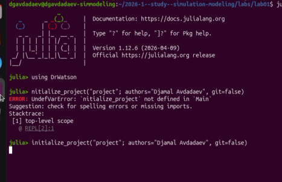{#fig-001 width=70%}

— Установим базовые инструменты разработки: git, git-flow, curl, wget, xclip, build-essential, vim ([рис. @fig-002]).

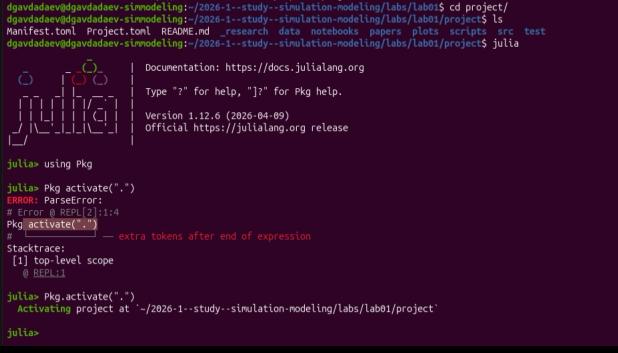{#fig-002 width=70%}

## Настройка git

— Зададим имя и email владельца репозитория, настроим отображение Unicode-символов, имя начальной ветки master, а также параметры autocrlf и safecrlf ([рис. @fig-003]).

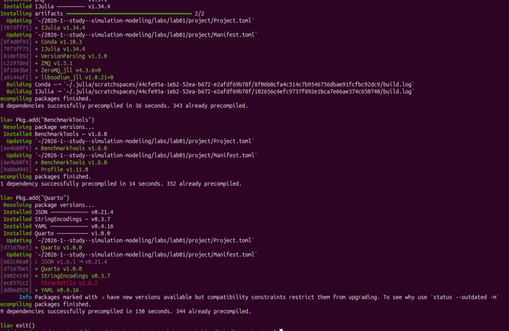{#fig-003 width=70%}

— Сгенерируем SSH-ключ алгоритма Ed25519 для авторизации на удалённых репозиториях. 
При запросе пути файл уже существовал, поэтому подтвердили перезапись; парольная фраза оставлена пустой ([рис. @fig-004]).

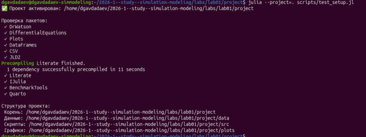{#fig-004 width=70%}

## Установка Julia

— Установим Julia с помощью официального скрипта Juliaup.
 Поскольку Juliaup уже присутствовал в системе, установщик сообщил об этом; запуск интерактивной сессии подтвердил работоспособность интерпретатора ([рис. @fig-005]).

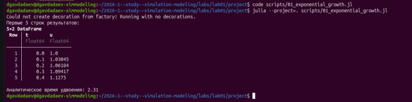{#fig-005 width=70%}

— Убедимся, что все ключевые инструменты доступны: `julia --version` вернул версию 1.12.6, `git flow version` --- 1.12.3 (AVH Edition) ([рис. @fig-006]).

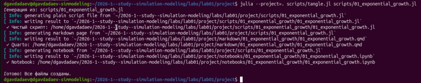{#fig-006 width=70%}

## Создание проекта DrWatson

— Откроем Julia REPL в рабочем каталоге курса, подключим пакет DrWatson и создадим проект командой `initialize_project`.
 При первой попытке допущена опечатка в имени функции, после исправления команда выполнилась успешно ([рис. @fig-007]).

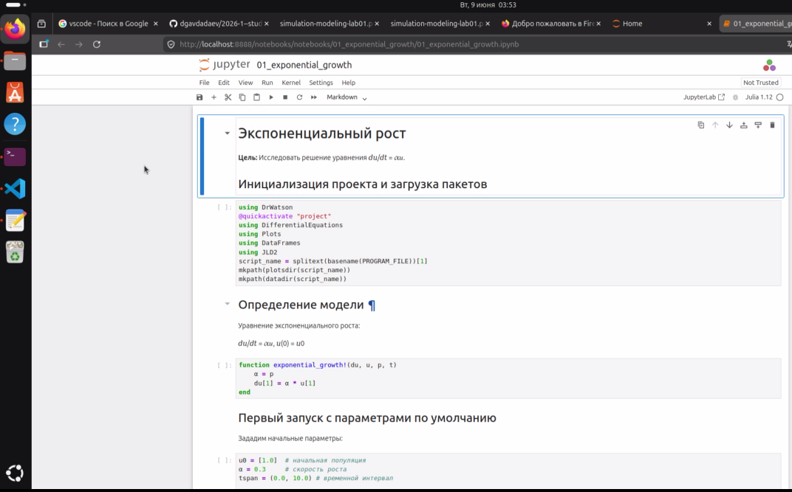{#fig-007 width=70%}

— Перейдём в созданный каталог `project`. Убедимся в наличии стандартных файлов DrWatson (Manifest.toml, Project.toml, README.md). 
Запустим Julia и активируем окружение командой `Pkg.activate(".")` ([рис. @fig-008]).

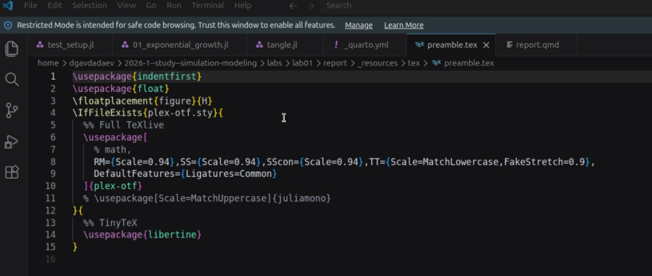{#fig-008 width=70%}

— Добавим необходимые пакеты. В процессе установки менеджер пакетов разрешает зависимости и компилирует библиотеки. 
На данном этапе устанавливаются: DrWatson, DifferentialEquations, Plots, DataFrames, CSV, JLD2, Literate, IJulia ([рис. @fig-009]).

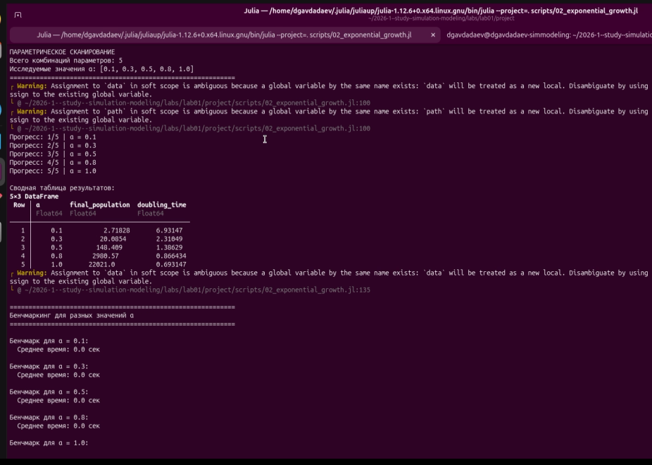{#fig-009 width=70%}

— Завершим установку, добавив BenchmarkTools и Quarto. После успешной компиляции закроем REPL командой `exit()` ([рис. @fig-010]).

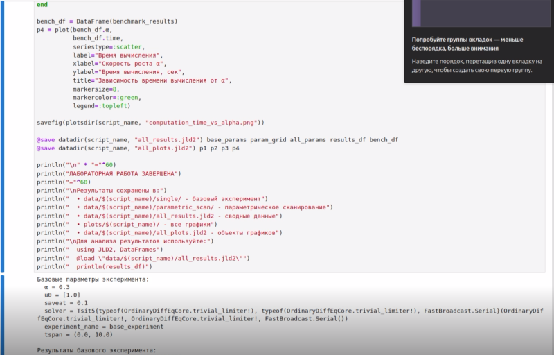{#fig-010 width=70%}

— Проверим работоспособность окружения. Запустим тестовый скрипт `scripts/test_setup.jl` командой `julia --project=. scripts/test_setup.jl`. 
Скрипт последовательно импортирует все пакеты и выводит структуру проекта с путями к каталогам данных, скриптов и графиков ([рис. @fig-011]).

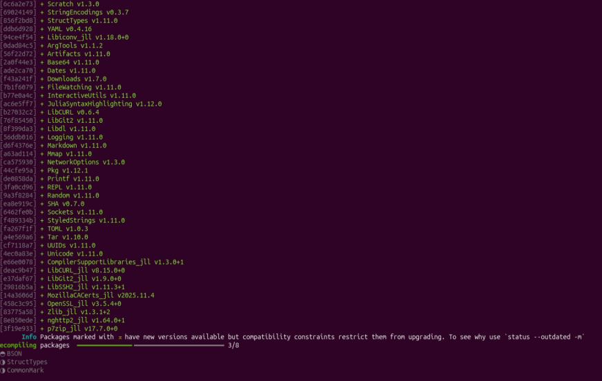{#fig-011 width=70%}

— Рассмотрим исходный код скрипта `test_setup.jl` в редакторе. 
Для каждого пакета из списка выполняется попытка загрузки через `eval(Meta.parse("using $pkg"))`; результат (успех или ошибка) выводится в терминал ([рис. @fig-012]).

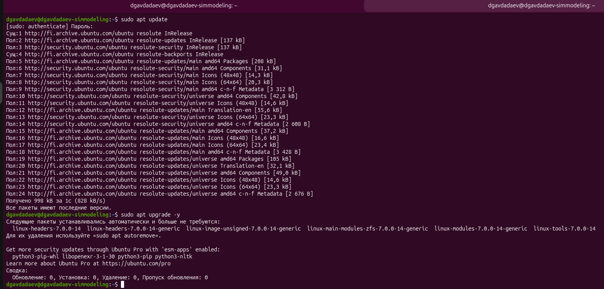{#fig-012 width=70%}

## Модель экспоненциального роста

— Создадим скрипт `scripts/01_exponential_growth.jl`. В редакторе VS Code видна его структура: подключение пакетов, определение функции `exponential_growth!`,
 задание начальных условий ($u_0 = 1.0$, $\alpha = 0.3$, интервал $[0, 10]$), численное решение через `ODEProblem` с методом Tsit5 и визуализация ([рис. @fig-013]).

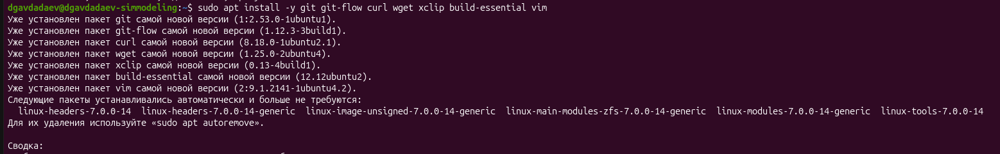{#fig-013 width=70%}

— Запустим скрипт командой `julia --project=. scripts/01_exponential_growth.jl`. 
Вывод содержит первые пять строк DataFrame с колонками `t` и `u`, а также вычисленное аналитическое время удвоения: $T_2 = 2.31$, 
что совпадает с аналитическим значением $\ln 2 / 0.3 \approx 2.31$ ([рис. @fig-014]).

{#fig-014 width=70%}

— Рассмотрим шаблон литературного скрипта `intro.jl`. 
Он демонстрирует базовую структуру: подключение DrWatson, активация проекта через `@quickactivate`, включение вспомогательных файлов из каталога `src` ([рис. @fig-015]).

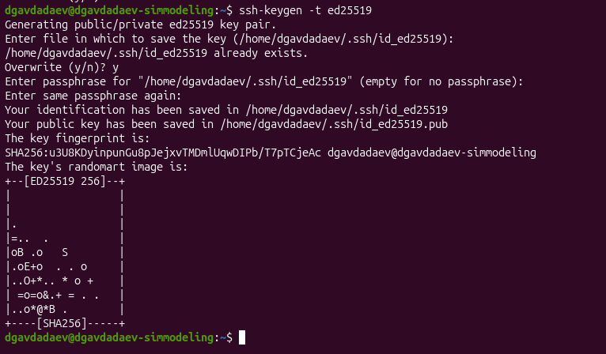{#fig-015 width=70%}

— Создадим скрипт-генератор `scripts/tangle.jl`.
 Он принимает путь к литературному скрипту в качестве аргумента и автоматически формирует три созданных файла: чистый Julia-скрипт, документ Quarto и Jupyter-ноутбук ([рис. @fig-016]).

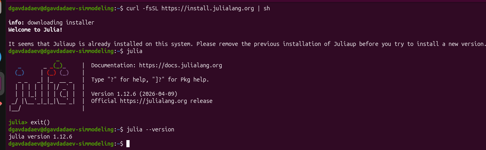{#fig-016 width=70%}

— Запустим генератор: `julia --project=. scripts/tangle.jl scripts/01_exponential_growth.jl`. 
Последовательно создаются чистый скрипт, Quarto-страница в каталоге `Markdown` и Jupyter-ноутбук в каталоге `notebooks`. Работа завершается сообщением «Готово!
 Все файлы созданы.» ([рис. @fig-017]).

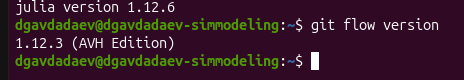{#fig-017 width=70%}

— Откроем сгенерированный ноутбук `notebooks/01_exponential_growth/01_exponential_growth.ipynb` в браузере через JupyterLab. 
Ноутбук имеет структурированные разделы: инициализация, определение модели, первый запуск с параметрами по умолчанию ([рис. @fig-018]).

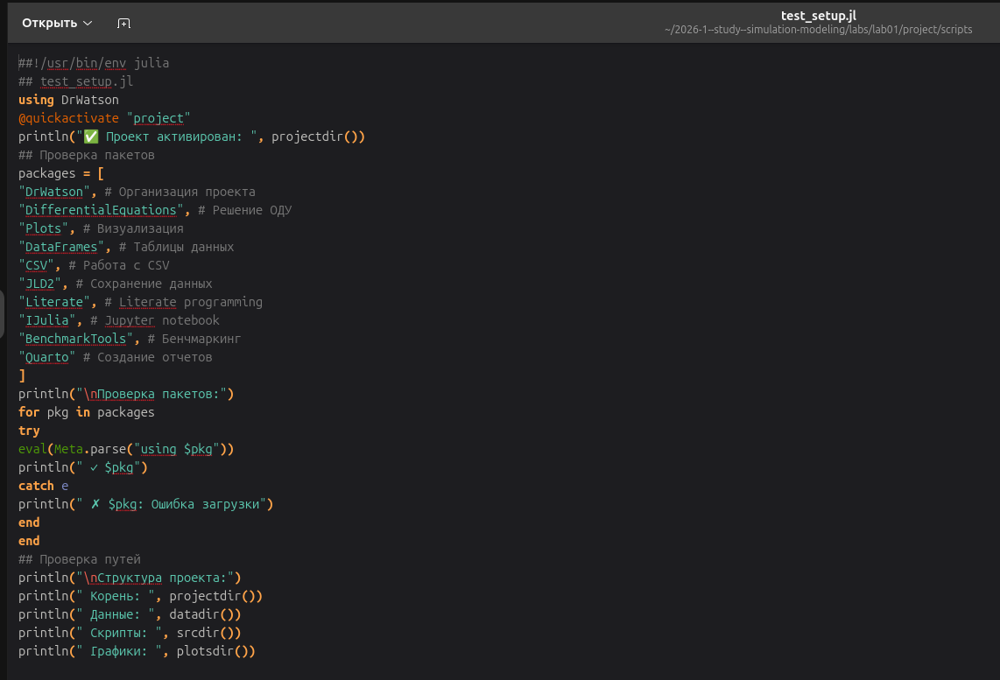{#fig-018 width=70%}

— В файле конфигурации отчёта `_quarto.yml` подключим поддержку Julia: зададим `engine: julia` с флагом `--project=../project`. 
Также настроим язык (`lang: ru-RU`), нумерацию разделов и оглавление ([рис. @fig-019]).

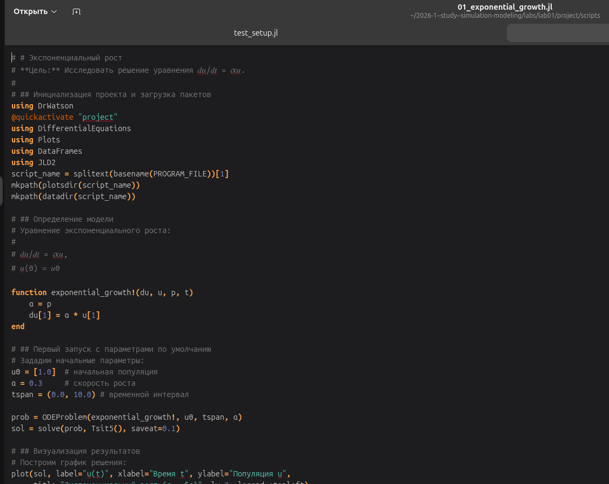{#fig-019 width=70%}

— В преамбуле LaTeX `preamble.tex` добавим поддержку шрифта `plex-otf` для корректного отображения кода Julia в PDF. 
В качестве запасного варианта указан шрифт `libertine` ([рис. @fig-020]).

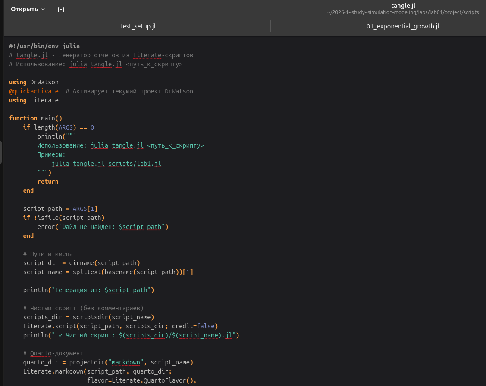{#fig-020 width=70%}

— В файл отчёта `report.qmd` добавим директиву `` для подключения Quarto-документации первой модели. 
Аналогичная директива предусмотрена для второй модели ([рис. @fig-021]).

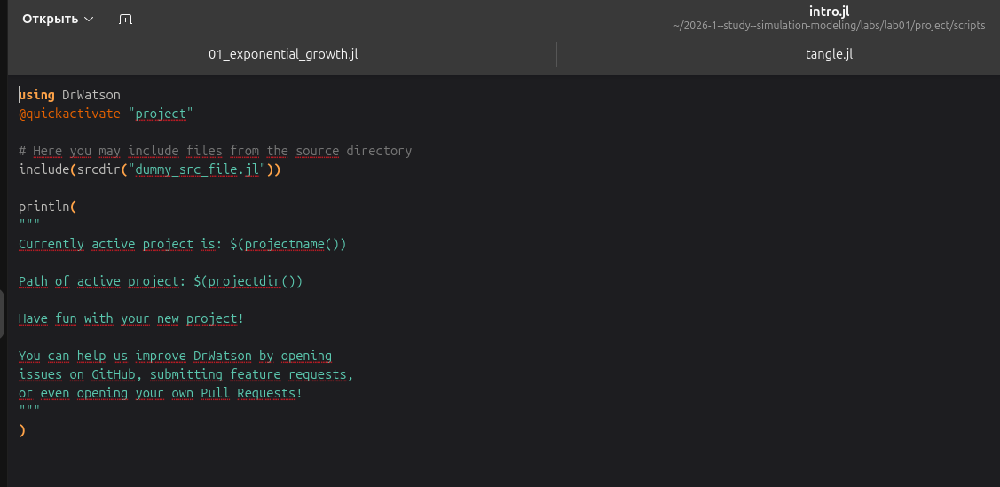{#fig-021 width=70%}

— Создадим скрипт `scripts/02_exponential_growth.jl` для параметрического сканирования. 
При запуске программа перебирает значения $\alpha \in \{0.1, 0.3, 0.5, 0.8, 1.0\}$ и выводит сводную таблицу с финальной численностью популяции и временем удвоения 
для каждого значения, а затем выполняет бенчмарки ([рис. @fig-022]).

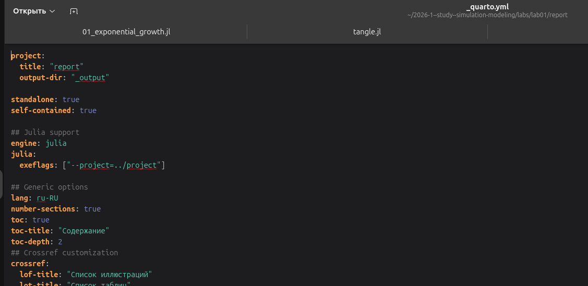{#fig-022 width=70%}

— В заключительной части программы реализовано сохранение результатов моделирования в файл формата JLD2. Через макрос `@save` формируются файлы `all_results.jld2` 
с параметрами, DataFrame и объектами графиков; в конце выводятся пути к сохранённым файлам и инструкция по загрузке ([рис. @fig-023]).

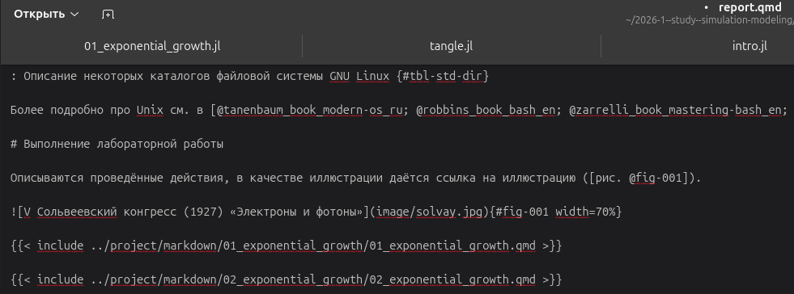{#fig-023 width=70%}

Для второго скрипта повторим цикл генерации: через `tangle.jl` создадим чистый скрипт, Quarto-документ и Jupyter-ноутбук, выполним ноутбук и интегрируем 
документацию в отчёт через вторую директиву ``.





# Выводы

В ходе данной лабораторной работы было подготовлено рабочее окружение для последующих лабораторных работ: настроен git с корректными параметрами безопасности и 
SSH-ключом, установлен интерпретатор Julia 1.12.6, создан воспроизводимый проект DrWatson с набором необходимых пакетов. 
Реализована модель экспоненциального роста, численное решение которой совпало с аналитическим (время удвоения $T_2 \approx 2.31$ при $\alpha = 0.3$). 
В ходе работы был освоен процесс преобразования литературного кода в обычный Julia-код, Jupyter Notebook и документацию Quarto.
 Расширенная версия модели продемонстрировала параметрическое сканирование с сохранением всех результатов через механизм DrWatson.

# Список литературы{.unnumbered}

1. Knuth D. E. Literate Programming // The Computer Journal. — 1984. — Feb. — Vol. 27, no. 2. — P. 97–111. — ISSN 1460-2067. — DOI: 10.1093/comjnl/27.2.97.

2. A Multi-Language Computing Environment for Literate Programming and Reproducible Research / E. Schulte [et al.] // Journal of Statistical Software. — 2012. — Vol. 46, no. 3. — ISSN 1548-7660. — DOI: 10.18637/jss.v046.i03.

3. The Story in the Notebook / M. B. Kery [et al.] // Proceedings of the 2018 CHI Conference on Human Factors in Computing Systems. — ACM, 04/2018. — P. 1–11. — DOI: 10.1145/3173574.3173748.

4. Имитационное моделирование. Практикум / А. В. Королькова, Д. С. Кулябов. — Москва : РУДН, 2025.