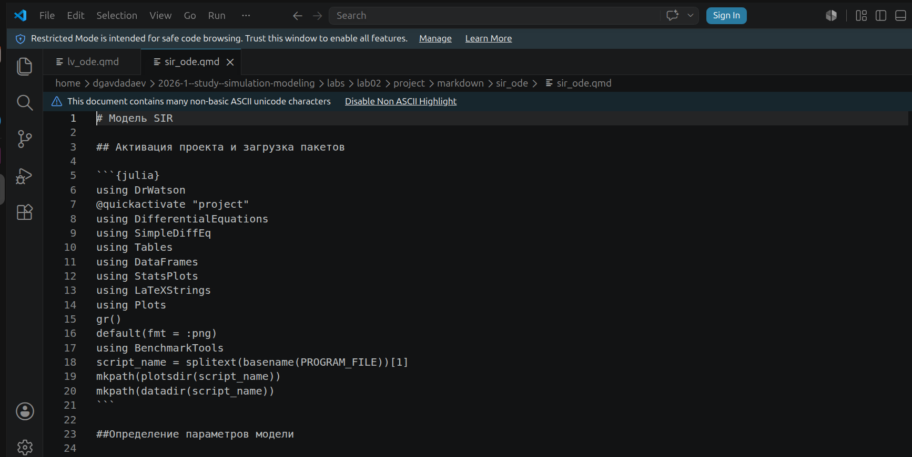
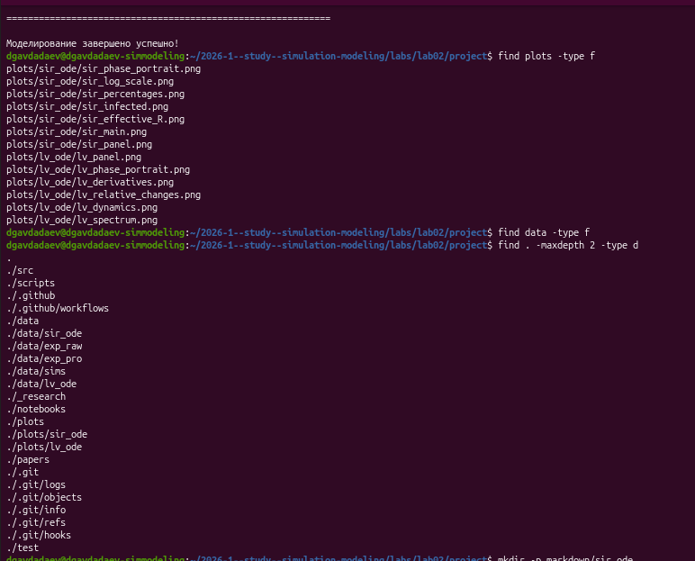

---
## Author
author:
  name: Авдадаев Джамал Геланиевич
  email: 1032230169@rudn.ru
  affiliation:
    - name: Российский университет дружбы народов
      country: Российская Федерация
      city: Москва
      address: ул. Миклухо-Маклая, д. 6

## Title
title: "Лабораторная работа №2"
subtitle: "Основные модели: SIR и Лотки-Вольтерры"
date: today
date-format: "YYYY-MM-DD"
---

# Информация

## Докладчик

:::::::::::::: {.columns align=center}
::: {.column width="70%"}

  * Авдадаев Джамал Геланиевич
  * Российский университет дружбы народов им. П. Лумумбы
  * [1032230169@rudn.ru](mailto:1032230169@rudn.ru)

:::
::: {.column width="30%"}

:::
::::::::::::::

# Вводная часть

## Цель работы

Исследовать основные математические модели динамических систем:

- Эпидемиологическую модель **SIR** --- распространение инфекции в популяции
- Экологическую модель **Лотки-Вольтерры** --- динамика «хищник-жертва»

## Объект и предмет исследования

- Модель SIR (Kermack-McKendrick, 1927)
- Модель Лотки-Вольтерры (1925–1926)
- Численные методы решения ОДУ в Julia

## Практическая значимость

Обе модели лежат в основе современного имитационного моделирования:

- SIR --- прогнозирование эпидемий, оценка мер карантина
- Лотки-Вольтерра --- управление биологическими ресурсами, экология

## Материалы и методы

:::::::::::::: {.columns align=center}
::: {.column width="50%"}

**Инструменты**

- Julia 1.12.6 + DrWatson
- DifferentialEquations.jl
- StatsPlots, LaTeXStrings
- FFTW, BenchmarkTools

:::
::: {.column width="50%"}

**Форматы результатов**

- Графики PNG (13 файлов)
- Jupyter Notebook
- Quarto-документация

:::
::::::::::::::

# Подготовка окружения

## Создание проекта

{width=85%}

- Создан каталог `lab02/project`
- Инициализирован проект DrWatson

## Установка пакетов

{width=85%}

- `SimpleDiffEq` --- упрощённый интерфейс к солверам ОДУ
- `BenchmarkTools` --- измерение производительности
- `LaTeXStrings` --- формулы на графиках
- `StatsPlots`, `FFTW` --- визуализация и спектральный анализ

# Модель SIR

## Математическая постановка

Система ОДУ для трёх компартментов популяции $N = S + I + R$:

$$\frac{dS}{dt} = -\beta c \frac{I}{N} S, \quad
\frac{dI}{dt} = \beta c \frac{I}{N} S - \gamma I, \quad
\frac{dR}{dt} = \gamma I$$

Базовое репродуктивное число: $R_0 = c\beta/\gamma$

## Основные этапы работы

{width=85%}

- Функция `sir_ode!` реализует правую часть системы
- Параметры: $\beta=0.05$, $c=10.0$, $\gamma=0.25$
- Начальные условия: $S_0=990$, $I_0=10$, $R_0=0$

## Запуск и численные результаты

{width=85%}

- $R_0 = 2.0$ → эпидемия развивается
- Пиковое число заражённых: $I_{max} = 154.8$
- Время пика: $t_{peak} = 19.1$ дней
- Переболело: $R(\infty) = 775.7$ (77.6%)

## Сгенерированные графики

{width=85%}

- 7 файлов: фазовый портрет, логарифмический масштаб,
  процентное соотношение, динамика заражённых,
  эффективное $R_e$, основной график, сводная панель

## Документация модели SIR

:::::::::::::: {.columns align=center}
::: {.column width="50%"}

:::
::: {.column width="50%"}

:::
::::::::::::::

- `sir_ode.qmd` оформлен в литературном стиле
- `quarto render` выполняет 27 блоков Julia-кода

## Jupyter-ноутбук: модель SIR

:::::::::::::: {.columns align=center}
::: {.column width="50%"}

:::
::: {.column width="50%"}

:::
::::::::::::::

- Бенчмарк решателя: медиана **17.6 мкс**, память **17.39 KiB**
- Результаты ноутбука совпадают со скриптом

# Модель Лотки-Вольтерры

## Математическая постановка

Система ОДУ для популяций жертв $x$ и хищников $y$:

$$\frac{dx}{dt} = \alpha x - \beta xy, \quad
\frac{dy}{dt} = \delta xy - \gamma y$$

Стационарная точка: $x^* = \gamma/\delta$, $y^* = \alpha/\beta$

## Реализация скрипта

{width=85%}

- Функция `lotka_volterra!` реализует систему уравнений
- Параметры: $\alpha=0.1$, $\beta=0.02$, $\delta=0.01$, $\gamma=0.3$
- Начальные условия: $x_0=40.0$, $y_0=9.0$

## Запуск и численные результаты

{width=85%}

- Стационарная точка: $x^*=30.0$, $y^*=5.0$
- Период колебаний жертв: **4.0** единицы времени
- Частота: $0.2499$ Гц
- Сдвиг фаз хищников: $-30.8$

## Структура проекта и графики

{width=85%}

- 6 файлов ЛВ: панель, фазовый портрет, производные,
  относительные изменения, динамика, спектр
- Итого в проекте: **13 графиков** обеих моделей

## Документация модели Лотки-Вольтерры

:::::::::::::: {.columns align=center}
::: {.column width="50%"}

:::
::: {.column width="50%"}

:::
::::::::::::::

- `lv_ode.qmd` включает спектральный анализ FFTW
- `quarto render` выполняет 28 блоков Julia-кода

## Jupyter-ноутбук: модель Лотки-Вольтерры

{width=85%}

- Ноутбук содержит 6 графиков с аннотациями
- Анализ чувствительности к параметрам
- Поиск доминирующих частот через FFT

# Заключение и выводы

## Итоги работы

**Модель SIR** ($R_0 = 2.0$):

- Эпидемия охватила 77.6% популяции
- Пик: 154.8 заражённых на 19.1-й день
- Порог коллективного иммунитета: 50%

**Модель Лотки-Вольтерры**:

- Устойчивые колебания с периодом 4.0 вокруг $(x^*=30,\ y^*=5)$
- Сдвиг фаз хищников относительно жертв: $-30.8$

## Освоенные навыки

- Реализация систем ОДУ через `DifferentialEquations.jl`
- Спектральный анализ временных рядов (FFTW)
- Цикл литературного программирования: скрипт → Quarto → Jupyter
- Воспроизводимое хранение результатов через DrWatson
