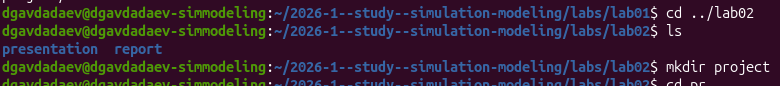
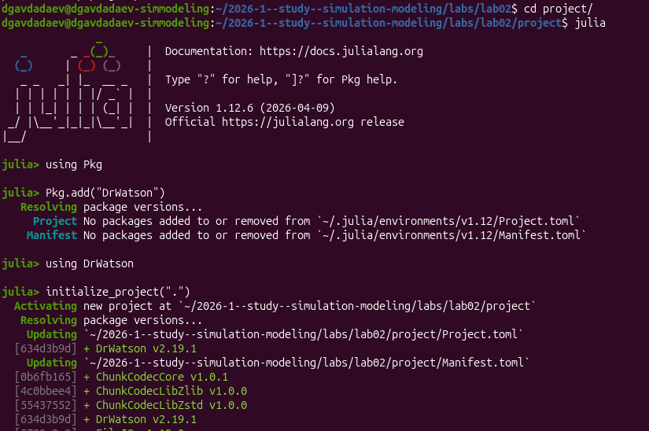
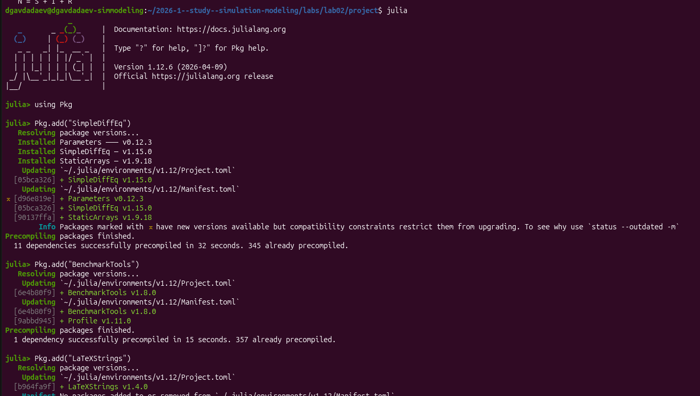
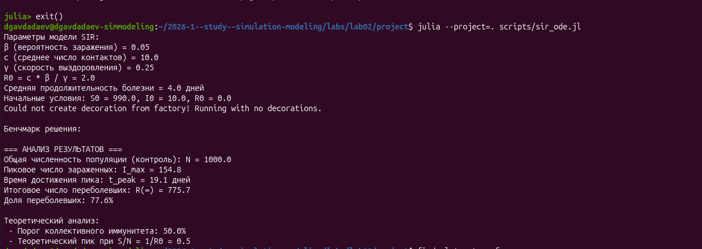
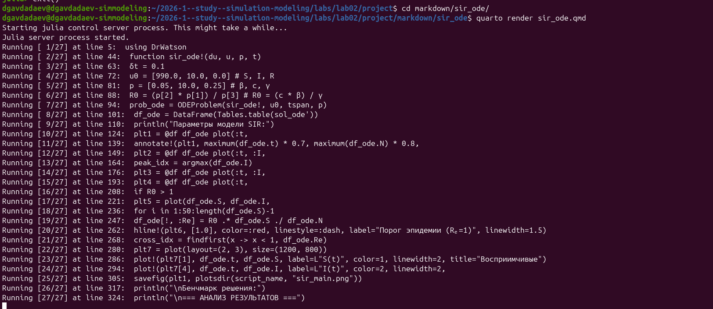
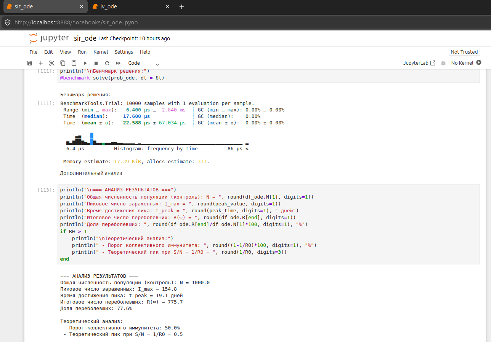
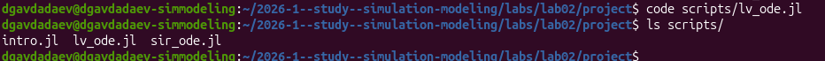
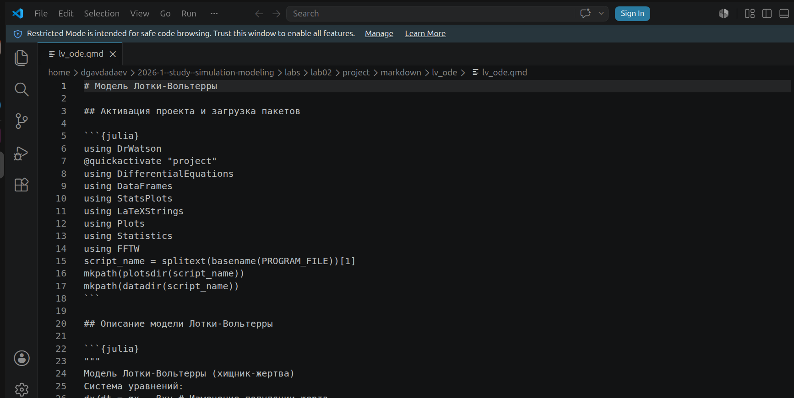

---
## Author
author:
  name: Авдадаев Джамал Геланиевич
  email: 1032230169@rudn.ru
  affiliation:
    - name: Российский университет дружбы народов
      country: Российская Федерация
      city: Москва
      address: ул. Миклухо-Маклая, д. 6
## Title
title: "Лабораторная работа №2"
subtitle: "Модель SIR. Модель Лотки–Вольтерры"
license: "CC BY"
date: today
date-format: "YYYY-MM-DD"
---

# Информация

## Докладчик

:::::::::::::: {.columns align=center}
::: {.column width="70%"}

  * Авдадаев Джамал Геланиевич
  * Российский университет дружбы народов им. П. Лумумбы
  * [1032230169@rudn.ru](mailto:1032230169@rudn.ru)

:::
::: {.column width="30%"}

:::
::::::::::::::

# Вводная часть

## Цель работы

Изучить две классические математические модели имитационного моделирования:

- **Модель SIR** — эпидемиологическая модель распространения инфекции
- **Модель Лотки–Вольтерры** — экологическая модель хищник-жертва

Освоить практику литературного программирования на Julia с генерацией Jupyter-ноутбуков и Quarto-документации.

## Объект и предмет исследования

- Объект: процесс имитационного моделирования динамических систем
- Предмет: модель SIR и модель Лотки–Вольтерры
- Инструменты: Julia 1.12.6, DrWatson.jl, Literate.jl, Quarto

## Задачи

1. Создать рабочий каталог и инициализировать проект DrWatson
2. Установить пакеты Julia (DifferentialEquations, StatsPlots, FFTW и др.)
3. Реализовать и выполнить коды обеих моделей
4. Преобразовать коды в литературный стиль
5. Сгенерировать чистый код, Jupyter-ноутбук, Quarto-документацию
6. Выполнить Jupyter-ноутбуки и интегрировать документацию в отчёт

## Практическая значимость

- Модель SIR используется для прогнозирования эпидемий и расчёта порога коллективного иммунитета
- Модель Лотки–Вольтерры применяется для анализа динамики экосистем
- Литературное программирование обеспечивает воспроизводимость научных результатов

## Материалы и методы

- Язык программирования Julia 1.12.6
- Пакеты: DifferentialEquations.jl, SimpleDiffEq.jl, DataFrames.jl, StatsPlots.jl, LaTeXStrings.jl, FFTW.jl, BenchmarkTools.jl
- DrWatson.jl для воспроизводимого управления проектом
- Literate.jl для литературного программирования
- Quarto для генерации отчётов и документации

# Модель SIR

## Математическая постановка

Система дифференциальных уравнений:

$$\frac{dS}{dt} = -\beta c \frac{I}{N} S, \quad \frac{dI}{dt} = \beta c \frac{I}{N} S - \gamma I, \quad \frac{dR}{dt} = \gamma I$$

Параметры модели:

- $\beta = 0.05$ — вероятность заражения, $c = 10.0$ — среднее число контактов
- $\gamma = 0.25$ — скорость выздоровления, $R_0 = c\beta/\gamma = 2.0$
- $S_0 = 990$, $I_0 = 10$, $R_0^{init} = 0$, $N = 1000$

## Создание проекта и реализация скрипта SIR

:::::::::::::: {.columns align=center}
::: {.column width="50%"}

{width=100%}

:::
::: {.column width="50%"}

{width=100%}

:::
::::::::::::::

- Создан каталог `lab02/project` и запущена Julia
- Проект инициализирован через DrWatson v2.19.1
- Создан файл `scripts/sir_ode.jl` с функцией `sir_ode!`

## Код модели SIR в VS Code

{width=85%}

- Функция `sir_ode!` реализует правые части системы ODE
- Параметры: $\beta = 0.05$, $c = 10.0$, $\gamma = 0.25$
- Используется `@inbounds` для оптимизации вычислений

## Установка пакетов Julia

:::::::::::::: {.columns align=center}
::: {.column width="50%"}

{width=100%}

:::
::: {.column width="50%"}

{width=100%}

:::
::::::::::::::

- Установлены SimpleDiffEq v1.15.0, BenchmarkTools v1.8.0, LaTeXStrings v1.4.0
- Установлен StatsPlots v0.15.8 с зависимостями (345 пакетов уже скомпилировано)

## Запуск и численные результаты SIR

{width=85%}

- $R_0 = 2.0$, средняя продолжительность болезни — 4.0 дня
- Пиковое число заражённых: $I_{max} = 154.8$, время пика: $t_{peak} = 19.1$ дней
- Итоговая доля переболевших: $R(\infty) = 775.7$ (77.6% популяции)
- Порог коллективного иммунитета: 50.0%

## Сгенерированные графики SIR

:::::::::::::: {.columns align=center}
::: {.column width="50%"}

{width=100%}

:::
::: {.column width="50%"}

{width=100%}

:::
::::::::::::::

- 7 графиков: `sir_main`, `sir_panel`, `sir_infected`, `sir_phase_portrait`, `sir_log_scale`, `sir_percentages`, `sir_effective_R`

## Quarto-документация SIR

:::::::::::::: {.columns align=center}
::: {.column width="50%"}

{width=100%}

:::
::: {.column width="50%"}

{width=100%}

:::
::::::::::::::

- Выполнен `quarto render sir_ode.qmd` — 27 блоков кода обработано
- В каталоге `markdown/sir_ode/` созданы `sir_ode.qmd`, `Project.toml`, `Manifest.toml`

## Jupyter-ноутбук SIR

:::::::::::::: {.columns align=center}
::: {.column width="50%"}

{width=100%}

:::
::: {.column width="50%"}

{width=100%}

:::
::::::::::::::

- Ноутбук `sir_ode.ipynb` открыт на `localhost:8888`, Julia 1.12
- Бенчмарк: 10000 образцов, среднее время 17.600 мкс, 17.39 KiB памяти

# Модель Лотки–Вольтерры

## Математическая постановка

Система дифференциальных уравнений:

$$\frac{dx}{dt} = \alpha x - \beta xy, \quad \frac{dy}{dt} = \delta xy - \gamma y$$

Параметры и стационарные точки:

- $\alpha = 0.1$, $\beta = 0.02$, $\delta = 0.01$, $\gamma = 0.3$
- $x_0 = 40.0$ (жертвы), $y_0 = 9.0$ (хищники)
- $x^* = \gamma/\delta = 30.0$, $y^* = \alpha/\beta = 5.0$

## Реализация скрипта Лотки–Вольтерры

:::::::::::::: {.columns align=center}
::: {.column width="50%"}

{width=100%}

:::
::: {.column width="50%"}

{width=100%}

:::
::::::::::::::

- Создан скрипт `scripts/lv_ode.jl` с функцией `lotka_volterra!`
- Подключены пакеты Statistics и FFTW для статистического и спектрального анализа

## Установка FFTW и запуск модели ЛВ

:::::::::::::: {.columns align=center}
::: {.column width="50%"}

{width=100%}

:::
::: {.column width="50%"}

{width=100%}

:::
::::::::::::::

- Установлен FFTW v1.10.0 (2 зависимости скомпилировано за 35 секунд)
- Жертвы: min=17.75, max=46.89, mean=29.71; хищники: min=1.9, max=10.41, mean=5.2

## Сгенерированные графики Лотки–Вольтерры

:::::::::::::: {.columns align=center}
::: {.column width="50%"}

{width=100%}

:::
::: {.column width="50%"}

{width=100%}

:::
::::::::::::::

- Период колебаний: 4.0 единицы времени, доминирующая частота: 0.2499 Гц
- 6 графиков: динамика, фазовый портрет, производные, спектр, относительные изменения, панель

## Создание структуры Markdown и Quarto-документация ЛВ

:::::::::::::: {.columns align=center}
::: {.column width="50%"}

{width=100%}

:::
::: {.column width="50%"}

{width=100%}

:::
::::::::::::::

- Файл `lv_ode.qmd` содержит структурированный литературный код
- `quarto render lv_ode.qmd` обработал 28 блоков кода

## Jupyter-ноутбук Лотки–Вольтерры

{width=85%}

- Ноутбук `lv_ode.ipynb` открыт на `localhost:8889`
- Содержит построение панельного графика 6×1 размером 1200×900 пикселей
- Реализован FFT-анализ для определения доминирующей частоты колебаний

# Заключение и выводы

## Итоги работы

- Модель SIR: $R_0 = 2.0$, пик эпидемии на $t = 19.1$ дня, $I_{max} = 154.8$, переболели 77.6%
- Модель Лотки–Вольтерры: равновесие при $x^* = 30$, $y^* = 5$, период колебаний 4.0 ед.
- Из каждого литературного скрипта успешно сгенерированы чистый код, Jupyter-ноутбук и Quarto-документация
- Бенчмарк SIR: среднее время решения 17.600 мкс, расход памяти 17.39 KiB

## Освоенные навыки

- Численное решение систем ОДУ с пакетом DifferentialEquations.jl
- Управление воспроизводимым проектом через DrWatson.jl v2.19.1
- Литературное программирование с Literate.jl
- Спектральный анализ колебаний через FFTW.jl
- Генерация Quarto-документации и Jupyter-ноутбуков из единого источника
