---
## Author
author:
  name: Авдадаев Джамал Геланиевич
  email: 1032230169@rudn.ru
  affiliation:
    - name: Российский университет дружбы народов
      country: Российская Федерация
      city: Москва
      address: ул. Миклухо-Маклая, д. 6

## Title
title: "Отчёт по лабораторной работе №2"
subtitle: "Модель SIR. Модель Лотки–Вольтерры"
license: "CC BY"
---

# Цель работы

Целью данной лабораторной работы является изучение двух классических математических моделей имитационного моделирования: эпидемиологической модели SIR и экологической модели Лотки–Вольтерры. В ходе работы предполагается освоить практику реализации систем дифференциальных уравнений на языке Julia, применить инструментарий литературного программирования посредством пакета Literate.jl, а также сформировать воспроизводимую исследовательскую среду с использованием DrWatson.jl и Quarto.

# Задание

— Создать рабочий каталог для кода лабораторной работы.

— Установить необходимые пакеты Julia: DifferentialEquations.jl, SimpleDiffEq.jl, DataFrames.jl, StatsPlots.jl, LaTeXStrings.jl, Plots.jl, BenchmarkTools.jl, FFTW.jl, Statistics.jl.

— Выполнить предложенный код для модели SIR и модели Лотки–Вольтерры.

— Преобразовать код в литературный стиль с помощью Literate.jl.

— Сгенерировать из литературного кода чистый скрипт, Jupyter-ноутбук и документацию в формате Quarto.

— Выполнить код из Jupyter-ноутбука.

— Интегрировать документацию в формате Quarto в настоящий отчёт.

— Добавить в литературный код вычисление для набора параметров.

— Сгенерировать из литературного кода с параметрами чистый скрипт, Jupyter-ноутбук и документацию Quarto.

— Выполнить код из Jupyter-ноутбука с параметрами.

— Интегрировать документацию с параметрами в формате Quarto в отчёт.

# Теоретическое введение

## Модель SIR

Модель SIR является классической и фундаментальной математической моделью эпидемиологии, описывающей распространение инфекционного заболевания в закрытой популяции. Аббревиатура SIR расшифровывается как: Susceptible (восприимчивые), Infected (заражённые), Recovered (переболевшие и получившие иммунитет).

Система дифференциальных уравнений модели имеет следующий вид:

$$
\frac{dS}{dt} = -\beta \cdot c \cdot \frac{I}{N} \cdot S
$$

$$
\frac{dI}{dt} = \beta \cdot c \cdot \frac{I}{N} \cdot S - \gamma \cdot I
$$

$$
\frac{dR}{dt} = \gamma \cdot I
$$

где $S$ — число восприимчивых, $I$ — число заражённых, $R$ — число переболевших, $N = S + I + R$ — общая численность популяции, $\beta$ — вероятность заражения при контакте, $c$ — среднее число контактов, $\gamma$ — скорость выздоровления.

Ключевым параметром модели является базовое репродуктивное число:

$$
R_0 = \frac{c \cdot \beta}{\gamma}
$$

При $R_0 > 1$ эпидемия распространяется, при $R_0 < 1$ — угасает. Порог коллективного иммунитета составляет $1 - 1/R_0$.

## Модель Лотки–Вольтерры

Модель Лотки–Вольтерры — это фундаментальная математическая модель в экологии, описывающая динамику взаимодействия двух видов: хищников и жертв. Она была независимо предложена в 1920-х годах Альфредом Лоткой (1925) для химических реакций и Витторио Вольтеррой (1926) для объяснения колебаний улова рыбы в Адриатическом море.

Система уравнений модели имеет вид:

$$
\frac{dx}{dt} = \alpha x - \beta x y
$$

$$
\frac{dy}{dt} = \delta x y - \gamma y
$$

где $x$ — популяция жертв, $y$ — популяция хищников, $\alpha$ — естественный прирост жертв, $\beta$ — коэффициент поедания жертв хищниками, $\delta$ — коэффициент прироста хищников за счёт поедания жертв, $\gamma$ — естественная смертность хищников.

Стационарные точки (точки равновесия) системы:

$$
x^* = \frac{\gamma}{\delta}, \quad y^* = \frac{\alpha}{\beta}
$$

Модель демонстрирует, как даже простая система взаимодействий может порождать сложные колебательные режимы, объясняя циклические изменения численности в природных экосистемах.

## Инструментарий

В работе используется следующий набор пакетов Julia ([табл. @tbl-packages]):

| Пакет | Версия | Назначение |
|---|---|---|
| DrWatson.jl | v2.19.1 | Управление проектом и воспроизводимость |
| DifferentialEquations.jl | — | Численное решение ОДУ |
| SimpleDiffEq.jl | v1.15.0 | Упрощённые решатели ОДУ |
| DataFrames.jl | — | Табличное представление данных |
| StatsPlots.jl | v0.15.8 | Статистическая визуализация |
| LaTeXStrings.jl | v1.4.0 | LaTeX-метки на графиках |
| BenchmarkTools.jl | v1.8.0 | Замер производительности |
| FFTW.jl | v1.10.0 | Быстрое преобразование Фурье |

: Пакеты Julia, используемые в лабораторной работе {#tbl-packages}

Управление проектом осуществляется через DrWatson.jl, обеспечивающий воспроизводимую научную среду. Литературный стиль программирования реализуется посредством Literate.jl, а генерация документации — через Quarto.

# Выполнение лабораторной работы

## 1. Создание рабочего каталога

— Перейдём в рабочий каталог курса и создадим структуру директорий для лабораторной работы №2. В каталоге `lab02` создаётся подпапка `project`, предназначенная для хранения кода, данных и результатов моделирования ([рис. @fig-001]).

{#fig-001 width=70%}

## 2. Инициализация проекта и установка DrWatson

— Запустим Julia в каталоге `project` и инициализируем проект через DrWatson. Команда `initialize_project(".")` создаёт стандартную структуру каталогов DrWatson и регистрирует проект, установив пакет DrWatson v2.19.1 ([рис. @fig-002]).

{#fig-002 width=70%}

## 3. Создание скрипта модели SIR

— Откроем в VS Code файл `scripts/sir_ode.jl` и убедимся, что он появился в списке скриптов командой `ls scripts/` ([рис. @fig-003]).

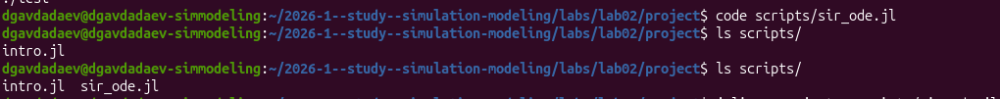{#fig-003 width=70%}

— Рассмотрим содержимое скрипта `sir_ode.jl`. Он подключает необходимые пакеты, определяет функцию `sir_ode!` для правых частей системы ODE, задаёт начальные условия $S_0 = 990$, $I_0 = 10$, $R_0 = 0$, параметры $\beta = 0.05$, $c = 10.0$, $\gamma = 0.25$ и выводит численные результаты ([рис. @fig-004]).

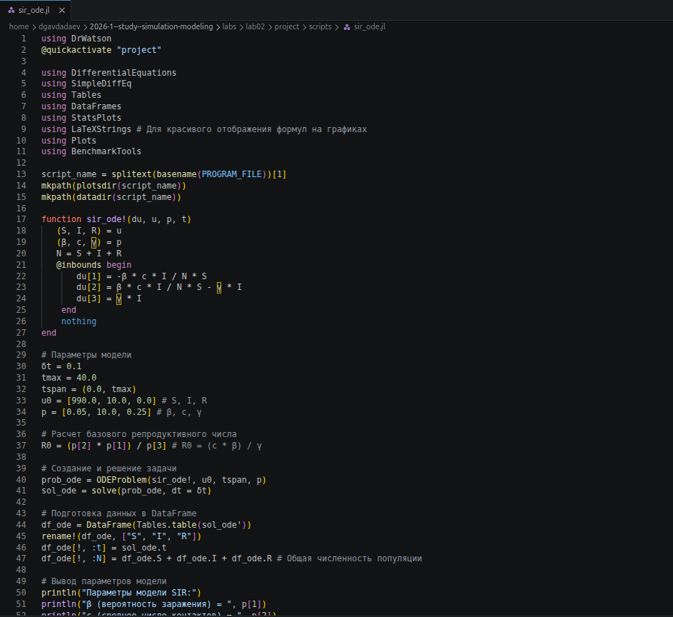{#fig-004 width=70%}

## 4. Установка пакетов для модели SIR

— Установим необходимые пакеты Julia. Первым этапом устанавливаются SimpleDiffEq v1.15.0, BenchmarkTools v1.8.0 и LaTeXStrings v1.4.0 ([рис. @fig-005]).

{#fig-005 width=70%}

— Вторым этапом устанавливается StatsPlots v0.15.8 вместе с обширным набором зависимостей, включая Distributions.jl, KernelDensity.jl и другие статистические пакеты ([рис. @fig-006]).

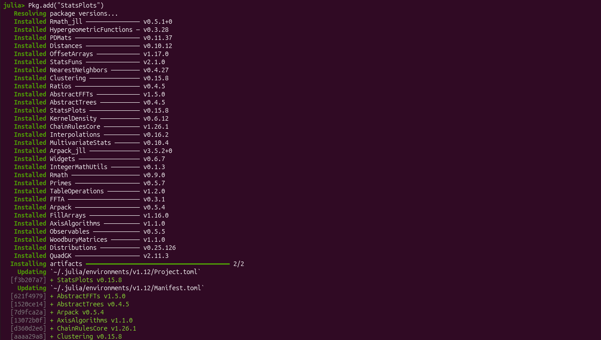{#fig-006 width=70%}

## 5. Запуск модели SIR

— Запустим скрипт командой `julia --project=. scripts/sir_ode.jl`. В консоль выводятся параметры модели: $\beta = 0.05$, $c = 10.0$, $\gamma = 0.25$, $R_0 = 2.0$, средняя продолжительность болезни 4.0 дня, а также результаты анализа: пиковое число заражённых $I_{max} = 154.8$, время пика $t_{peak} = 19.1$ дней, итоговое число переболевших $R(\infty) = 775.7$, доля переболевших 77.6% ([рис. @fig-007]).

{#fig-007 width=70%}

— Проверим сгенерированные графики командой `find plots -type f`. Модель SIR создала 7 файлов: `sir_phase_portrait.png`, `sir_log_scale.png`, `sir_percentages.png`, `sir_infected.png`, `sir_effective_R.png`, `sir_main.png`, `sir_panel.png` ([рис. @fig-008]).

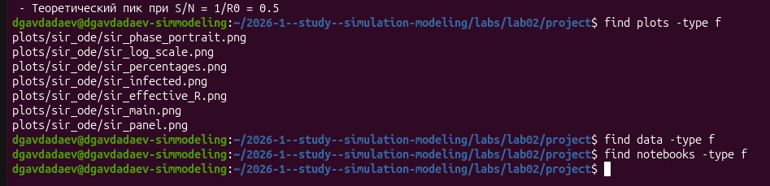{#fig-008 width=70%}

## 6. Установка пакета FFTW для модели Лотки–Вольтерры

— Создадим скрипт `scripts/lv_ode.jl` и установим дополнительный пакет FFTW v1.10.0, требуемый для спектрального анализа колебаний в модели Лотки–Вольтерры ([рис. @fig-009]).

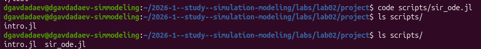{#fig-009 width=70%}

## 7. Создание скрипта модели Лотки–Вольтерры

— Убедимся в наличии файла `lv_ode.jl` в каталоге `scripts/` ([рис. @fig-010]).

{#fig-010 width=70%}

— Рассмотрим содержимое скрипта `lv_ode.jl`. Он подключает пакеты DifferentialEquations, DataFrames, StatsPlots, LaTeXStrings, Statistics и FFTW, определяет функцию `lotka_volterra!` для правых частей системы и содержит описание модели в виде docstring ([рис. @fig-011]).

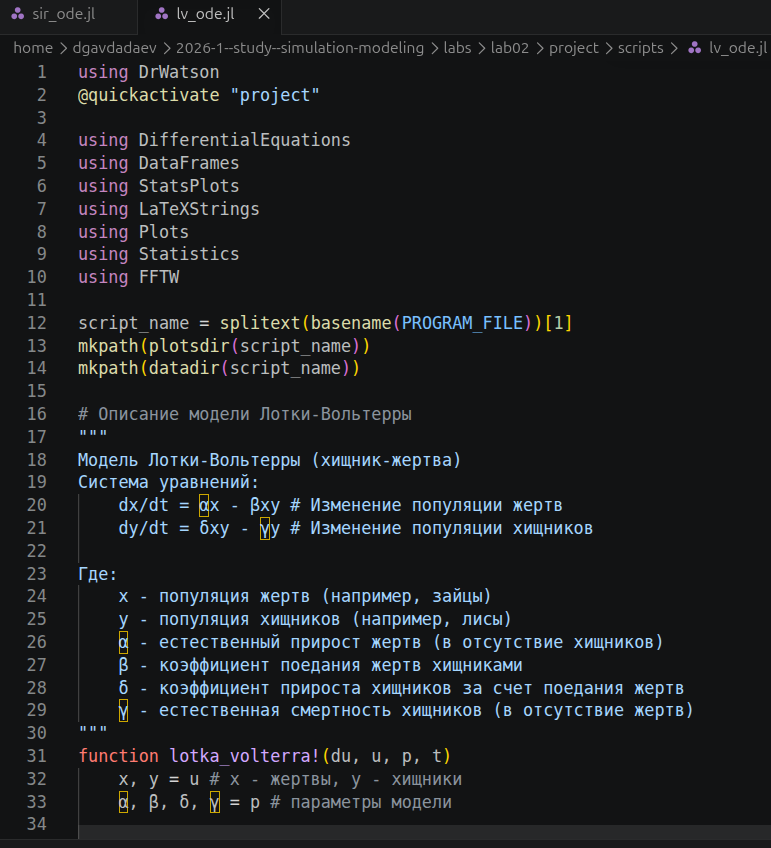{#fig-011 width=70%}

## 8. Установка пакета FFTW и запуск модели Лотки–Вольтерры

— Установим FFTW v1.10.0 через менеджер пакетов Julia ([рис. @fig-012]).

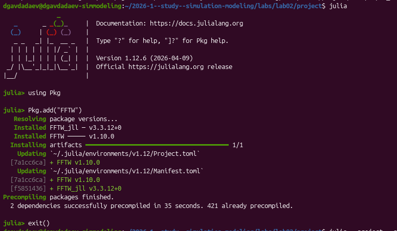{#fig-012 width=70%}

— Запустим скрипт `lv_ode.jl`. Модель выводит параметры: $\alpha = 0.1$, $\beta = 0.02$, $\delta = 0.01$, $\gamma = 0.3$, начальные условия $x_0 = 40.0$, $y_0 = 9.0$. Стационарные точки: $x^* = 30.0$, $y^* = 5.0$. Анализ результатов: жертвы $min = 17.75$, $max = 46.89$, $mean = 29.71$; хищники $min = 1.9$, $max = 10.41$, $mean = 5.2$. Доминирующая частота колебаний жертв — 0.2499 Гц, период — 4.0 единицы времени ([рис. @fig-013]).

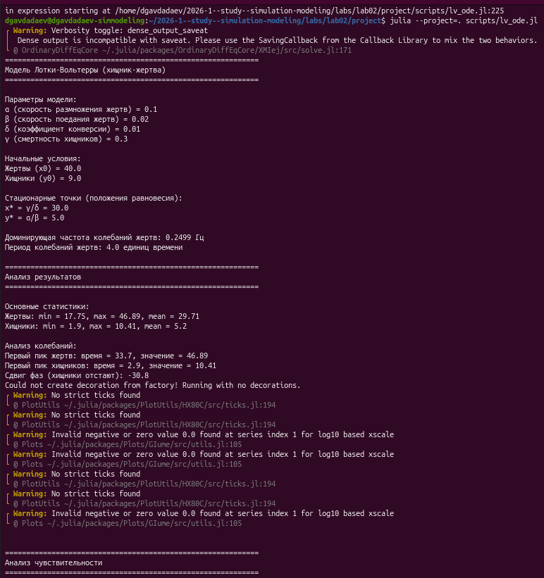{#fig-013 width=70%}

## 9. Проверка структуры проекта и создание каталогов Markdown

— Проверим структуру каталогов проекта командами `find plots -type f` и `find . -maxdepth 2 -type d`. Убедимся в наличии обеих папок с графиками: `plots/sir_ode/` и `plots/lv_ode/`. Затем создадим каталоги `markdown/sir_ode` и `markdown/lv_ode` для хранения Quarto-документации ([рис. @fig-014]).

{#fig-014 width=70%}

— Проверим созданную структуру каталогов `markdown/` командой `ls -R markdown`, убедившись в наличии подкаталогов `sir_ode` и `lv_ode` ([рис. @fig-015]).

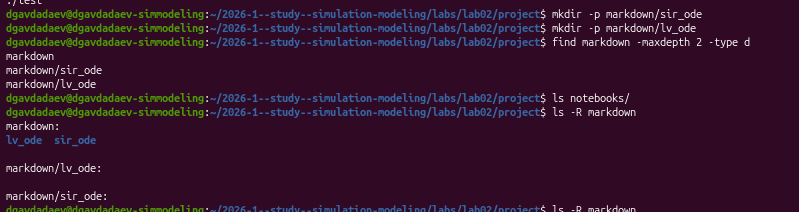{#fig-015 width=70%}

## 10. Генерация Quarto-документации для модели SIR

— Перейдём в каталог `markdown/sir_ode/` и выполним команду `quarto render sir_ode.qmd`. Quarto запустил Julia-сервер и выполнил все 27 блоков кода в литературном файле, включая определение функции ODE, задание параметров и построение всех графиков ([рис. @fig-016]).

{#fig-016 width=70%}

## 11. Просмотр сгенерированной Quarto-документации SIR

— Откроем файловый менеджер и убедимся, что в каталоге `markdown/` (папка `sir_ode`) появились файлы `sir_ode.qmd`, `Manifest.toml` и `Project.toml` ([рис. @fig-017]).

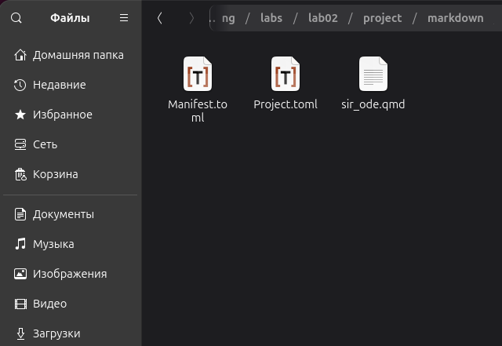{#fig-017 width=70%}

## 12. Quarto-документация для модели Лотки–Вольтерры

— Убедимся в наличии файла `lv_ode.qmd` в каталоге `markdown/lv_ode/` ([рис. @fig-018]).

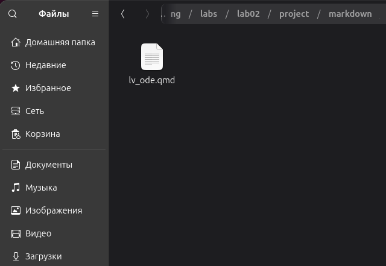{#fig-018 width=70%}

## 13. Литературный код в VS Code

— Откроем файл `lv_ode.qmd` в VS Code. Файл содержит заголовок `# Модель Лотки-Вольтерры`, раздел активации проекта с блоком Julia-кода и раздел описания модели ([рис. @fig-019]).

{#fig-019 width=70%}

— Откроем также файл `sir_ode.qmd` в VS Code. Файл организован аналогично: заголовок `# Модель SIR`, раздел `## Активация проекта и загрузка пакетов`, раздел `## Определение параметров модели` ([рис. @fig-020]).

{#fig-020 width=70%}

## 14. Генерация Quarto-документации для модели Лотки–Вольтерры

— Выполним команду `quarto render lv_ode.qmd` в каталоге `markdown/lv_ode/`. Quarto обработал все 28 блоков кода, включая решение системы ODE, вычисление стационарных точек, FFT-анализ и построение панельных графиков ([рис. @fig-021]).

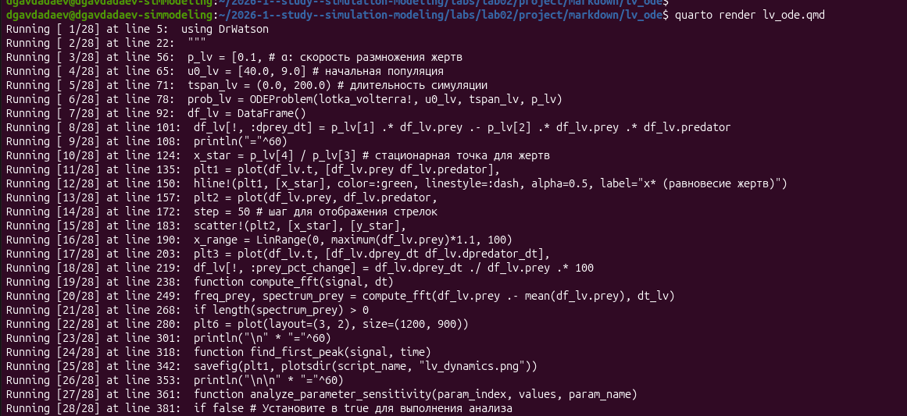{#fig-021 width=70%}

## 15. Выполнение Jupyter-ноутбука модели SIR

— Откроем Jupyter-ноутбук `sir_ode.ipynb` в браузере по адресу `localhost:8888`. Ноутбук содержит заголовок `Модель SIR`, раздел активации проекта с кодом загрузки всех пакетов. Результаты выполнения: $N = 1000.0$, $I_{max} = 154.8$, $t_{peak} = 19.1$ дней, $R(\infty) = 775.7$, доля переболевших 77.6% ([рис. @fig-022]).

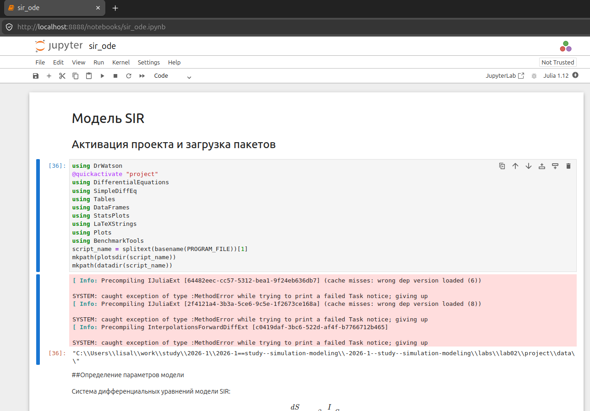{#fig-022 width=70%}

— Просмотрим результаты анализа модели SIR в Jupyter. Бенчмарк решения: 10000 образцов, среднее время 17.600 мкс, выделение памяти 17.39 KiB, 333 аллокации ([рис. @fig-023]).

{#fig-023 width=70%}

## 16. Выполнение Jupyter-ноутбука модели Лотки–Вольтерры

— Откроем ноутбук `lv_ode.ipynb` по адресу `localhost:8889`. Ноутбук содержит все разделы литературного кода, включая построение панельного графика `plt6` с шестью подграфиками размером 1200×900 пикселей ([рис. @fig-024]).

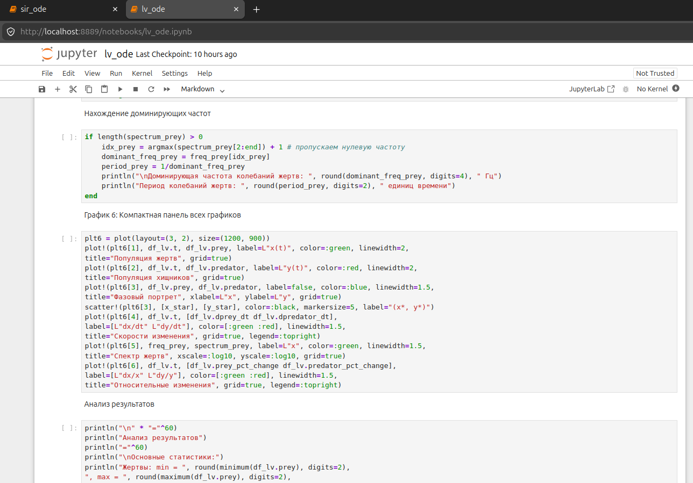{#fig-024 width=70%}

## 17. Сгенерированные графики модели SIR

— Рассмотрим графики, сгенерированные моделью SIR. На рисунках ниже представлены основные визуализации модели ([рис. @fig-025] — [рис. @fig-031]).

{#fig-025 width=70%}

{#fig-026 width=70%}

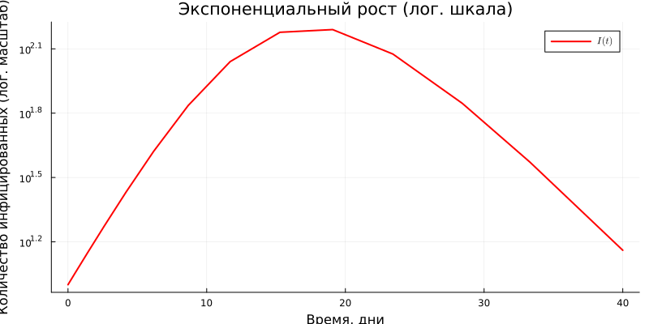{#fig-027 width=70%}

{#fig-028 width=70%}

{#fig-029 width=70%}

{#fig-030 width=70%}

{#fig-031 width=70%}

## 18. Сгенерированные графики модели Лотки–Вольтерры

— Рассмотрим графики, сгенерированные моделью Лотки–Вольтерры ([рис. @fig-032] — [рис. @fig-037]).

{#fig-032 width=70%}

{#fig-033 width=70%}

{#fig-034 width=70%}

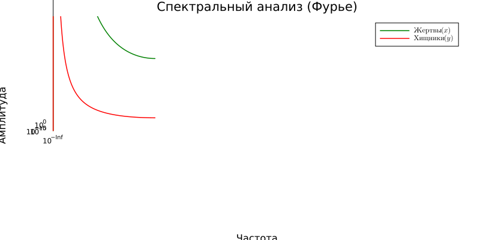{#fig-035 width=70%}

{#fig-036 width=70%}

{#fig-037 width=70%}

# Выводы

В ходе лабораторной работы были успешно реализованы и исследованы две классические модели имитационного моделирования на языке Julia. Для модели SIR с параметрами $\beta = 0.05$, $c = 10.0$, $\gamma = 0.25$ и базовым репродуктивным числом $R_0 = 2.0$ установлено, что пиковое число заражённых составило $I_{max} = 154.8$ человека, пик достигается на 19.1-й день, а итоговая доля переболевших составила 77.6% от общей популяции в 1000 человек. Для модели Лотки–Вольтерры с параметрами $\alpha = 0.1$, $\beta = 0.02$, $\delta = 0.01$, $\gamma = 0.3$ выявлены стационарные точки $x^* = 30.0$, $y^* = 5.0$, подтверждена колебательная динамика с периодом 4.0 единицы времени и доминирующей частотой 0.2499 Гц. Освоены инструменты DrWatson.jl v2.19.1 для воспроизводимого управления проектом и Literate.jl для литературного программирования. Из каждого литературного скрипта успешно сгенерированы чистый код, Jupyter-ноутбук и Quarto-документация, включённая в настоящий отчёт. Бенчмарк численного решения модели SIR показал среднее время вычисления 17.600 мкс при выделении 17.39 KiB памяти.

# Список литературы{.unnumbered}

::: {#refs}
:::








