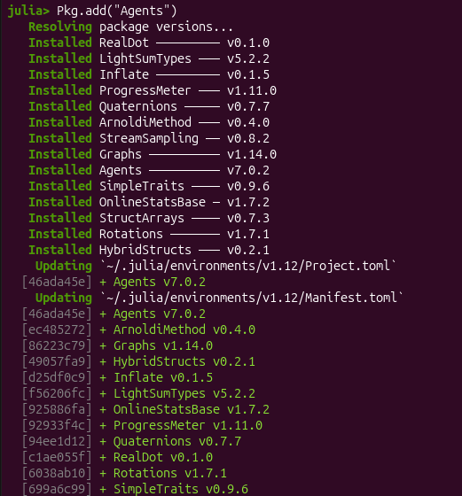
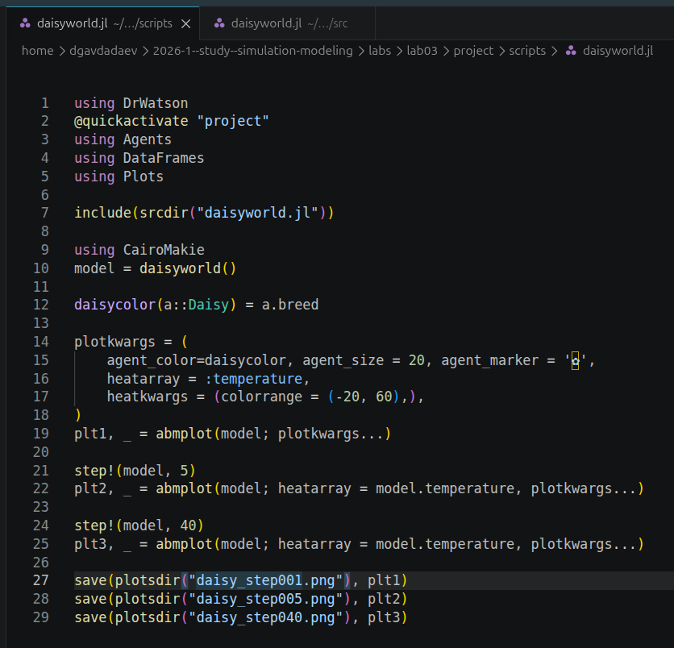
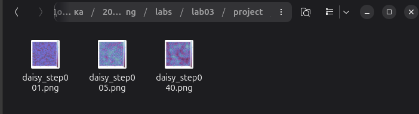
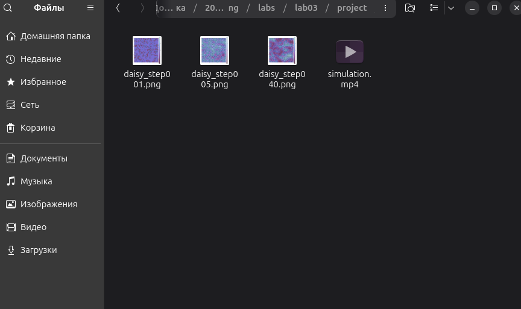
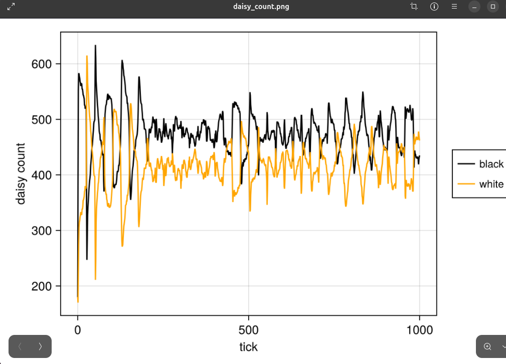
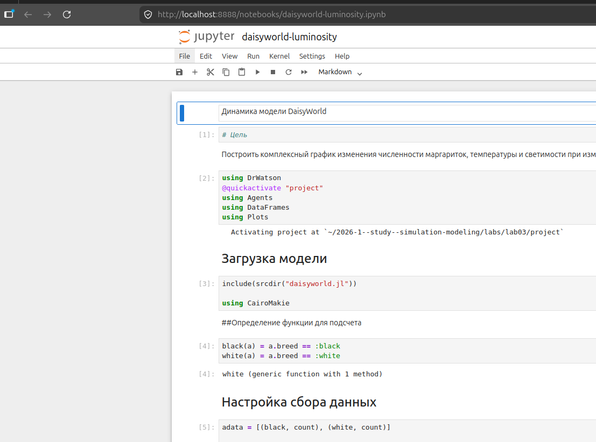
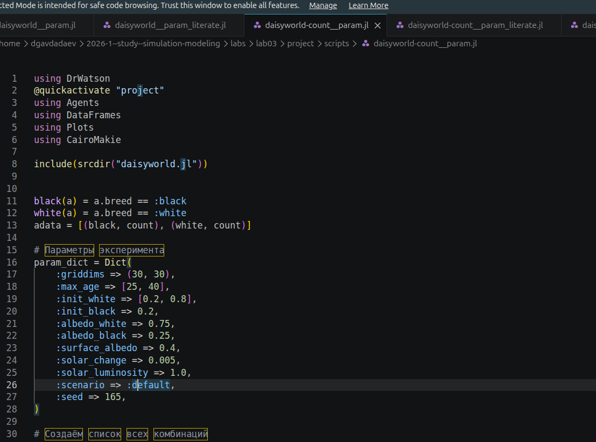
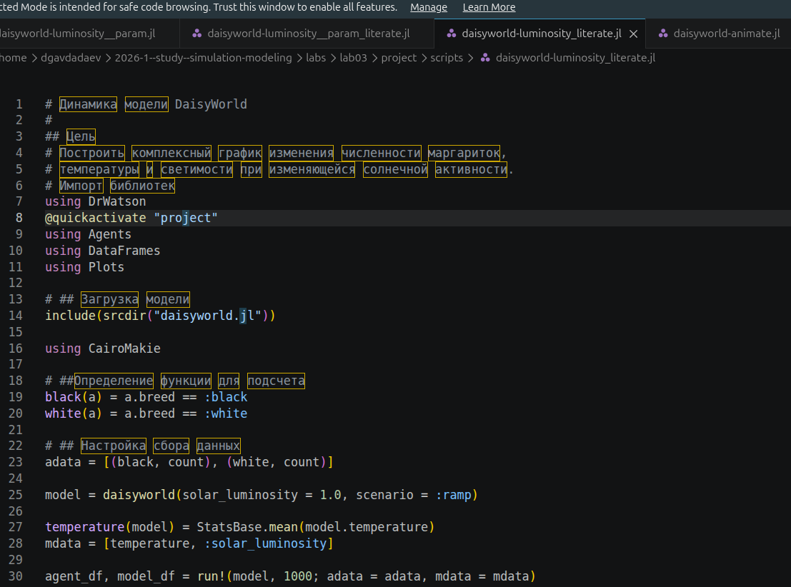

---
## Author
author:
  name: Авдадаев Джамал Геланиевич
  email: 1032230169@rudn.ru
  affiliation:
    - name: Российский университет дружбы народов
      country: Российская Федерация
      city: Москва
      address: ул. Миклухо-Маклая, д. 6

## Title
title: "Лабораторная работа №3"
subtitle: "Модель DaisyWorld"
date: today
date-format: "2026-06-10"
bibliography: cite.bib
---

# Информация

## Докладчик

:::::::::::::: {.columns align=center}
::: {.column width="70%"}

  * Авдадаев Джамал Геланиевич
  * студент
  * Российский университет дружбы народов им. П. Лумумбы
  * [1032230169@rudn.ru](mailto:1032230169@rudn.ru)

:::
::: {.column width="30%"}

:::
::::::::::::::

# Вводная часть

## Цель работы

Изучить агент-ориентированную модель DaisyWorld — демонстрацию
биологической авторегуляции планетарного климата.

- Освоить `Agents.jl` для агентного моделирования
- Применить `Literate.jl` для литературного программирования
- Сгенерировать производные форматы: скрипт, Jupyter, Quarto

## Объект и предмет исследования

- Объект: агент-ориентированная модель DaisyWorld (Lovelock & Watson, 1983)
- Предмет: динамика популяций маргариток и климатическая авторегуляция
- Инструменты: Julia 1.12.6, Agents.jl, DrWatson.jl, Literate.jl, Quarto

## Практическая значимость

- Модель иллюстрирует гипотезу Геи: жизнь стабилизирует окружающую среду
- Метод литературного программирования обеспечивает воспроизводимость исследований
- Параметрическое исследование позволяет систематически изучать пространство параметров

## Материалы и методы

- Язык программирования Julia 1.12.6
- Пакеты: `Agents.jl v7.0.2`, `DrWatson.jl v2.19.1`, `CairoMakie.jl`, `Plots.jl`
- Литературное программирование: `Literate.jl`
- Управление проектом: DrWatson + Git
- Документация: Quarto + JupyterLab

# Модель DaisyWorld — базовая визуализация

## Инициализация проекта

:::::::::::::: {.columns align=center}
::: {.column width="50%"}

{width=100%}

:::
::: {.column width="50%"}

{width=100%}

:::
::::::::::::::

- `Pkg.add("Agents")` — установлен `Agents v7.0.2` и 13 зависимостей
- `initialize_project("project")` — создан DrWatson-проект с `DrWatson v2.19.1`
- Структура: `scripts/`, `src/`, `notebooks/`, `plots/`, `data/`

## Структура проекта и исходный код модели

:::::::::::::: {.columns align=center}
::: {.column width="50%"}

{width=100%}

:::
::: {.column width="50%"}

{width=100%}

:::
::::::::::::::

- Проект содержит 10 каталогов стандартной структуры DrWatson
- `src/daisyworld.jl` — агент `Daisy` с полями `breed`, `age`, `albedo`
- Реализованы функции `update_surface_temperature!` и `diffuse_temperature!`

## Реализация скрипта визуализации

{width=85%}

- Тепловая карта температур в диапазоне от −20 до 60 °C
- `step!(model, 5)` и `step!(model, 40)` — три снимка состояния
- Сохранение: `daisy_step001.png`, `daisy_step005.png`, `daisy_step040.png`

## Сгенерированные визуализации и анимация

:::::::::::::: {.columns align=center}
::: {.column width="50%"}

{width=100%}

:::
::: {.column width="50%"}

{width=100%}

:::
::::::::::::::

- Три снимка состояния модели на шагах 1, 5 и 40
- Скрипт анимации создал файл `simulation.mp4`
- Все файлы сохранены в каталоге `plots/`

## Jupyter-ноутбук — базовая визуализация

{width=85%}

- `StandardABM` с 360 агентами типа `Daisy` на сетке 30×30
- Секции: «Загрузка модели», «Настройка визуализации», «Шаг 0/5/40»
- Метрика Чебышёва, периодические граничные условия

# Модель DaisyWorld — граф. числа маргариток

## Реализация литературного скрипта

{width=85%}

- `daisyworld-count_literate.jl` — литературный стиль с секциями `# ## ...`
- Запуск 1000 тиков, сбор временны́х рядов `count_black` и `count_white`
- Сохранение результата как `daisy_count.png`

## Генерация производных форматов

{width=85%}

- `Literate.script(...)` → `daisyworld_script.jl`
- `Literate.notebook(...)` → `daisyworld.ipynb`
- `Literate.markdown(...)` → `daisyworld-count.md`

## Jupyter-ноутбук и результирующий график

:::::::::::::: {.columns align=center}
::: {.column width="50%"}

{width=100%}

:::
::: {.column width="50%"}

{width=100%}

:::
::::::::::::::

- Численность чёрных: 400–580 особей; белых: 180–640 особей
- После ≈200 тиков — квазипериодический устойчивый режим
- Амплитуда колебаний: 100–150 особей

# Модель DaisyWorld — динамика при изменении светимости

## Литературный скрипт daisyworld-luminosity

{width=85%}

- Сценарий `:ramp`: светимость растёт с шагом `solar_change = 0.005`
- Сбор трёх временны́х рядов: численность, температура, светимость
- `StatsBase.mean(model.temperature)` — средняя температура поверхности

## Генерация форматов и Jupyter-ноутбук

:::::::::::::: {.columns align=center}
::: {.column width="50%"}

{width=100%}

:::
::: {.column width="50%"}

{width=100%}

:::
::::::::::::::

- `Literate.markdown(...)` → `daisyworld-luminosity.md`
- Ноутбук `daisyworld-luminosity.ipynb` выполнен в JupyterLab
- Секции: «Загрузка», «Определение функций», «Настройка сбора данных»

# Параметрическое исследование

## Скрипт daisyworld-count__param

{width=85%}

- `max_age => [25, 40]`, `init_white => [0.2, 0.8]` — варьируемые параметры
- `seed => 165`, `solar_luminosity => 1.0`, `scenario => :default`
- `dict_list(param_dict)` разворачивает 4 комбинации для перебора

## Литературный скрипт и Jupyter count__param

:::::::::::::: {.columns align=center}
::: {.column width="50%"}

{width=100%}

:::
::: {.column width="50%"}

{width=100%}

:::
::::::::::::::

- Литературный скрипт `daisyworld-count__param_literate.jl` оформлен с `## ...`
- Ноутбук `daisyworld-count__param.ipynb` выполнен успешно
- Все 4 комбинации параметров обработаны в цикле `for params in params_list`

## Скрипт daisyworld-luminosity__param

:::::::::::::: {.columns align=center}
::: {.column width="50%"}

{width=100%}

:::
::: {.column width="50%"}

{width=100%}

:::
::::::::::::::

- Параметры аналогичны count__param, но `scenario => :ramp`
- Литературный вариант `daisyworld-luminosity_literate.jl` готов
- Моделирование реакции системы на нарастающую солнечную активность

## Jupyter-ноутбук luminosity__param

{width=85%}

- `daisyworld-luminosity__param.ipynb` запущен в JupyterLab (порт 8889)
- Параметрический цикл `for params in params_list` выполнен для 4 комбинаций
- Результаты сохранены в каталоге `plots/` с именами, кодирующими параметры

# Список литературы

## Источники

Подробнее об агент-ориентированном подходе см. в:

- [@axtell_agents]
- [@wilensky_netlogo]
- [@grimm_odd]
- [@bonabeau_swarm]

:::: {#refs}
::::

# Заключение и выводы

## Итоги работы

- Реализована агент-ориентированная модель DaisyWorld с `Agents.jl v7.0.2`
- Выполнено 6 скриптов (базовый, анимация, count, luminosity и два параметрических)
- Из 4 литературных скриптов сгенерировано 4 ноутбука и 4 Quarto-документа
- Параметрическое исследование охватило 4 комбинации `max_age` и `init_white`

## Освоенные навыки

- Агентное моделирование на сетке с тепловой картой температур
- Литературное программирование: `Literate.script`, `Literate.notebook`, `Literate.markdown`
- Управление научным проектом: DrWatson `initialize_project`, `dict_list`
- Автоматизация параметрических экспериментов через `DrWatson.dict_list`
- Интеграция Quarto-документации в единый отчёт через ``
