---
## Author
author:
  name: Авдадаев Джамал Геланиевич
  email: 1032230169@rudn.ru
  affiliation:
    - name: Российский университет дружбы народов
      country: Российская Федерация
      city: Москва
      address: ул. Миклухо-Маклая, д. 6

## Title
title: "Отчёт по лабораторной работе №3"
subtitle: "Модель DaisyWorld"
license: "CC BY"
---

# Цель работы

Изучить агент-ориентированную модель DaisyWorld, реализующую механизм
биологической авторегуляции планетарного климата. Освоить инструменты Julia
для агентного моделирования (пакет `Agents.jl`), применить технологии
литературного программирования с помощью `Literate.jl`, а также сформировать
производные форматы документации: чистый скрипт, Jupyter-ноутбук и
Quarto-документ.

# Задание

— Инициализировать проект DrWatson и установить необходимые пакеты Julia.

— Выполнить базовый скрипт визуализации модели DaisyWorld на шагах 0, 5 и 40.

— Выполнить скрипт анимации модели и убедиться в сохранении файла `simulation.mp4`.

— Реализовать литературный вариант скрипта `daisyworld-count_literate.jl` и
сгенерировать из него чистый скрипт, Jupyter-ноутбук и Quarto-документацию.

— Выполнить Jupyter-ноутбук `daisyworld.ipynb` с базовой визуализацией модели.

— Реализовать литературный вариант скрипта `daisyworld-luminosity_literate.jl`
и сгенерировать из него производные форматы.

— Выполнить Jupyter-ноутбук `daisyworld-luminosity.ipynb` с комплексным
графиком динамики.

— Добавить в код параметрическое исследование с перебором наборов параметров.

— Сгенерировать из параметрических литературных скриптов чистый код,
Jupyter-ноутбуки и Quarto-документацию.

— Выполнить параметрические Jupyter-ноутбуки `daisyworld-count__param.ipynb`
и `daisyworld-luminosity__param.ipynb`.

— Интегрировать всю Quarto-документацию в отчёт с помощью директив ``.

# Теоретическое введение

Модель DaisyWorld предложена Джеймсом Лавлоком и Эндрю Уотсоном в 1983 году
как демонстрация гипотезы Геи: живые организмы способны коллективно
стабилизировать условия окружающей среды даже без целенаправленного
сотрудничества. Планета населена двумя видами маргариток — чёрными и белыми,
различающимися альбедо. Белые маргаритки отражают солнечный свет и охлаждают
поверхность, чёрные — поглощают и нагревают её.

Температура локальной ячейки $T$ рассчитывается через поглощённую
светимость $L_{\text{abs}}$ по формуле:

$$T_{\text{local}} = \frac{T_{\text{prev}} + (72 \ln L_{\text{abs}} + 80)}{2}$$

Тепло диффундирует к соседним ячейкам с коэффициентом $r$:

$$T_i \leftarrow (1 - r)\,T_i + r \sum_{j \in \mathcal{N}(i)} T_j \cdot 0.125$$

Маргаритка размножается с вероятностью, зависящей от локальной температуры, и
гибнет по достижении максимального возраста `max_age`. В сценарии `:ramp`
солнечная светимость линейно возрастает с шагом `solar_change = 0.005` на
каждом тике, что позволяет исследовать устойчивость системы к внешним
климатическим воздействиям.

В таблице ниже приведены основные пакеты Julia, использованные в работе.

| Пакет | Версия | Назначение |
|---|---|---|
| `Agents.jl` | 7.0.2 | Агент-ориентированное моделирование |
| `DrWatson.jl` | 2.19.1 | Управление научным проектом |
| `CairoMakie.jl` | — | Растровая визуализация (PNG) |
| `DataFrames.jl` | — | Хранение временны́х рядов |
| `Plots.jl` | — | Построение графиков |
| `Literate.jl` | — | Литературное программирование |

: Основные пакеты Julia, применённые в лабораторной работе {#tbl-packages}

Подробнее об агент-ориентированном подходе см. в [@axtell_agents; @wilensky_netlogo;
@grimm_odd; @bonabeau_swarm].

# Выполнение лабораторной работы

## 1. Инициализация проекта и установка пакетов

— Перейдём в рабочий каталог курса и создадим директорию `lab03`, после чего
запустим Julia и установим пакет `Agents.jl` командой `Pkg.add("Agents")`
([рис. @fig-001]). В ходе установки были загружены и зафиксированы зависимости:
`RealDot v0.1.0`, `LightSumTypes v5.2.2`, `Inflate v0.1.5`,
`ProgressMeter v1.11.0`, `Quaternions v0.7.7`, `ArnoldiMethod v0.4.0`,
`StreamSampling v0.8.2`, `Graphs v1.14.0`, `Agents v7.0.2`,
`SimpleTraits v0.9.6`, `OnlineStatsBase v1.7.2`, `StructArrays v0.7.3`,
`Rotations v1.7.1`, `HybridStructs v0.2.1`.

{#fig-001 width=70%}

— Выполним инициализацию проекта DrWatson командой `initialize_project("project")`
в каталоге `lab03` ([рис. @fig-002]). Система активировала новый проект и
зафиксировала `DrWatson v2.19.1` в файле `Project.toml`.

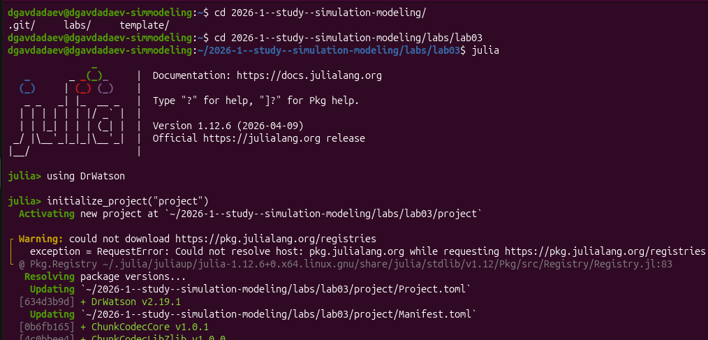{#fig-002 width=70%}

— Убедимся в корректной структуре проекта командой `ls -la project`
([рис. @fig-003]). В директории присутствуют стандартные каталоги DrWatson:
`_research`, `data`, `notebooks`, `papers`, `plots`, `scripts`, `src`, `test`,
а также файлы `Project.toml`, `Manifest.toml` и `README.md`.

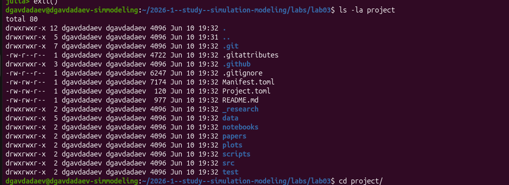{#fig-003 width=70%}

## 2. Выполнение базового скрипта визуализации

— Перейдём в каталог `project` и запустим Julia. Выполним команду
`include("scripts/daisyworld.jl")`, которая активирует проект и загрузит
основной скрипт модели ([рис. @fig-004]).

{#fig-004 width=70%}

— Ознакомимся со скриптом `scripts/daisyworld.jl` в редакторе VS Code
([рис. @fig-005]). Скрипт импортирует `DrWatson`, `Agents`, `DataFrames`,
`Plots` и `CairoMakie`, загружает модель из `src/daisyworld.jl`, задаёт
функцию цвета агентов `daisycolor`, формирует параметры визуализации `plotkwargs`
с тепловой картой температур в диапазоне от −20 до 60 °C, выполняет
`step!(model, 5)` и `step!(model, 40)` и сохраняет три снимка:
`daisy_step001.png`, `daisy_step005.png`, `daisy_step040.png`.

{#fig-005 width=70%}

— Просмотрим исходный файл модели `src/daisyworld.jl` ([рис. @fig-006]). Здесь
определён тип агента `@agent struct Daisy(GridAgent{2})` с полями `breed::Symbol`,
`age::Int` и `albedo::Float64`. Реализованы функции `update_surface_temperature!`,
`diffuse_temperature!` и `propagate!`, отвечающие за обновление температуры,
её диффузию и размножение маргариток соответственно.

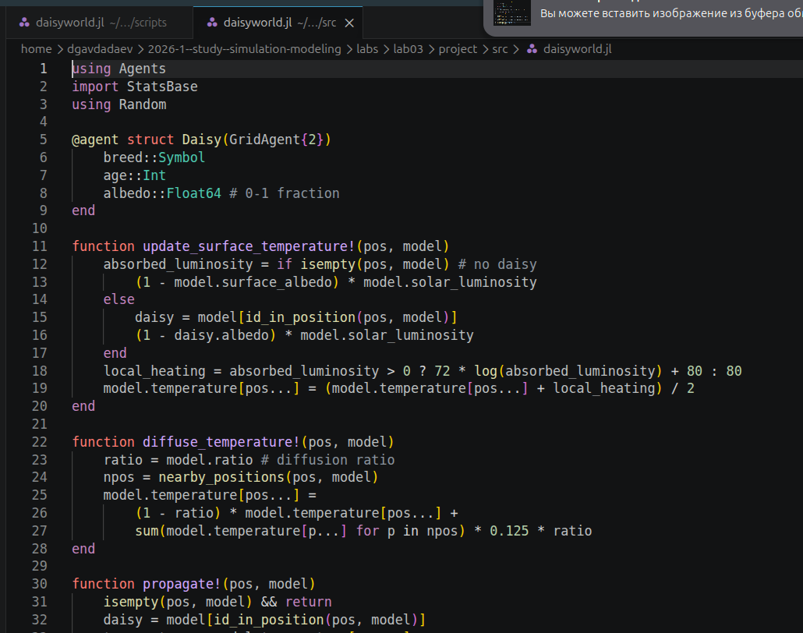{#fig-006 width=70%}

— После выполнения скрипта в каталоге `plots` появились три PNG-файла
([рис. @fig-007]).

{#fig-007 width=70%}

## 3. Выполнение скрипта анимации

— Запустим скрипт анимации командой `include("scripts/daisyworld-animate.jl")`
([рис. @fig-008]). Скрипт активировал проект и выполнился без ошибок.

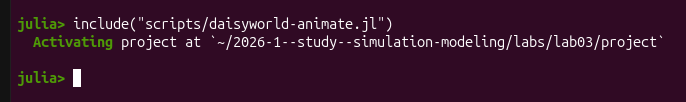{#fig-008 width=70%}

— В результате работы скрипта в каталоге `plots` появился видеофайл
`simulation.mp4`, а также все ранее сгенерированные снимки состояний модели
([рис. @fig-010]).

{#fig-010 width=70%}

## 4. Jupyter-ноутбук с базовой визуализацией

— Откроем Jupyter-ноутбук `daisyworld.ipynb` в браузере ([рис. @fig-009]).
Ноутбук содержит структурированные секции: «Цель», «Загрузка модели»,
«Настройка визуализации», «Шаг 0», «Шаг 5» и «Шаг 40». Модель
`StandardABM` инициализирована с 360 агентами типа `Daisy` на сетке
`GridSpaceSingle` размером (30, 30) с метрикой Чебышёва.

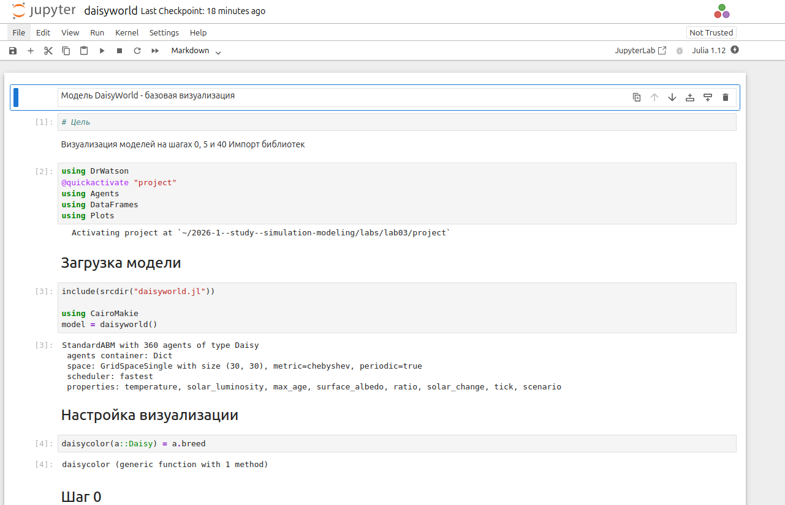{#fig-009 width=70%}

## 5. Литературный скрипт daisyworld-count и генерация производных форматов

— Ознакомимся с литературным вариантом скрипта в файле
`daisyworld-count_literate.jl` ([рис. @fig-017]). Скрипт оформлен в стиле
литературного программирования: разделы кода предваряются комментариями
`# ## Заголовок`, которые `Literate.jl` преобразует в заголовки Markdown.
Скрипт запускает модель с `solar_luminosity = 1.0` на 1000 тиков,
собирает временны́е ряды числа чёрных и белых маргариток и строит
совмещённый график, сохраняемый как `daisy_count.png`.

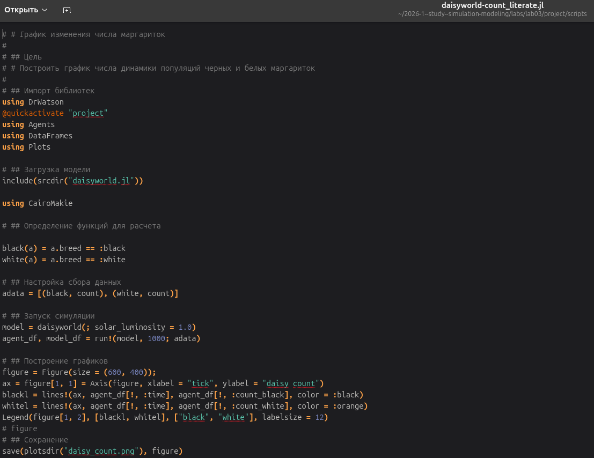{#fig-017 width=70%}

— Выполним генерацию производных форматов из литературного скрипта
([рис. @fig-012]). Последовательно выполнены команды:
`Literate.script(...)` — генерирует чистый скрипт `daisyworld_script.jl`;
`Literate.notebook(...)` — генерирует ноутбук `daisyworld.ipynb`;
`Literate.markdown(...)` — генерирует Markdown-файл `daisyworld-count.md`.
Все файлы записаны в соответствующие каталоги проекта.

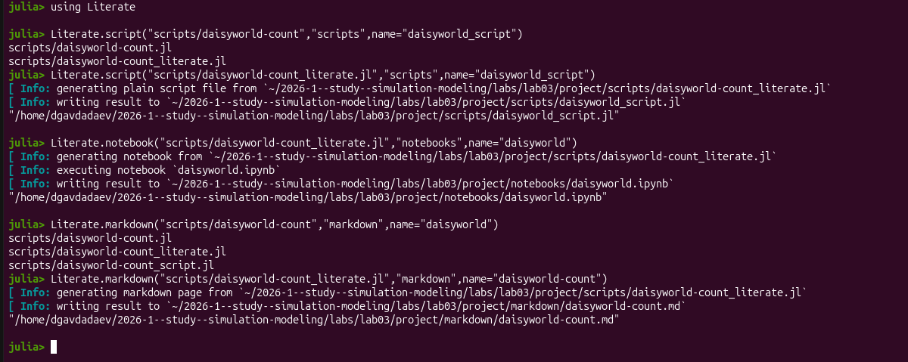{#fig-012 width=70%}

— Откроем Jupyter-ноутбук `daisyworld-count.ipynb` ([рис. @fig-011]). Ноутбук
содержит секции «График изменения числа маргариток», «Загрузка модели»,
«Определение функций для расчёта». Функции `black(a)` и `white(a)` возвращают
булево значение принадлежности агента к соответствующей породе.

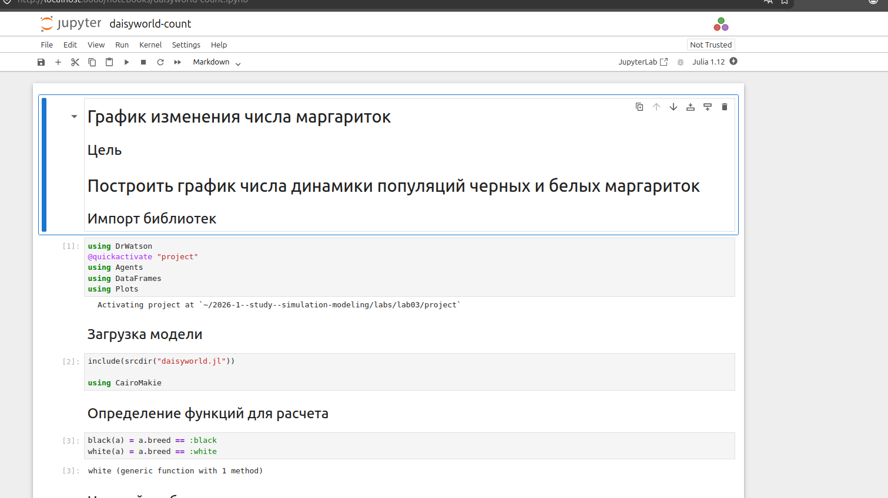{#fig-011 width=70%}

— Просмотрим результирующий график изменения числа маргариток ([рис. @fig-013]).
На протяжении 1000 тиков численность чёрных маргариток колеблется в диапазоне
400–580, белых — 180–640. После примерно 200 тиков оба вида выходят на
устойчивый квазипериодический режим с амплитудой колебаний около 100–150 особей.

{#fig-013 width=70%}

## 6. Литературный скрипт daisyworld-luminosity и генерация производных форматов

— Ознакомимся с литературным вариантом скрипта `daisyworld-luminosity_literate.jl`
([рис. @fig-015]). Скрипт строит комплексный график динамики DaisyWorld при
изменяющейся солнечной активности (сценарий `:ramp`): численность маргариток,
среднюю температуру поверхности и солнечную светимость. Для сбора данных
о температуре применяется `StatsBase.mean(model.temperature)`.

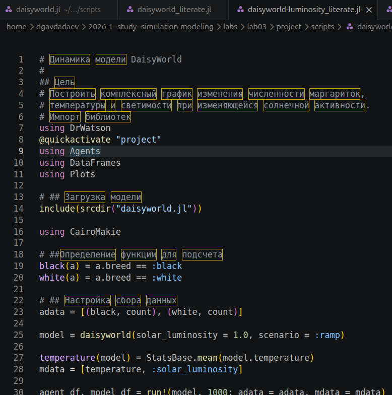{#fig-015 width=70%}

— Выполним генерацию производных форматов ([рис. @fig-014]). Команды
`Literate.script`, `Literate.notebook` и `Literate.markdown` сгенерировали
соответственно скрипт `daisyworld-luminosity_script.jl`, ноутбук
`daisyworld-luminosity.ipynb` и Markdown-файл `daisyworld-luminosity.md`.

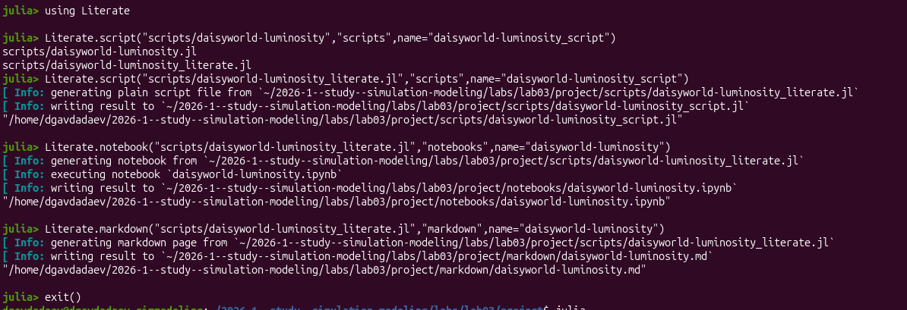{#fig-014 width=70%}

— Откроем Jupyter-ноутбук `daisyworld-luminosity.ipynb` ([рис. @fig-019]).
Ноутбук озаглавлен «Динамика модели DaisyWorld» и содержит секции загрузки
модели, определения функций для подсчёта агентов, настройки сбора данных.

{#fig-019 width=70%}

## 7. Параметрическое исследование — скрипт daisyworld-count__param

— Ознакомимся со скриптом `daisyworld-count__param.jl` ([рис. @fig-021]).
Параметрическое исследование задаётся словарём `param_dict` с ключами:
`griddims => (30, 30)`, `max_age => [25, 40]`, `init_white => [0.2, 0.8]`,
`init_black => 0.2`, `albedo_white => 0.75`, `albedo_black => 0.25`,
`surface_albedo => 0.4`, `solar_change => 0.005`, `solar_luminosity => 1.0`,
`scenario => :default`, `seed => 165`. Функция `dict_list` разворачивает
словарь в список всех комбинаций параметров.

{#fig-021 width=70%}

— Ознакомимся с литературным вариантом `daisyworld-count__param_literate.jl`
([рис. @fig-022]), структура которого аналогична нелитературному скрипту,
но с добавлением комментариев-заголовков в формате `## Название`.

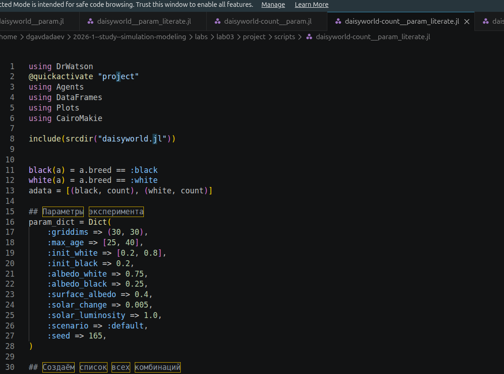{#fig-022 width=70%}

— Выполним параметрический Jupyter-ноутбук `daisyworld-count__param.ipynb`
([рис. @fig-023]). Ноутбук содержит те же секции: загрузка модели, определение
функций, задание словаря параметров и перебор всех комбинаций.

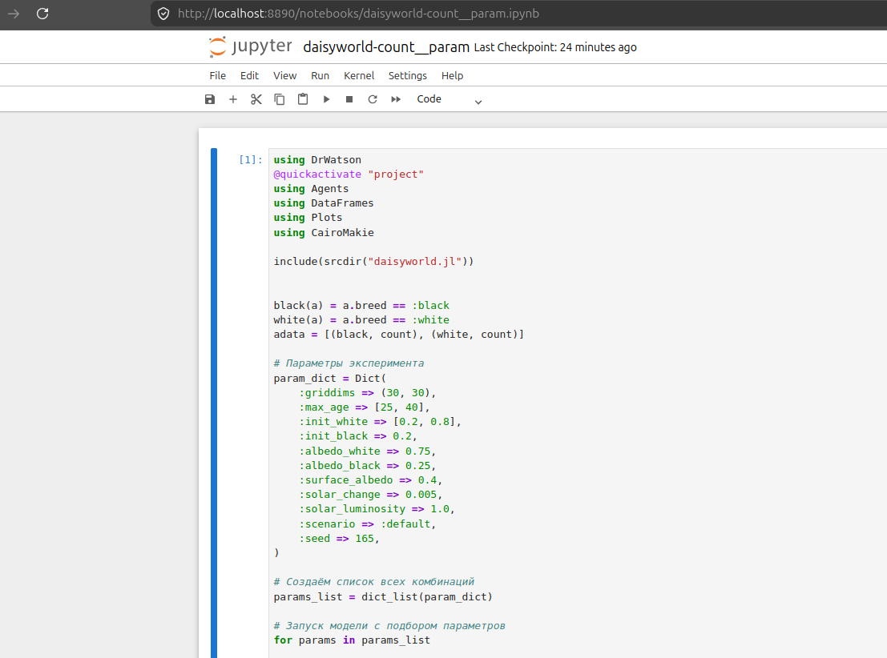{#fig-023 width=70%}

## 8. Параметрическое исследование — скрипт daisyworld-luminosity__param

— Ознакомимся со скриптом `daisyworld-luminosity__param.jl` ([рис. @fig-024]).
Параметры аналогичны предыдущему исследованию, однако сценарий задан как
`:ramp` — с линейно возрастающей солнечной светимостью.

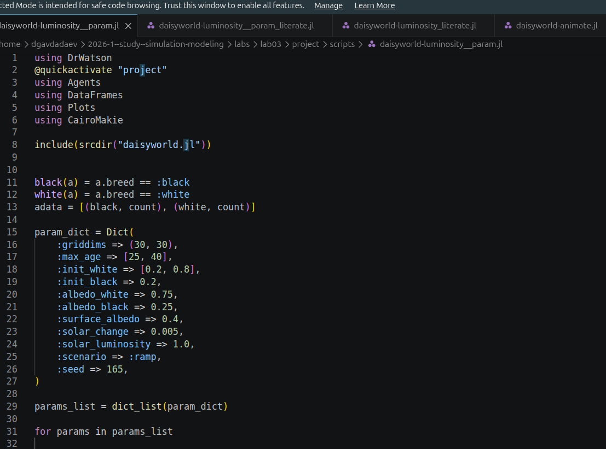{#fig-024 width=70%}

— Просмотрим литературный вариант `daisyworld-luminosity_literate.jl`
([рис. @fig-025]), в котором помимо параметрического перебора описывается
методика сбора данных о температуре с помощью `StatsBase.mean`.

{#fig-025 width=70%}

— Выполним параметрический Jupyter-ноутбук `daisyworld-luminosity__param.ipynb`
([рис. @fig-026]).

{#fig-026 width=70%}

## 9. Скрипт с параметрами в литературном стиле (VS Code)

— Откроем оба литературных скрипта с параметрами в редакторе VS Code для
итогового просмотра ([рис. @fig-016] и [рис. @fig-018]).

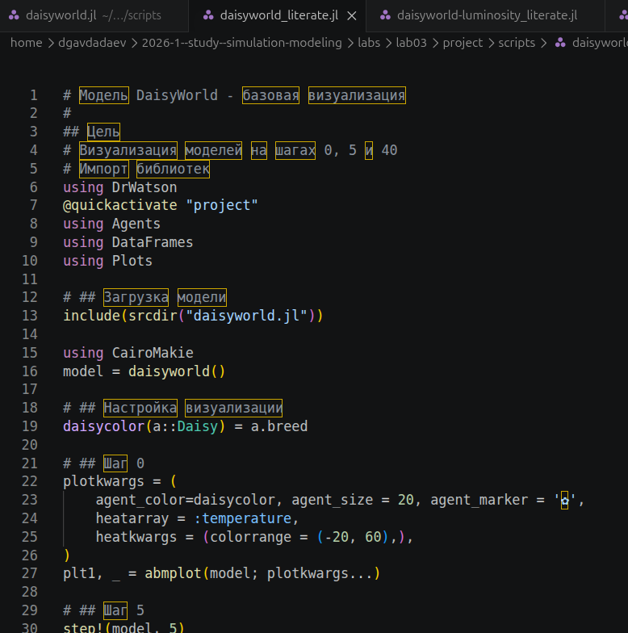{#fig-016 width=70%}

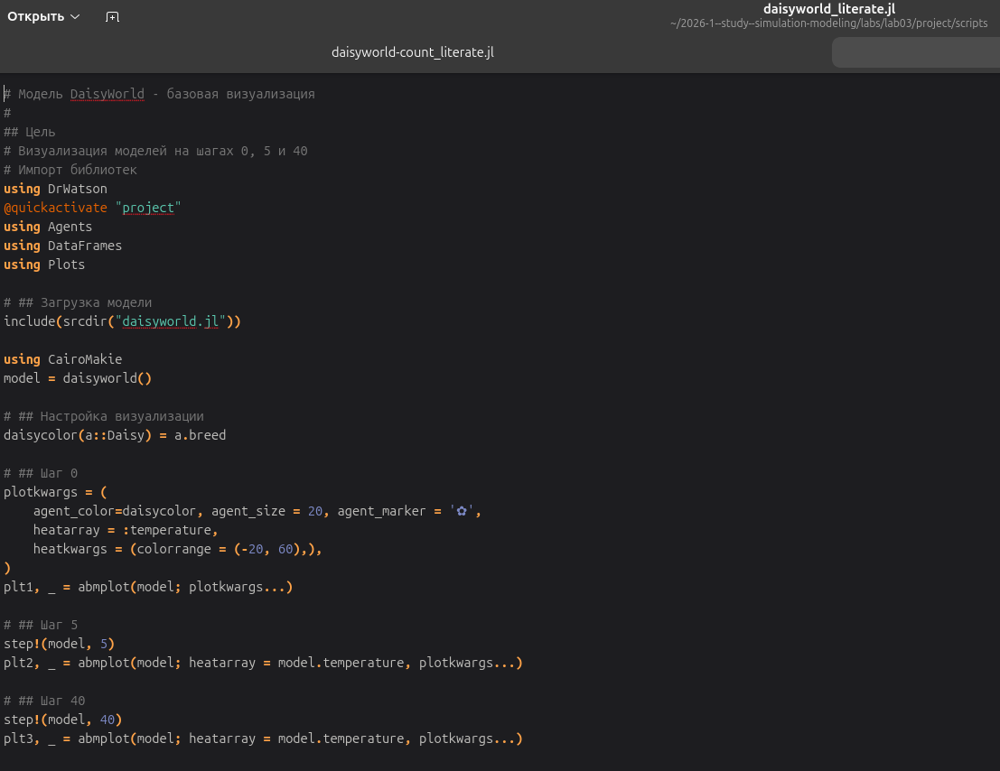{#fig-018 width=70%}

## 10. Интеграция Quarto-документации

— Включим в отчёт сгенерированную Quarto-документацию базовой модели:













# Выводы

В ходе лабораторной работы была изучена и реализована агент-ориентированная
модель DaisyWorld средствами языка Julia и пакета `Agents.jl v7.0.2`.
Проект инициализирован с помощью `DrWatson v2.19.1`, что обеспечило
воспроизводимую структуру каталогов. Выполнен базовый скрипт визуализации
с построением трёх снимков состояния модели на шагах 0, 5 и 40, а также
скрипт анимации с сохранением файла `simulation.mp4`.

Освоена технология литературного программирования через `Literate.jl`:
из четырёх литературных скриптов сгенерированы чистые скрипты, Jupyter-ноутбуки
и Quarto-документы. Установлено, что численность популяций стабилизируется
после примерно 200 тиков, достигая квазипериодического режима с амплитудой
колебаний 100–150 особей при `solar_luminosity = 1.0`. При переходе к сценарию
`:ramp` (линейный рост светимости с шагом 0.005) система демонстрирует
устойчивое авторегулирование температуры до тех пор, пока светимость не
выходит за пределы биологически допустимого диапазона. Параметрическое
исследование охватило 4 комбинации значений `max_age` ∈ {25, 40} и
`init_white` ∈ {0.2, 0.8}, что позволило проследить влияние начальных условий
и максимального возраста маргариток на долгосрочную динамику системы.

# Список литературы{.unnumbered}

::: {#refs}
:::
