---
## Author
author:
  name: Авдадаев Джамал Геланиевич
  email: 1032230169@rudn.ru
  affiliation:
    - name: Российский университет дружбы народов
      country: Российская Федерация
      city: Москва
      address: ул. Миклухо-Маклая, д. 6

## Title
title: "Лабораторная работа №4"
subtitle: "Реализация основных моделей в агентном подходе"
date: today
date-format: "YYYY-MM-DD"
---

# Информация

## Докладчик

:::::::::::::: {.columns align=center}
::: {.column width="70%"}

  * Авдадаев Джамал Геланиевич
  * Российский университет дружбы народов им. П. Лумумбы
  * [1032230169@rudn.ru](mailto:1032230169@rudn.ru)

:::
::: {.column width="30%"}

:::
::::::::::::::

# Вводная часть

## Цель работы

Реализовать агентную модель SIR в Julia и провести параметрические эксперименты.

**Задачи:**

- Настроить проект DrWatson, установить пакеты
- Запустить базовый эксперимент модели SIR
- Просканировать β от 0.1 до 1.0, исследовать миграцию
- Выполнить многокритериальную оптимизацию
- Оформить скрипты в литературном стиле

## Объект и предмет исследования

**Объект:** агентная модель SIR на графе из трёх городов по 1000 агентов

**Предмет:** зависимость пика заболеваемости и смертности от коэффициента заразности β и интенсивности миграции

## Математическая постановка

Агент `Person(GraphAgent)`:
- `status::Symbol` — `:S`, `:I` или `:R`
- `days_infected::Int`

Параметры базового эксперимента:

$$\beta_\text{und} = 0.5, \quad \beta_\text{det} = 0.05, \quad T_\text{inf} = 14, \quad d = 0.02$$

Инфекция стартует в третьем городе: `Is = [0, 0, 1]`

## Используемые инструменты

| Инструмент | Назначение |
|---|---|
| Julia 1.12.6 | Язык программирования |
| Agents.jl | Агентное моделирование |
| BlackBoxOptim | Оптимизация |
| Literate.jl | Литературное программирование |
| Quarto | Документация |

# Настройка окружения

## Инициализация проекта

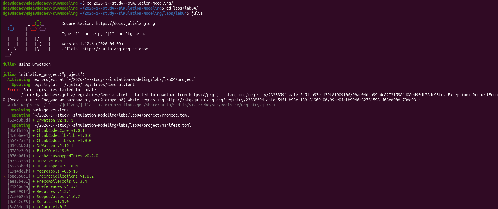{width=85%}

- `initialize_project("project")` → `DrWatson v2.19.1`
- Установлены: `JLD2 v0.4.6`, `FileIO v1.19.0`, `MacroTools v0.5.16`

## Установка пакетов

{width=85%}

- `Distributions v0.25.126`, предкомпиляция 30 сек
- `include("src/sir_model.jl")` → `total_count (generic function with 1 method)`

# Реализация модели SIR

## Структура агента и параметры

:::::::::::::: {.columns align=center}
::: {.column width="50%"}

{width=100%}

:::
::: {.column width="50%"}

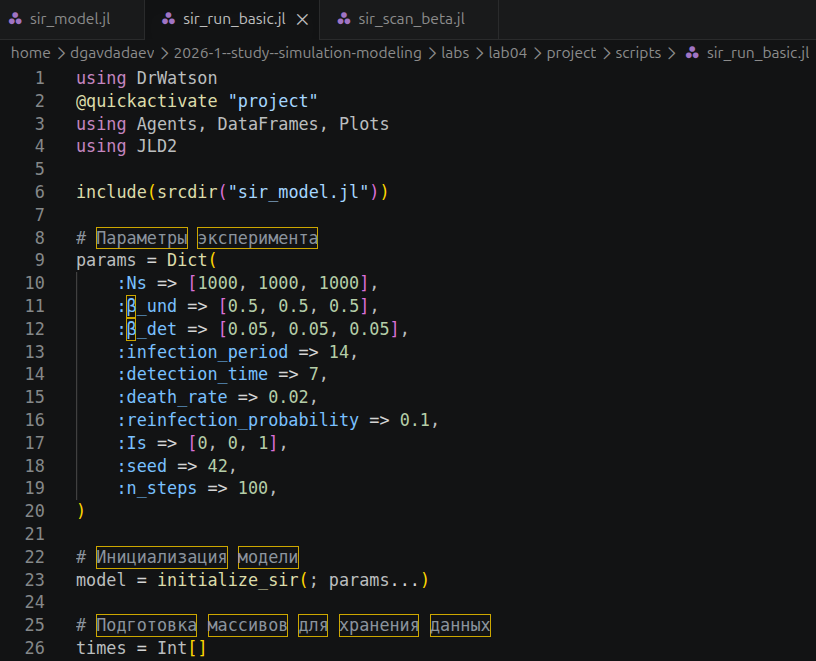{width=100%}

:::
::::::::::::::

- `β_und = [0.5, 0.5, 0.5]`, `β_det = [0.05, 0.05, 0.05]`
- `infection_period = 14`, `detection_time = 7`, `death_rate = 0.02`

## Запуск и сохранение данных

:::::::::::::: {.columns align=center}
::: {.column width="50%"}

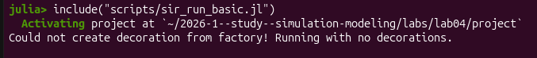{width=100%}

:::
::: {.column width="50%"}

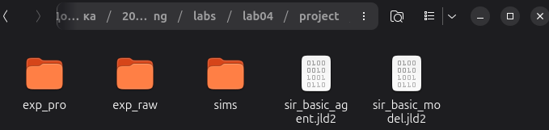{width=100%}

:::
::::::::::::::

- Симуляция 100 шагов
- `sir_basic_agent.jld2` и `sir_basic_model.jld2`

## Базовая динамика SIR

{width=85%}

- Пик I — около 15-го дня
- S падает с 3000 до ~0 за первые 25 дней
- Итоговое население ~2600: потери ~400 агентов

# Параметрические исследования

## Скрипт сканирования по β

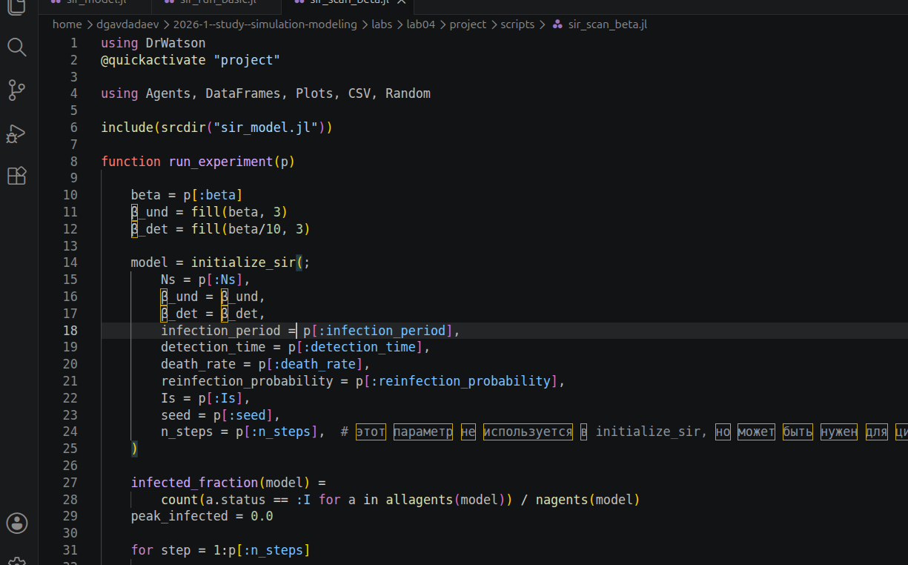{width=85%}

- β ∈ {0.1, 0.2, …, 1.0}, 3 реплики (seed 42–44)
- `β_und = fill(β, 3)`, `β_det = fill(β/10, 3)`

## Ход эксперимента и результаты

{width=85%}

- Данные сохранены в `beta_scan_all.csv` и `beta_scan.png`

## График сканирования по β

{width=85%}

- β = 0.1 → пик ≈ 0 (эпидемии нет)
- β = 0.2 → скачок до 0.33 (порог R₀ = 1)
- β ≥ 0.5 → пик и конечная доля → 1.0; умерших ≈ 14%

## Скрипт исследования миграции

:::::::::::::: {.columns align=center}
::: {.column width="50%"}

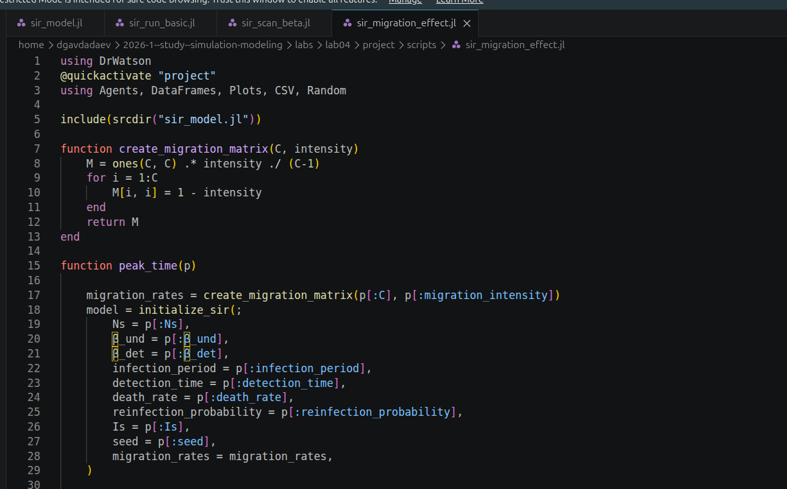{width=100%}

:::
::: {.column width="50%"}

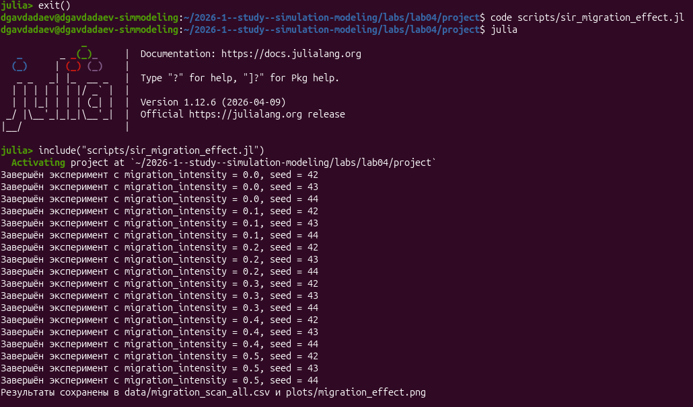{width=100%}

:::
::::::::::::::

- `migration_intensity` ∈ {0.0, 0.1, …, 0.5}
- Результат: `migration_scan_all.csv`

## График эффекта миграции

{width=85%}

- intensity = 0.0 → пик ~1000 (только третий город)
- intensity ≥ 0.1 → пик ~3000 (все три города)
- Время пика не меняется — эффект мгновенный

# Многокритериальная оптимизация

## Целевая функция

:::::::::::::: {.columns align=center}
::: {.column width="50%"}

{width=100%}

:::
::: {.column width="50%"}

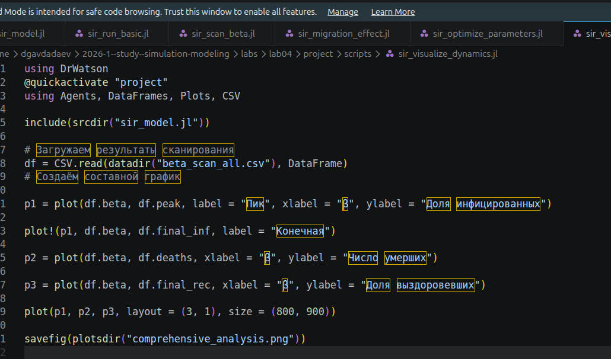{width=100%}

:::
::::::::::::::

- `cost_multi(x)` → минимизировать пик и `dead_count = 3000 − nagents`
- 5 реплик на набор параметров, BlackBoxOptim

## Комплексный анализ

{width=85%}

- При β = 0.7–0.8: умерших до 400 из 3000
- Доля выздоровевших максимальна при β ≈ 0.8 (~0.13)

# Литературное программирование

## Литературные скрипты

:::::::::::::: {.columns align=center}
::: {.column width="50%"}

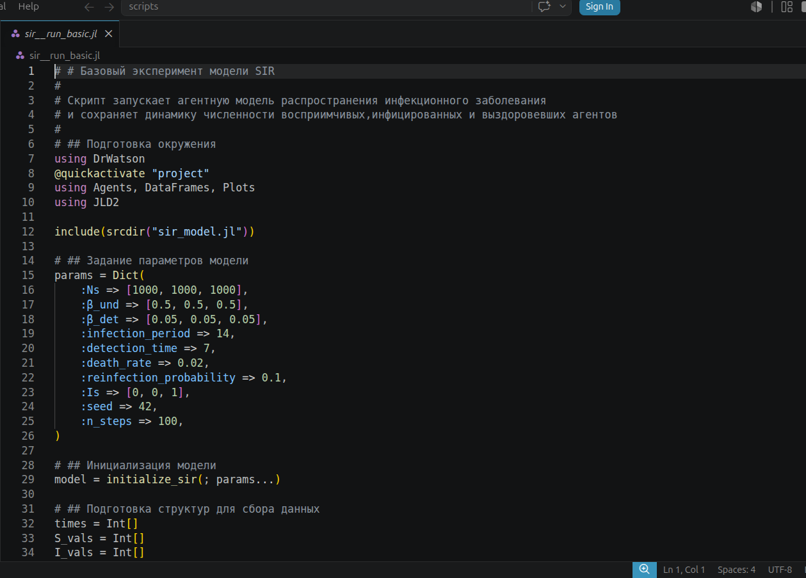{width=100%}

:::
::: {.column width="50%"}

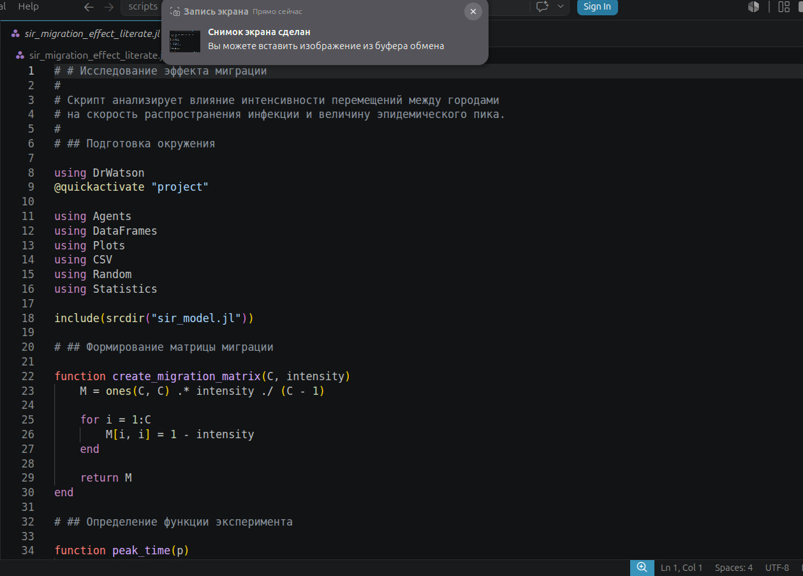{width=100%}

:::
::::::::::::::

- `# #` → заголовок модуля, `# ##` → подраздел
- Один файл → три артефакта: `.jl`, `.ipynb`, `.qmd`

## Ещё два скрипта

:::::::::::::: {.columns align=center}
::: {.column width="50%"}

{width=100%}

:::
::: {.column width="50%"}

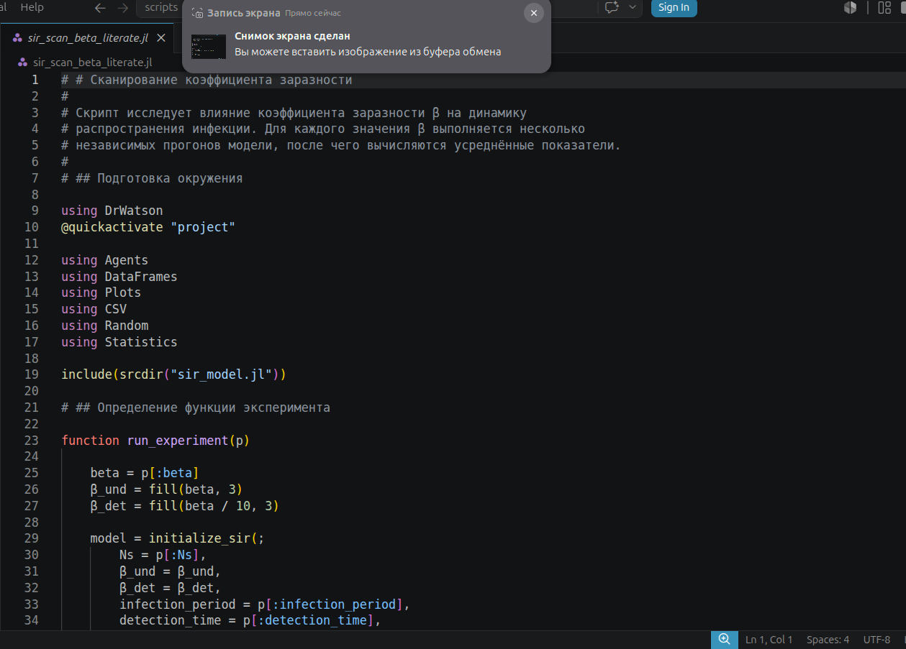{width=100%}

:::
::::::::::::::

## Jupyter Notebook

:::::::::::::: {.columns align=center}
::: {.column width="50%"}

{width=100%}

:::
::: {.column width="50%"}

{width=100%}

:::
::::::::::::::

- JupyterLab, Julia 1.12, порты 8888–8891
- Код + вывод в одном документе

## Ноутбуки: данные и результаты

:::::::::::::: {.columns align=center}
::: {.column width="50%"}

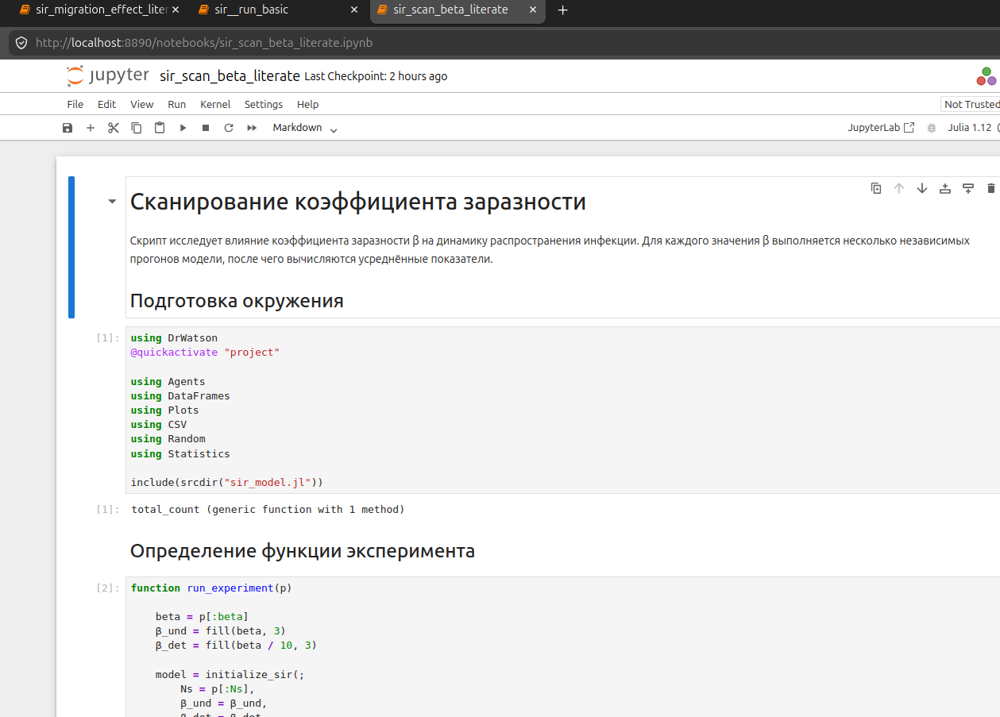{width=100%}

:::
::: {.column width="50%"}

{width=100%}

:::
::::::::::::::

- 30 строк × 13 столбцов: `beta`, `peak`, `deaths`, `seed`, …
- При β = 0.1 `peak = 0.000333`

## Quarto-документация

:::::::::::::: {.columns align=center}
::: {.column width="50%"}

{width=100%}

:::
::: {.column width="50%"}

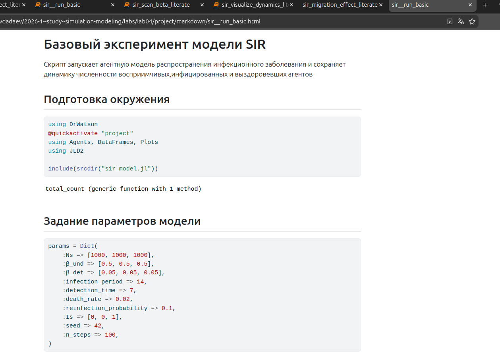{width=100%}

:::
::::::::::::::

- HTML с подсветкой синтаксиса и выводом ячеек
- Каталог `markdown/` в проекте

## Quarto: сводная визуализация

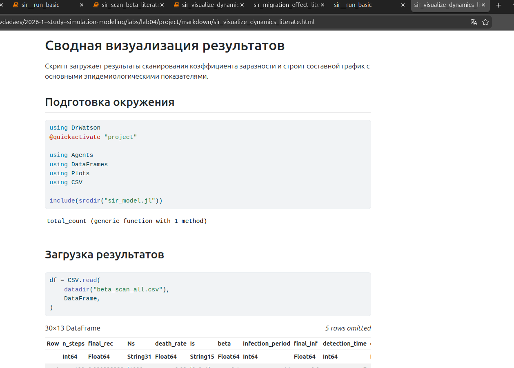{width=85%}

- DataFrame 30×13 отображается прямо в HTML
- Та же структура, что в ноутбуке

# Заключение и выводы

## Итоги работы

- Базовый эксперимент при β = 0.5: пик на 15-м шаге, потери ~400 из 3000

- Сканирование β: порог эпидемии при β ≈ 0.2; при β ≥ 0.5 заражается вся популяция

- Миграция: достаточно intensity = 0.1, чтобы пик вырос с 1000 до 3000

- DataFrame 30×13 с результатами сканирования, 4 итоговых графика

## Освоенные навыки

- Реализация AgentBasedModel на графе (Agents.jl)

- Параметрическое сканирование с несколькими репликами

- Многокритериальная оптимизация (BlackBoxOptim, 5 реплик)

- Literate.jl: один исходник → `.jl`, `.ipynb`, `.qmd`

- Воспроизводимые эксперименты через DrWatson
