---
## Author
author:
  name: Авдадаев Джамал Геланиевич
  email: 1032230169@rudn.ru
  affiliation:
    - name: Российский университет дружбы народов
      country: Российская Федерация
      city: Москва
      address: ул. Миклухо-Маклая, д. 6

## Title
title: "Отчёт по лабораторной работе №4"
subtitle: "Реализация основных моделей в агентном подходе"
license: "CC BY"
---

# Цель работы

Освоить реализацию эпидемиологической модели SIR в агентном подходе на языке Julia с использованием пакета Agents.jl. Научиться проводить параметрическое сканирование и многокритериальную оптимизацию агентных моделей, а также оформлять скрипты в литературном стиле с помощью Literate.jl и Quarto.

# Задание

— Создать рабочий каталог и инициализировать проект DrWatson.

— Установить пакеты: DrWatson, Agents, DataFrames, Plots, CSV, JLD2, BlackBoxOptim, Distributions.

— Запустить базовый эксперимент агентной модели SIR на 100 шагов.

— Провести параметрическое сканирование коэффициента заразности β от 0.1 до 1.0.

— Исследовать влияние интенсивности миграции между городами на пик заболеваемости.

— Выполнить многокритериальную оптимизацию параметров с помощью BlackBoxOptim.

— Преобразовать все скрипты в литературный стиль, сгенерировать Jupyter Notebook и Quarto-документы.

— Интегрировать результаты в отчёт.

# Теоретическое введение

## Агентное моделирование эпидемий

В агентном подходе каждый индивид моделируется как отдельный агент со своим состоянием. В отличие от детерминированных моделей на дифференциальных уравнениях, здесь взаимодействия стохастичны, а агенты могут мигрировать между узлами графа. В данной работе агенты размещены на графе из трёх городов, соединённых рёбрами с заданной матрицей переходов.

## Модель SIR

Модель делит популяцию на три компартмента:

- **S** — восприимчивые,
- **I** — инфицированные,
- **R** — выздоровевшие.

Классические уравнения детерминированной модели:

$$\frac{dS}{dt} = -\beta \frac{SI}{N}, \quad \frac{dI}{dt} = \beta \frac{SI}{N} - \gamma I, \quad \frac{dR}{dt} = \gamma I$$

где $\beta$ — коэффициент заразности, $\gamma$ — скорость выздоровления. Пороговый параметр $R_0 = \beta / \gamma$: при $R_0 > 1$ эпидемия развивается, при $R_0 < 1$ затухает.

В агентной реализации каждый агент типа `Person` имеет два поля: `days_infected::Int` и `status::Symbol` (`:S`, `:I` или `:R`). Заражение происходит с разными коэффициентами в зависимости от того, выявлен ли носитель: $\beta_\text{und}$ для невыявленных и $\beta_\text{det}$ для выявленных.

## Используемые пакеты

| Пакет | Назначение |
|---|---|
| `DrWatson` | Организация проекта и воспроизводимость экспериментов |
| `Agents.jl` | Агентное моделирование на графах |
| `DataFrames` | Хранение и обработка табличных данных |
| `Plots` | Визуализация |
| `CSV` | Чтение и запись данных |
| `JLD2` | Сохранение объектов Julia |
| `BlackBoxOptim` | Оптимизация методом чёрного ящика |
| `Distributions` | Вероятностные распределения |
| `Literate.jl` | Литературное программирование |

: Пакеты Julia, используемые в лабораторной работе {#tbl-packages}

# Выполнение лабораторной работы

## Инициализация проекта и установка пакетов

— Перешёл в каталог `labs/lab04` и запустил Julia 1.12.6. Выполнил `using DrWatson` и `initialize_project("project")` — в результате создана структура каталогов проекта и автоматически установлен `DrWatson v2.19.1` вместе с зависимостями: `JLD2 v0.4.6`, `FileIO v1.19.0`, `MacroTools v0.5.16`, `ChunkCodecCore v1.0.1` и другими ([рис. @fig-001]). При обновлении реестра возникли предупреждения о недоступности некоторых серверов, однако это не помешало установке.

{#fig-001 width=70%}

— Дополнительно установил пакет `Distributions v0.25.126` командой `Pkg.add("Distributions")`. Предкомпиляция заняла 30 секунд при 546 уже скомпилированных пакетах. Затем выполнил `include("src/sir_model.jl")` для проверки корректности модели — в ответ получил `total_count (generic function with 1 method)`, что подтверждает успешную загрузку ([рис. @fig-002]).

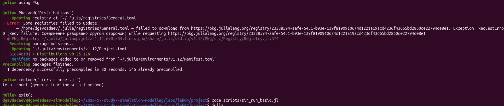{#fig-002 width=70%}

## Реализация модели SIR

— В VS Code открыл файл `src/sir_model.jl` ([рис. @fig-003]). Агент описывается макросом `@agent struct Person(GraphAgent)` с двумя полями: `days_infected::Int` и `status::Symbol`. Функция `initialize_sir` принимает параметры по умолчанию: три города по 1000 агентов (`Ns = [1000, 1000, 1000]`), $\beta_\text{und} = [0.5, 0.5, 0.5]$, $\beta_\text{det} = [0.05, 0.05, 0.05]$, период инфекции 14 дней, время выявления 7 дней, смертность 0.02, вероятность повторного заражения 0.1. Инфекция стартует в третьем городе: `Is = [0, 0, 1]`.

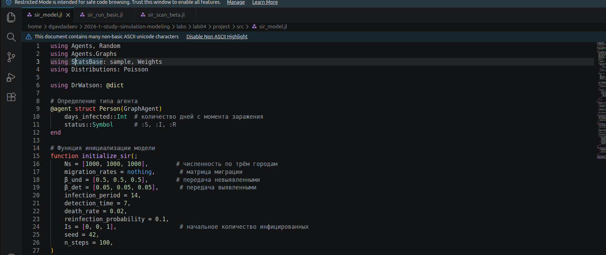{#fig-003 width=70%}

## Базовый эксперимент

— Скрипт `sir_run_basic.jl` задаёт словарь `params` с теми же параметрами по умолчанию и запускает симуляцию на 100 шагов ([рис. @fig-004]). На каждом шаге собираются данные о численности S, I, R. По завершении результаты сохранены в `data/sir_basic_agent.jld2` и `data/sir_basic_model.jld2`, которые видны в файловом менеджере ([рис. @fig-005]).

{#fig-004 width=70%}

{#fig-005 width=70%}

— Скрипт запущен через `include("scripts/sir_run_basic.jl")` в Julia REPL ([рис. @fig-006]).

{#fig-006 width=70%}

— Результирующий график динамики SIR показан на ([рис. @fig-025]). Видно, что в первые 15 дней кривая восприимчивых S (синяя) резко падает примерно с 3000 до нуля, а кривая инфицированных I (оранжевая) проходит через пик около 15-го дня и затем снижается. Кривая выздоровевших R (зелёная) нарастает волнами — это связано со стохастическим характером модели и механизмом повторного заражения. Линия «Всего» (пунктирная) постепенно снижается от 3000 к примерно 2600, что отражает накопленную смертность за 100 шагов.

{#fig-025 width=70%}

## Сканирование коэффициента заразности β

— В VS Code открыт скрипт `sir_scan_beta.jl` ([рис. @fig-007]). Функция `run_experiment(p)` принимает словарь параметров, формирует $\beta_\text{und} = \text{fill}(\beta, 3)$ и $\beta_\text{det} = \text{fill}(\beta/10, 3)$, инициализирует модель и считает пик заражённых за 100 шагов. Сканирование выполнялось по $\beta$ от 0.1 до 1.0 с тремя репликами (seed 42, 43, 44).

{#fig-007 width=70%}

— В терминале последовательно выводились сообщения о завершении 30 экспериментов ([рис. @fig-008]). Справа на том же скриншоте виден промежуточный график, на котором уже прослеживается пороговый характер зависимости. Результаты сохранены в `data/beta_scan_all.csv` и `plots/beta_scan.png`.

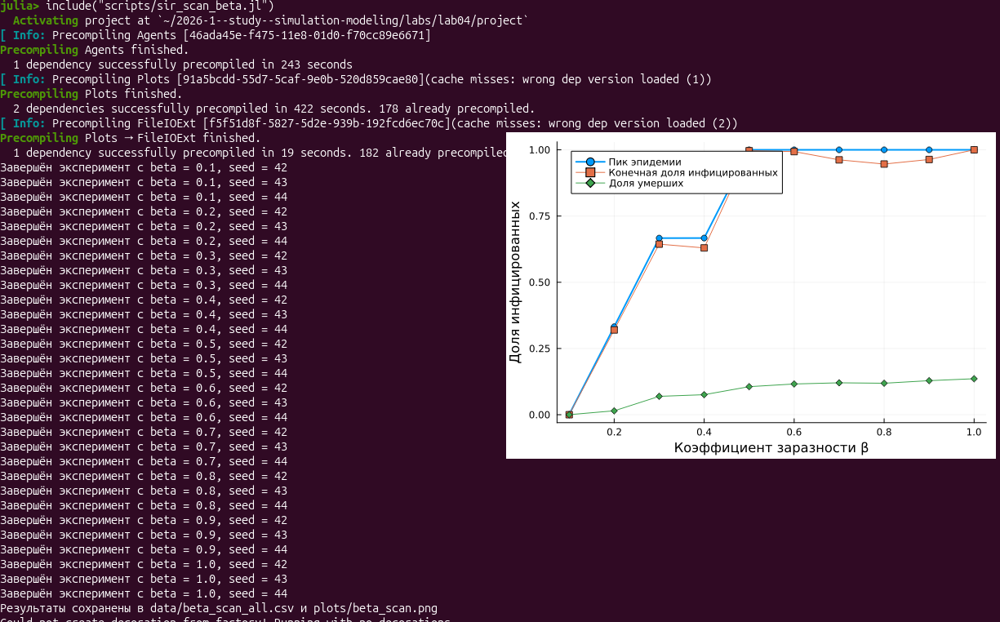{#fig-008 width=70%}

— По итоговому графику ([рис. @fig-026]) видно, что при $\beta = 0.1$ эпидемия не возникает — пик и конечная доля инфицированных практически равны нулю. При $\beta = 0.2$ пик резко вырастает примерно до 0.33, а уже при $\beta \geq 0.5$ обе кривые (пик и конечная доля) стабилизируются вблизи 1.0, то есть через эпидемию проходит вся популяция. Доля умерших (зелёные ромбы) растёт медленнее и к $\beta = 1.0$ достигает примерно 0.14. Резкий скачок при $\beta \approx 0.2$ соответствует переходу через порог $R_0 = 1$.

{#fig-026 width=70%}

## Исследование эффекта миграции

— В скрипте `sir_migration_effect.jl` реализована функция `create_migration_matrix(C, intensity)`, которая строит матрицу $C \times C$: внедиагональные элементы равны $\text{intensity} / (C-1)$, диагональные — $1 - \text{intensity}$ ([рис. @fig-009]). Функция `peak_time(p)` запускает модель с заданной матрицей миграции и фиксирует время достижения пика.

{#fig-009 width=70%}

— Эксперимент охватывал `migration_intensity` от 0.0 до 0.5 с шагом 0.1 и тремя репликами, итого 18 прогонов ([рис. @fig-010]). Результаты сохранены в `data/migration_scan_all.csv` и `plots/migration_effect.png`.

{#fig-010 width=70%}

— На графике ([рис. @fig-027]) наблюдается резкий скачок пиковой заболеваемости уже при `intensity = 0.1`: она вырастает примерно с 1000 (без миграции) до ~3000, то есть в три раза. При значениях от 0.1 до 0.5 пик остаётся около 3000 — это означает, что при любом ненулевом потоке мигрантов инфекция быстро распространяется из третьего города во все остальные. Кривая «Время пика» (синяя) при этом остаётся вблизи нуля по всей оси, то есть пик фиксируется в самом начале симуляции при любой интенсивности.

{#fig-027 width=70%}

## Многокритериальная оптимизация

— Скрипт `sir_optimize_parameters.jl` определяет функцию `cost_multi(x)`, принимающую вектор из трёх параметров: $\beta_\text{und}$, времени выявления и смертности ([рис. @fig-011]). Для каждого набора выполняется 5 реплик, после чего вычисляются средний пик заражённых и среднее число умерших (`dead_count = 3000 - nagents(model)`). BlackBoxOptim ищет Парето-фронт, минимизируя оба критерия одновременно.

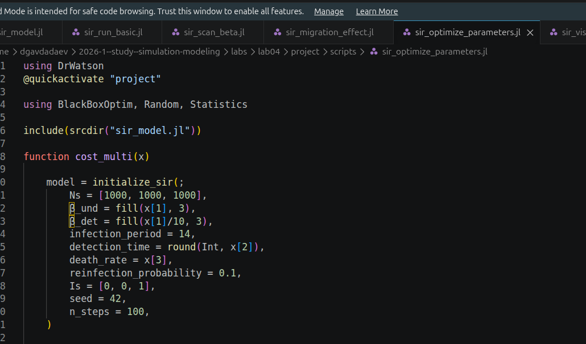{#fig-011 width=70%}

## Сводная визуализация результатов

— Скрипт `sir_visualize_dynamics.jl` считывает `data/beta_scan_all.csv` и строит составной график из трёх субплотов: пик и конечная доля инфицированных; число умерших; доля выздоровевших ([рис. @fig-012]).

{#fig-012 width=70%}

— Итоговый составной график ([рис. @fig-028]) отличается от `beta_scan.png` тем, что отражает полную вариабельность трёх реплик. На верхнем субплоте хорошо виден пороговый переход и разброс между репликами при β = 0.3–0.4. Средний субплот показывает, что число умерших при β = 0.7–0.8 достигает 400 человек из 3000. Нижний субплот отражает долю выздоровевших: пик около 0.13 при β ≈ 0.8, после чего значение снижается — вероятно, из-за роста смертности при высоких β.

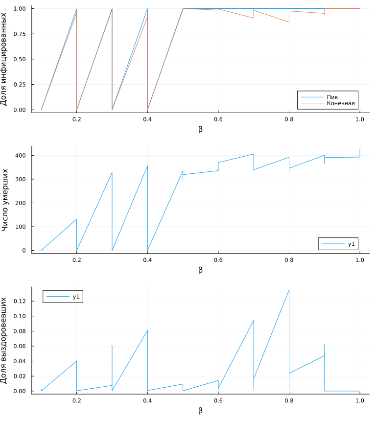{#fig-028 width=70%}

## Преобразование скриптов в литературный стиль

— Все скрипты переработаны в литературный стиль с помощью Literate.jl. Ключевое отличие — комментарии вида `# #` задают заголовок модуля, `# ##` — подраздел. При обработке Literate.jl превращает их в markdown-заголовки и генерирует три артефакта: чистый `.jl`, ноутбук `.ipynb` и документ `.qmd`.

— Файл `sir__run_basic.jl` в литературном стиле ([рис. @fig-013]) разбит на блоки: «Базовый эксперимент модели SIR», «Подготовка окружения», «Задание параметров модели», «Инициализация модели», «Подготовка структур для сбора данных». Видно, что сам код не изменился — добавлены только структурированные комментарии.

{#fig-013 width=70%}

— Файл `sir_migration_effect_literate.jl` ([рис. @fig-014]) содержит блоки «Формирование матрицы миграции» и «Определение функции эксперимента».

{#fig-014 width=70%}

— Файл `sir_optimize_parameters_literate.jl` ([рис. @fig-015]) структурирован как «Многокритериальная оптимизация параметров» с подразделом «Определение целевой функции». Функция `cost_multi` занимает центральное место.

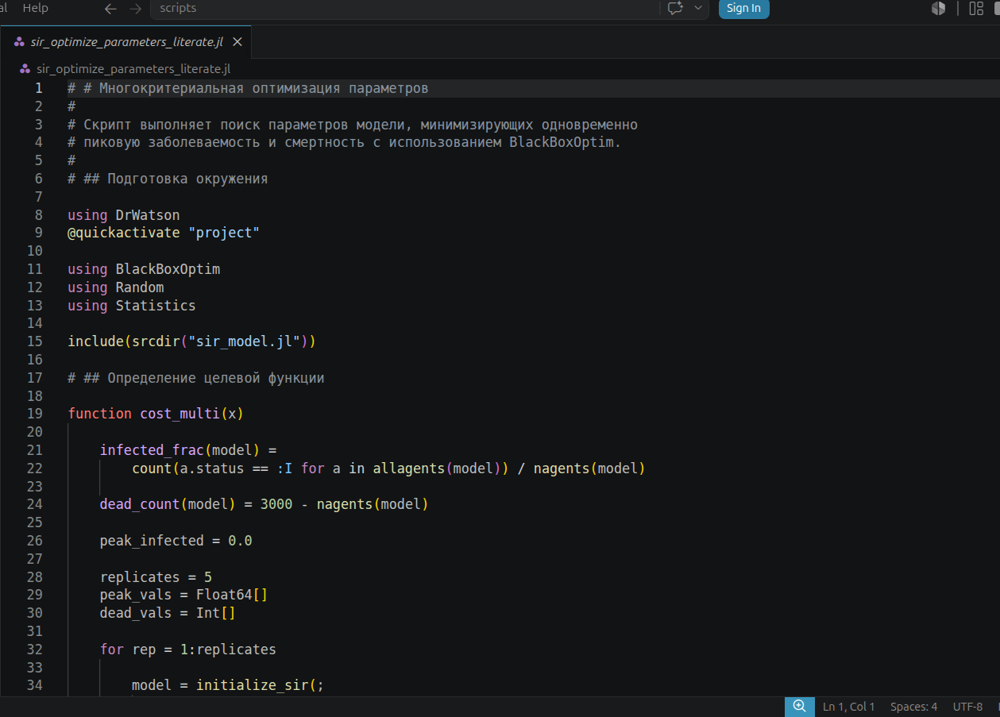{#fig-015 width=70%}

— Файл `sir_scan_beta_literate.jl` ([рис. @fig-016]) описывает сканирование коэффициента заразности и содержит функцию `run_experiment`.

{#fig-016 width=70%}

— Файл `sir_visualize_dynamics_literate.jl` ([рис. @fig-017]) разбит на блоки «Загрузка результатов» и «Построение графиков».

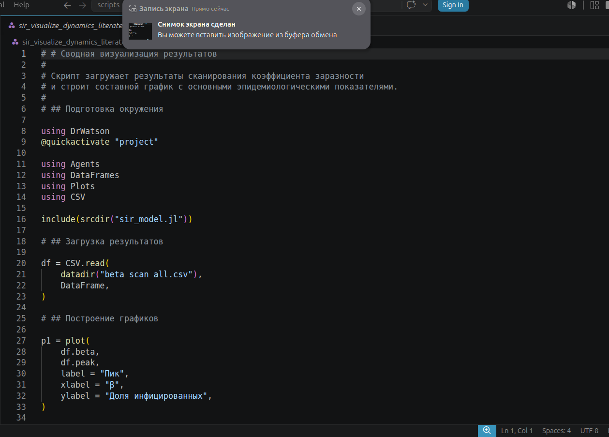{#fig-017 width=70%}

## Jupyter Notebook

— После генерации в JupyterLab (порты 8888–8891) открыты ноутбуки для всех скриптов.

— Ноутбук `sir_migration_effect_literate.ipynb` ([рис. @fig-018]) воспроизводится на Julia 1.12. В первой ячейке загружены зависимости и вызван `include(srcdir("sir_model.jl"))`, ответ — `total_count (generic function with 1 method)`.

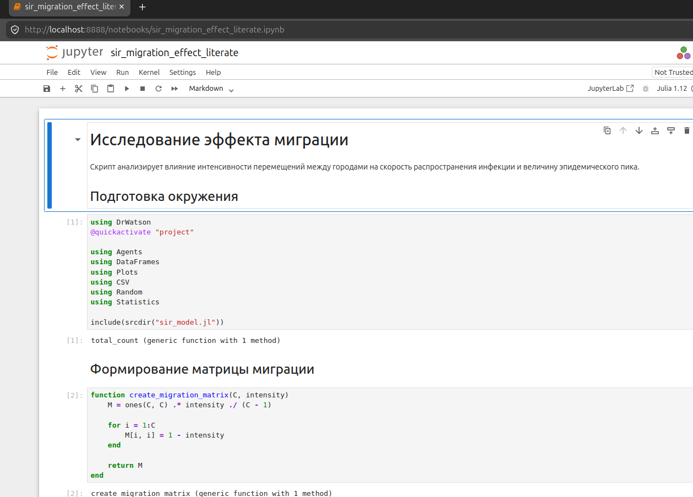{#fig-018 width=70%}

— Ноутбук `sir__run_basic.ipynb` ([рис. @fig-019]) содержит словарь параметров, который совпадает с тем, что задан в `sir_run_basic.jl`: `:Ns => [1000, 1000, 1000]`, `:β_und => [0.5, 0.5, 0.5]`, `:n_steps => 100`.

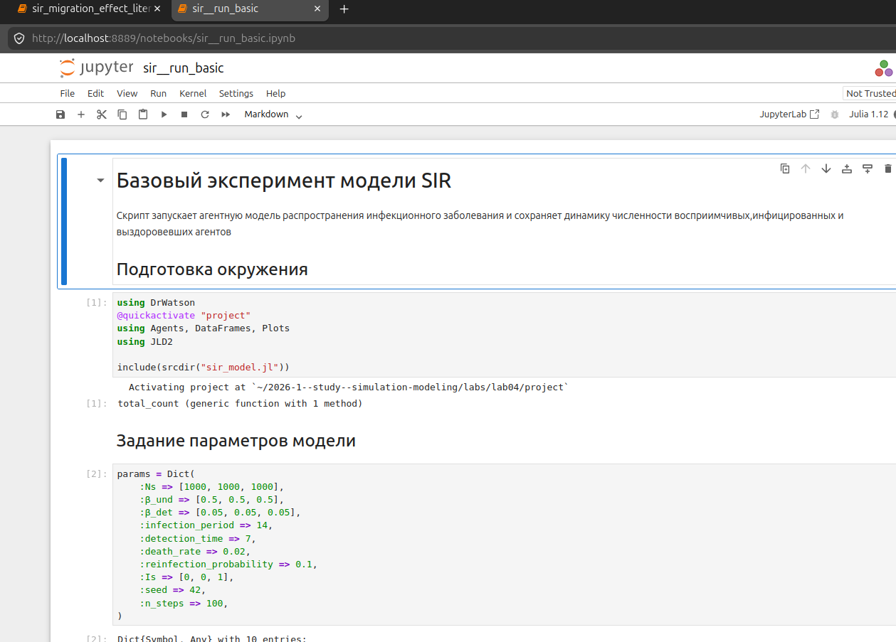{#fig-019 width=70%}

— Ноутбук `sir_scan_beta_literate.ipynb` ([рис. @fig-020]) воспроизводит функцию `run_experiment` и подключает те же зависимости, что и исходный скрипт.

{#fig-020 width=70%}

— В ноутбуке `sir_visualize_dynamics_literate.ipynb` ([рис. @fig-021]) результат загрузки `beta_scan_all.csv` виден как DataFrame размером 30×13. Среди столбцов — `beta`, `peak`, `deaths`, `final_rec`, `final_inf`, `seed`, `death_rate`, `infection_period`, `detection_time`. Первые строки соответствуют экспериментам с $\beta = 0.1$ (seed 42, 43, 44), где `peak = 0.000333` — то есть пика фактически нет.

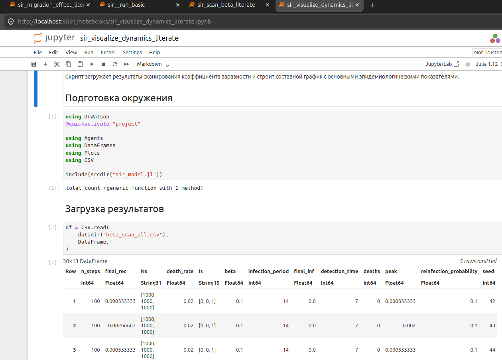{#fig-021 width=70%}

## Quarto-документация

— Сгенерированные `.qmd`-файлы рендерились в HTML и открывались в браузере из каталога `markdown/`.

— Файл `sir_migration_effect_literate.html` ([рис. @fig-022]) отображает читаемую документацию с подзаголовком «Формирование матрицы миграции» и блоком кода с подсветкой синтаксиса.

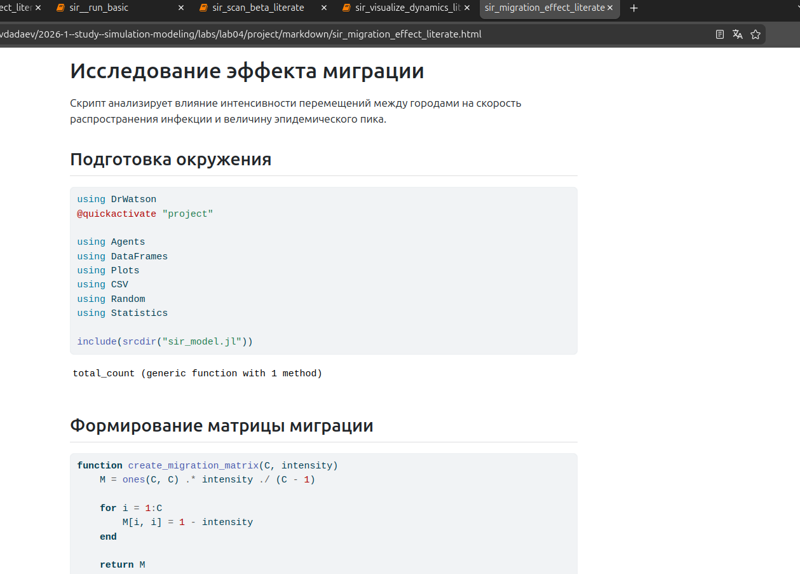{#fig-022 width=70%}

— Файл `sir__run_basic.html` ([рис. @fig-023]) содержит полный словарь параметров в форматированном блоке кода и вывод `Dict{Symbol, Any} with 10 entries`.

{#fig-023 width=70%}

— Файл `sir_visualize_dynamics_literate.html` ([рис. @fig-024]) показывает загруженный DataFrame 30×13 прямо в документе, с теми же столбцами, что и в ноутбуке.

{#fig-024 width=70%}











# Выводы

В ходе работы реализована и запущена агентная модель SIR для трёх городов по 1000 человек. Базовый эксперимент при $\beta_\text{und} = 0.5$ показал, что пик инфицированных достигается примерно на 15-м шаге, после чего численность S падает до нуля, а суммарное население снижается с 3000 примерно до 2600 к концу 100 шагов — около 400 смертей ([рис. @fig-025]).

Параметрическое сканирование по $\beta$ выявило порог эпидемии между значениями 0.1 и 0.2: при $\beta = 0.1$ пик практически нулевой, при $\beta = 0.2$ — скачкообразно вырастает до 0.33 ([рис. @fig-026]). При $\beta \geq 0.5$ через эпидемию проходит вся популяция, а доля умерших достигает 0.14 при $\beta = 1.0$.

Эксперимент с миграцией показал, что даже небольшая интенсивность 0.1 приводит к тому, что пиковая заболеваемость вырастает с ~1000 до ~3000 — то есть эпидемия охватывает все три города, а не только третий ([рис. @fig-027]). При дальнейшем увеличении интенсивности значение пика практически не меняется.

Все скрипты успешно преобразованы в литературный стиль. Для каждого из них сгенерированы Jupyter Notebook и Quarto-документ, проверена их корректность в браузере. DataFrame с результатами сканирования содержит 30 строк и 13 столбцов ([рис. @fig-021]).

# Список литературы{.unnumbered}

1. Кулябов Д. С., Королькова А. В. Имитационное моделирование. Практикум. — М.: РУДН, 2024.
2. Datseris G., Vahdati A. R., DuBois T. C. Agents.jl: a performant and feature-full agent-based modeling software of minimal code complexity // SIMULATION. — 2022. — Vol. 98, № 4. — P. 477–487.
3. Kermack W. O., McKendrick A. G. A Contribution to the Mathematical Theory of Epidemics // Proceedings of the Royal Society of London. Series A. — 1927. — Vol. 115, № 772. — P. 700–721.
4. Bezanson J., Edelman A., Karpinski S., Shah V. B. Julia: A Fresh Approach to Numerical Computing // SIAM Review. — 2017. — Vol. 59, № 1. — P. 65–98.
5. Rackauckas C., Nie Q. DifferentialEquations.jl — A Performant and Feature-Rich Ecosystem for Solving Differential Equations in Julia // Journal of Open Research Software. — 2017. — Vol. 5, № 1. — P. e15.
