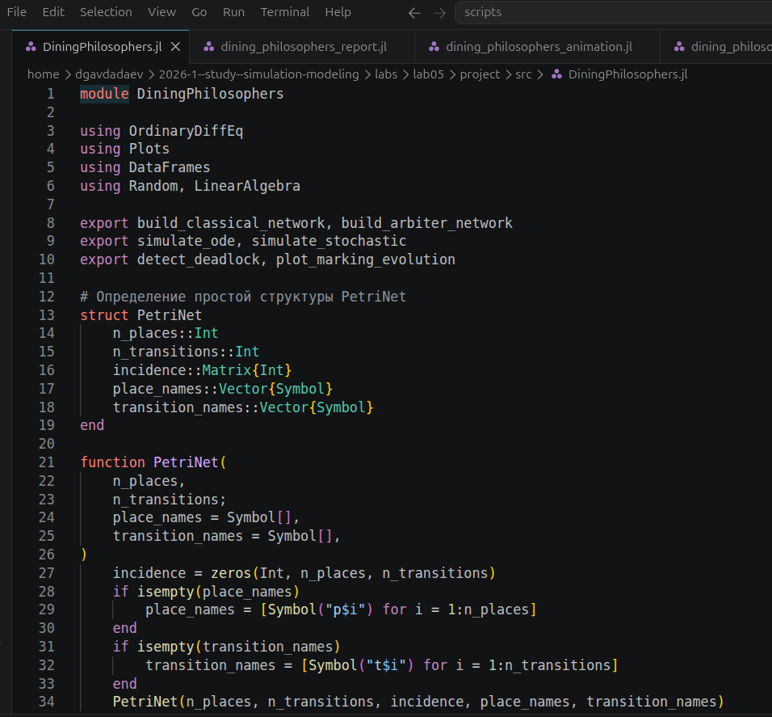
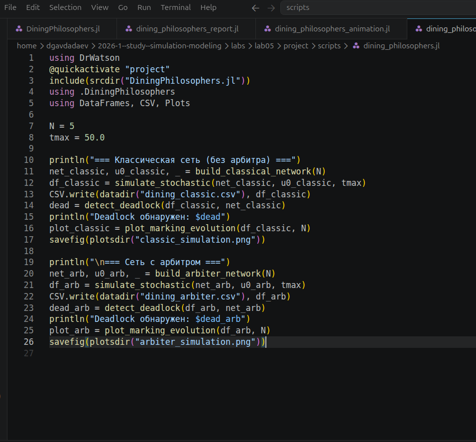
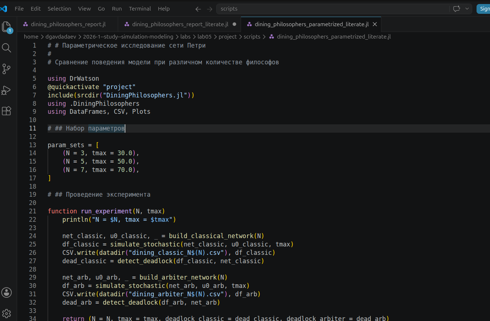
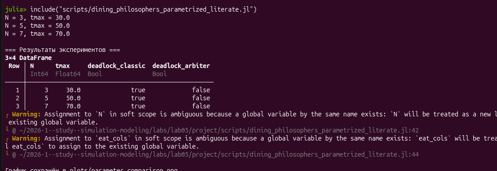
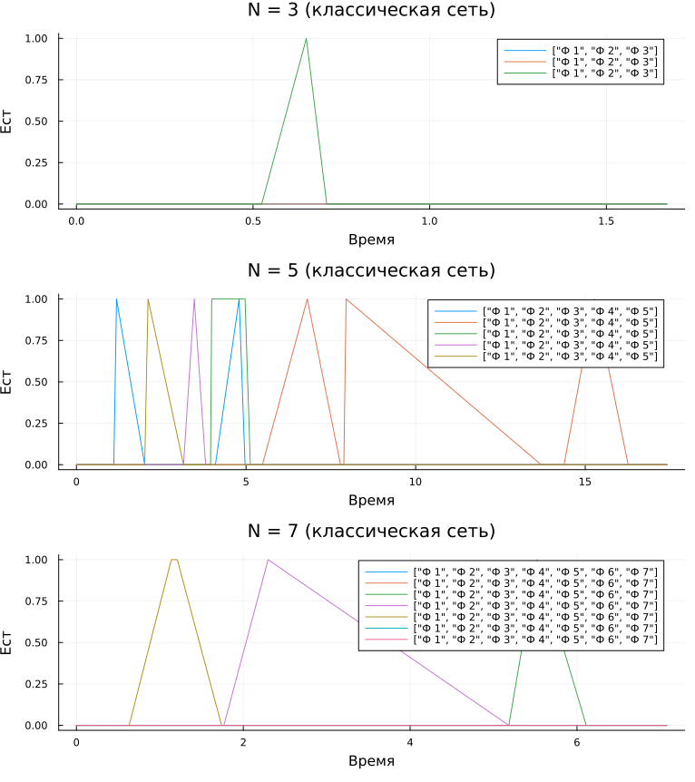

---
## Author
author:
  name: Авдадаев Джамал Геланиевич
  email: 1032230169@rudn.ru
  affiliation:
    - name: Российский университет дружбы народов
      country: Российская Федерация
      city: Москва
      address: ул. Миклухо-Маклая, д. 6

## Title
title: "Лабораторная работа №5"
subtitle: "Исследование задачи обедающих философов средствами сетей Петри"
date: today
date-format: "2026-06-11"
---

# Информация

## Докладчик

:::::::::::::: {.columns align=center}
::: {.column width="70%"}

  * Авдадаев Джамал Геланиевич
  * Российский университет дружбы народов им. П. Лумумбы
  * [1032230169@rudn.ru](mailto:1032230169@rudn.ru)

:::
::: {.column width="30%"}

:::
::::::::::::::

# Вводная часть

## Цель работы

- Реализовать сети Петри для задачи обедающих философов: классическую и с арбитром
- Научиться обнаруживать тупики (deadlock) в модели
- Визуализировать динамику маркировки и провести параметрическое исследование

## Объект и предмет исследования

- **Объект:** сеть Петри для задачи обедающих философов
- **Предмет:** условия возникновения тупика и динамика маркировки в классической сети и сети с арбитром

## Математическая постановка

- Сеть Петри: позиции $\mathrm{Think}_i$, $\mathrm{Hungry}_i$, $\mathrm{Eat}_i$, $\mathrm{Fork}_i$
- Матрица инцидентности задаёт переходы между состояниями философов и вилок
- Классическая сеть допускает одновременный захват соседних вилок → возможен deadlock
- Сеть с арбитром ограничивает число одновременно «голодных» философов

## Используемые инструменты

- Julia 1.12.6, DrWatson v2.19.1
- `OrdinaryDiffEq`, `Plots v1.41.6`, `DataFrames v1.8.2`, `CSV v0.10.16`
- Literate.jl для литературного программирования
- Quarto / Jupyter Notebook

# Реализация модели

## Модуль DiningPhilosophers

{width=85%}

- `PetriNet`: places, transitions, матрица инцидентности
- Функции: `build_classical_network`, `build_arbiter_network`, `simulate_stochastic`, `detect_deadlock`, `plot_marking_evolution`

## Базовый скрипт: N = 5

{width=85%}

- Классическая сеть и сеть с арбитром, N = 5, tmax = 50.0
- Результаты → `dining_classic.csv`, `dining_arbiter.csv`
- Проверка `detect_deadlock` для обоих вариантов

# Базовый эксперимент (N = 5)

## Результат: deadlock в классической сети

{width=85%}

- Классическая сеть: `Deadlock обнаружен: true`
- Сеть с арбитром: `Deadlock обнаружен: false`

## Классическая сеть: динамика маркировки

{width=85%}

- Моделирование останавливается на `t ≈ 2.6`
- Поесть успевает только философ 3 (два коротких импульса)
- К `t ≈ 1.0` четыре вилки (`Fork_1`–`Fork_4`) зафиксированы на 0

## Сеть с арбитром: динамика маркировки

{width=85%}

- Моделирование идёт весь интервал `t ∈ [0, 50]`
- Все 5 философов регулярно переходят в состояние «ест»
- Вилки активно переключаются — нет захваченных навсегда ресурсов

## Итоговый сравнительный график

{width=85%}

- Классика (`t ∈ [0, 2.5]`): только 2 импульса еды, затем тупик
- Арбитр (`t ∈ [0, 50]`): регулярные импульсы еды у всех 5 философов

# Анимация и литературное программирование

## Анимация маркировки (N = 3)

{width=70%}

- N = 3, tmax = 30.0, `Random.seed!(123)`
- Начальное состояние: все философы Think, все вилки свободны (Fork_1–3 = 1)
- Сохранено в `philosophers_simulation.gif`, fps = 5

## Литературные версии скриптов

{width=85%}

- Преобразованы: базовый скрипт, анимация, параметрическое исследование, отчёт
- Сгенерированы Jupyter Notebook (.ipynb) и Quarto-документы (.qmd / .html)

## Сгенерированные Notebook и Quarto-документы

{width=85%}

- 4 скрипта → 4 `.ipynb` + 4 `.qmd`/`.html`
- Все документы успешно сгенерированы и выполнены

# Параметрическое исследование

## Набор параметров

{width=85%}

- `param_sets`: (N=3, tmax=30.0), (N=5, tmax=50.0), (N=7, tmax=70.0)
- Функция `run_experiment(N, tmax)` строит обе сети и проверяет deadlock

## Результаты исследования

{width=85%}

- Для всех N (3, 5, 7): `deadlock_classic = true`
- Для всех N (3, 5, 7): `deadlock_arbiter = false`

## График: классическая сеть, N = 3, 5, 7

{width=85%}

- N = 3 → тупик к `t ≈ 0.7` (1 импульс еды)
- N = 5 → тупик к `t ≈ 17.5` (несколько импульсов еды)
- N = 7 → тупик к `t ≈ 6.5` (2 импульса еды)

# Заключение и выводы

## Итоги работы

- Реализованы классическая сеть и сеть с арбитром для задачи обедающих философов
- Для N = 5 классическая сеть приходит к тупику (`t ≈ 2.6`), сеть с арбитром работает без тупика на `t ∈ [0, 50]`
- Для N = 3, 5, 7 классическая сеть всегда приходит к тупику, арбитр — никогда
- Время до тупика в классической сети немонотонно: `t ≈ 0.7` (N=3), `t ≈ 17.5` (N=5), `t ≈ 6.5` (N=7)
- Построена анимация маркировки сети для N = 3

## Освоенные навыки

- Реализация сетей Петри и проверка тупиковых ситуаций на Julia
- Стохастическое моделирование и сохранение результатов в CSV
- Построение анимаций (`@animate`, `gif`)
- Литературное программирование: Literate.jl → Jupyter Notebook и Quarto (QuartoFlavor)
