---
## Author
author:
  name: Авдадаев Джамал Геланиевич
  email: 1032230169@rudn.ru
  affiliation:
    - name: Российский университет дружбы народов
      country: Российская Федерация
      city: Москва
      address: ул. Миклухо-Маклая, д. 6

## Title
title: "Отчёт по лабораторной работе №5"
subtitle: "Исследование задачи обедающих философов средствами сетей Петри"
license: "CC BY"
---

# Цель работы

Реализовать на языке Julia модель сетей Петри для задачи обедающих философов в классическом и арбитражном вариантах. Научиться обнаруживать тупиковые ситуации (deadlock), визуализировать динамику маркировки сети и проводить параметрическое исследование при разном числе философов.

# Задание

— Создать рабочий каталог лабораторной работы и инициализировать проект DrWatson.

— Реализовать модуль `DiningPhilosophers` со структурой `PetriNet` и функциями построения классической сети и сети с арбитром.

— Реализовать функции стохастического моделирования `simulate_stochastic`, проверки тупика `detect_deadlock` и построения графиков `plot_marking_evolution`.

— Запустить базовый эксперимент для классической сети и сети с арбитром при N = 5, сравнить наличие тупика.

— Построить анимацию изменения маркировки сети для N = 3.

— Сформировать итоговый отчёт со сравнительными графиками для обоих вариантов сети.

— Выполнить параметрическое исследование при N = 3, 5, 7.

— Преобразовать скрипты в литературный стиль с помощью Literate.jl и сгенерировать Jupyter Notebook и Quarto-документы.

# Теоретическое введение

## Задача обедающих философов

Задача обедающих философов — классическая иллюстрация проблем синхронизации параллельных процессов: конкуренции за общие ресурсы (вилки) и возможности возникновения тупиковой ситуации (deadlock), когда каждый философ удерживает один ресурс и ждёт второй.

## Сети Петри

Сеть Петри задаётся набором позиций (places), переходов (transitions) и матрицей инцидентности, описывающей связи между ними. Маркировка сети — распределение фишек по позициям — представляет текущее состояние системы. Срабатывание перехода переносит фишки из входных позиций в выходные согласно матрице инцидентности.

Для каждого философа $i$ вводятся позиции состояний: $\mathrm{Think}_i$, $\mathrm{Hungry}_i$, $\mathrm{Eat}_i$, а также позиция вилки $\mathrm{Fork}_i$. Переходы соответствуют действиям «захотел есть», «взял вилки», «закончил есть».

В классической сети каждый философ может одновременно претендовать на обе соседние вилки, что при определённой последовательности срабатываний переходов приводит к тупику — все философы одновременно удерживают по одной вилке и бесконечно ждут вторую. В сети с арбитром добавляется дополнительный механизм, ограничивающий число одновременно «голодных» философов, что устраняет возможность тупика.

Таблица пакетов Julia, используемых в лабораторной работе:

| Пакет | Назначение |
|---|---|
| `DrWatson` | Организация проекта и воспроизводимость экспериментов |
| `OrdinaryDiffEq` | Решение дифференциальных уравнений (зависимость проекта) |
| `Plots` | Визуализация графиков и анимаций |
| `DataFrames` | Работа с табличными данными |
| `CSV` | Сохранение и загрузка результатов моделирования |

: Пакеты Julia, используемые в лабораторной работе {#tbl-packages}

# Выполнение лабораторной работы

## Инициализация проекта

Перешёл в каталог `labs/lab05` и запустил Julia 1.12.6. Выполнил `using DrWatson` и `initialize_project("project")` — создана структура проекта DrWatson для лабораторной работы 5 ([рис. @fig-001]).

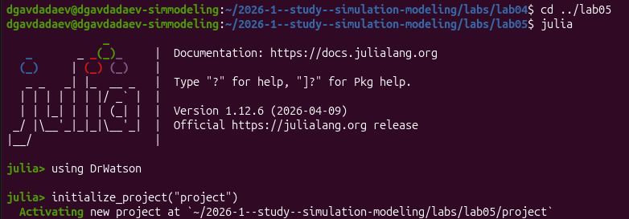{#fig-001 width=70%}

## Модуль DiningPhilosophers

В файле `src/DiningPhilosophers.jl` реализован модуль с базовой структурой `PetriNet`, содержащей число позиций `n_places`, число переходов `n_transitions`, матрицу инцидентности `incidence` и имена позиций/переходов. Модуль экспортирует функции `build_classical_network`, `build_arbiter_network`, `simulate_ode`, `simulate_stochastic`, `detect_deadlock` и `plot_marking_evolution` ([рис. @fig-002]).

{#fig-002 width=85%}

## Базовый скрипт моделирования

В скрипте `scripts/dining_philosophers.jl` для N = 5 философов и `tmax = 50.0` строятся классическая сеть (`build_classical_network`) и сеть с арбитром (`build_arbiter_network`). Для каждой сети выполняется стохастическое моделирование `simulate_stochastic`, результаты сохраняются в CSV (`dining_classic.csv`, `dining_arbiter.csv`), проверяется наличие тупика функцией `detect_deadlock`, строится график маркировки `plot_marking_evolution` и сохраняется в `classic_simulation.png` и `arbiter_simulation.png` ([рис. @fig-003]).

{#fig-003 width=85%}

## Скрипт анимации

В скрипте `dining_philosophers_animation.jl` для N = 3 философов и `tmax = 30.0` строится классическая сеть, фиксируется `Random.seed!(123)`, выполняется `simulate_stochastic`. Для каждой строки результирующего датафрейма строится столбчатая диаграмма значений всех позиций сети, кадры собираются в анимацию с помощью макроса `@animate` и сохраняются в `philosophers_simulation.gif` с частотой 5 кадров в секунду ([рис. @fig-004]).

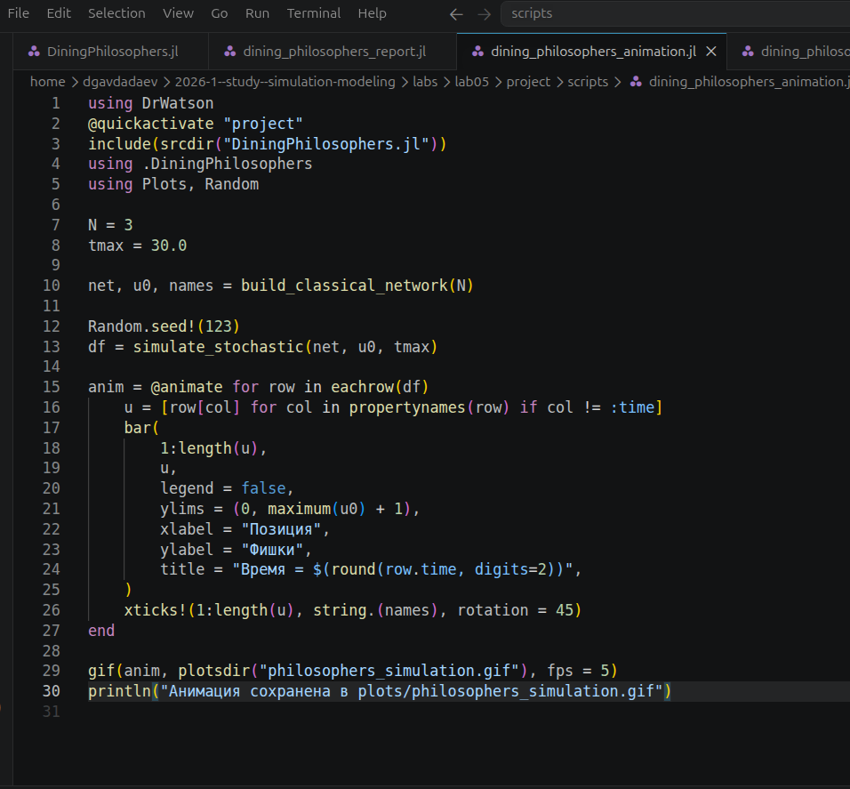{#fig-004 width=85%}

## Скрипт формирования итогового отчёта

В скрипте `dining_philosophers_report.jl` загружаются результаты `dining_classic.csv` и `dining_arbiter.csv` для N = 5. Для каждой сети из датафрейма выбираются столбцы `Eat_1`–`Eat_5`, строятся графики состояний «ест» по времени для классической сети и сети с арбитром, оба графика объединяются в макет 2×1 размером 800×600 и сохраняются в `final_report.png` ([рис. @fig-005]).

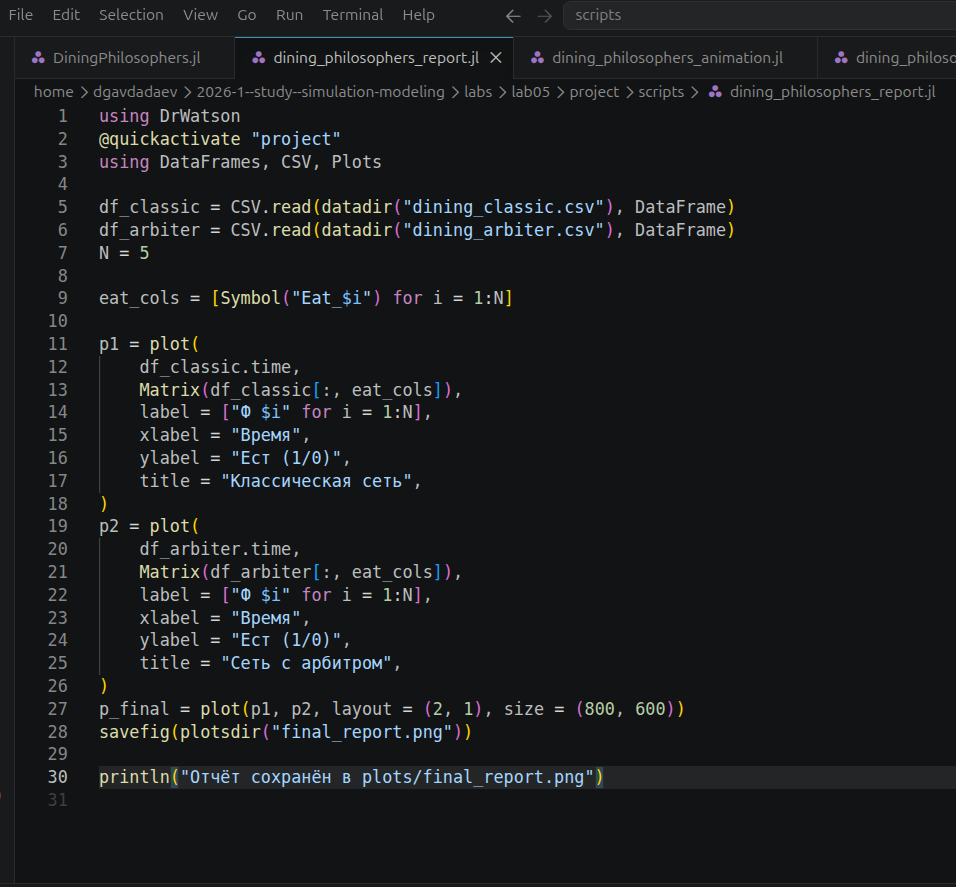{#fig-005 width=85%}

## Скрипт параметрического исследования

В скрипте `dining_philosophers_parametrized_literate.jl` задан набор параметров `param_sets`: (N = 3, tmax = 30.0), (N = 5, tmax = 50.0), (N = 7, tmax = 70.0). Функция `run_experiment(N, tmax)` для каждого набора строит классическую сеть и сеть с арбитром, выполняет моделирование, сохраняет CSV-файлы `dining_classic_N$(N).csv` и `dining_arbiter_N$(N).csv`, проверяет наличие тупика для обоих вариантов и возвращает результат в виде именованного кортежа ([рис. @fig-006]).

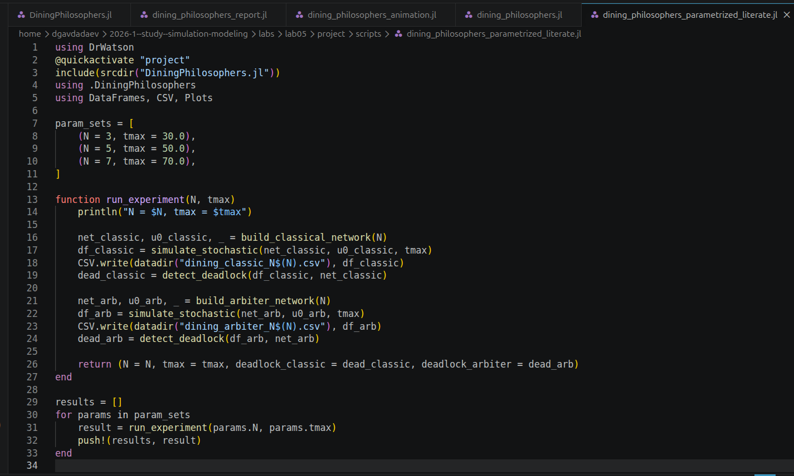{#fig-006 width=85%}

## Установленные пакеты

Проверка состояния проекта командой `Pkg.status()` показала, что в `Project.toml` установлены пакеты: `CSV v0.10.16`, `DataFrames v1.8.2`, `DrWatson v2.19.1`, `OrdinaryDiffEq v7.0.0`, `Plots v1.41.6` ([рис. @fig-007]).

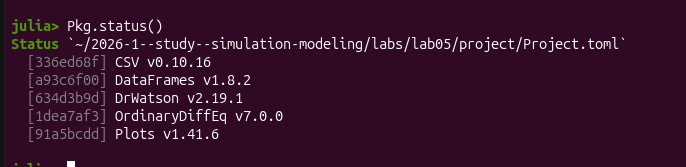{#fig-007 width=70%}

## Базовый эксперимент: классическая сеть и сеть с арбитром

Выполнен `include("scripts/dining_philosophers.jl")`. Для классической сети (без арбитра) обнаружен тупик: `Deadlock обнаружен: true`. Для сети с арбитром тупик не обнаружен: `Deadlock обнаружен: false`. При построении графика для сети с арбитром появилось предупреждение `Could not create decoration from factory! Running with no decorations`, не влияющее на результат. Итоговый график сети с арбитром сохранён в `arbiter_simulation.png` ([рис. @fig-008]).

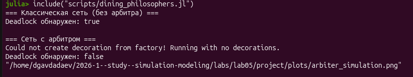{#fig-008 width=85%}

В каталоге `data` появились подкаталоги `exp_pro`, `exp_raw`, `sims`, а также файлы результатов `dining_arbiter.csv` и `dining_classic.csv` ([рис. @fig-009]).

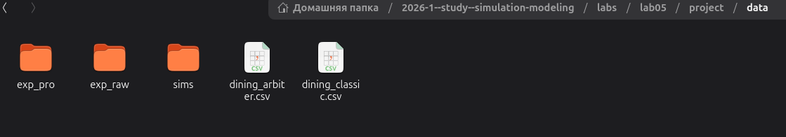{#fig-009 width=70%}

### Анализ графика классической сети ([рис. @fig-010])

На графике `classic_simulation.png` ([рис. @fig-010]) видно четыре панели — Think, Hungry, Eat и Fork states. Моделирование останавливается около `t ≈ 2.6` из-за тупика. На панели Eat states видно, что философ `Eat_3` ест дважды короткими интервалами (примерно `t ≈ 0.75–1.0` и `t ≈ 1.2–2.5`), а остальные четыре философа (`Eat_1`, `Eat_2`, `Eat_4`, `Eat_5`) за всё время моделирования вообще не приступают к еде — их кривые остаются на нуле. На панели Fork states видно, что к моменту тупика (после `t ≈ 1.0`) большинство вилок (`Fork_1`–`Fork_4`) фиксируются в положении 0 (захвачены и не освобождаются), а свободной остаётся только одна вилка (`Fork_5`, убывающая до нуля к `t ≈ 2.5`), что соответствует классической схеме deadlock: каждый философ держит одну вилку и ждёт вторую.

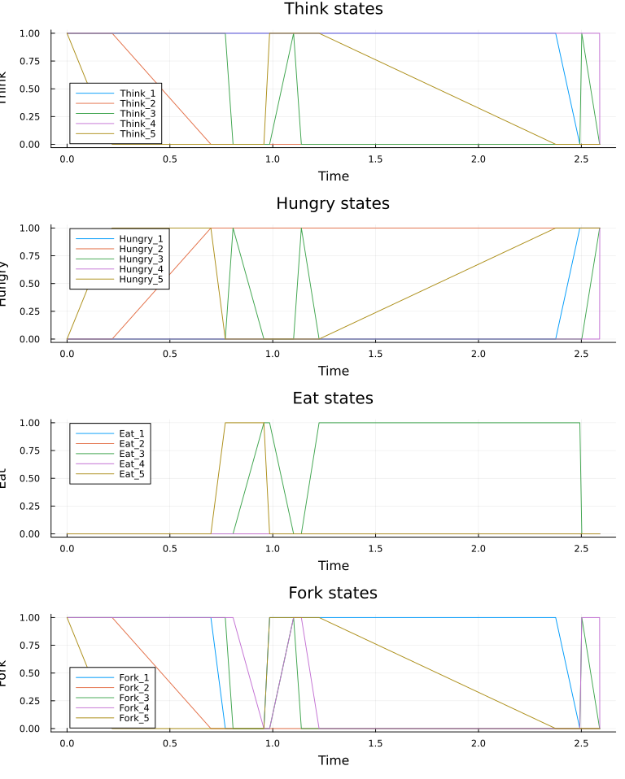{#fig-010 width=90%}

### Анализ графика сети с арбитром ([рис. @fig-011])

На графике `arbiter_simulation.png` ([рис. @fig-011]) видно, что моделирование продолжается весь интервал `t ∈ [0, 50]` без остановки. На панели Eat states все пять философов (`Eat_1`–`Eat_5`) регулярно переходят в состояние «ест» в виде острых треугольных импульсов, равномерно распределённых по всему времени моделирования, без длительных периодов простоя. На панели Fork states вилки (`Fork_1`–`Fork_5`) также активно переключаются между 0 и 1 на протяжении всего интервала, что говорит об отсутствии захваченных навсегда ресурсов. Это подтверждает результат `Deadlock обнаружен: false` — арбитр устраняет тупиковую ситуацию и обеспечивает непрерывную работу системы.

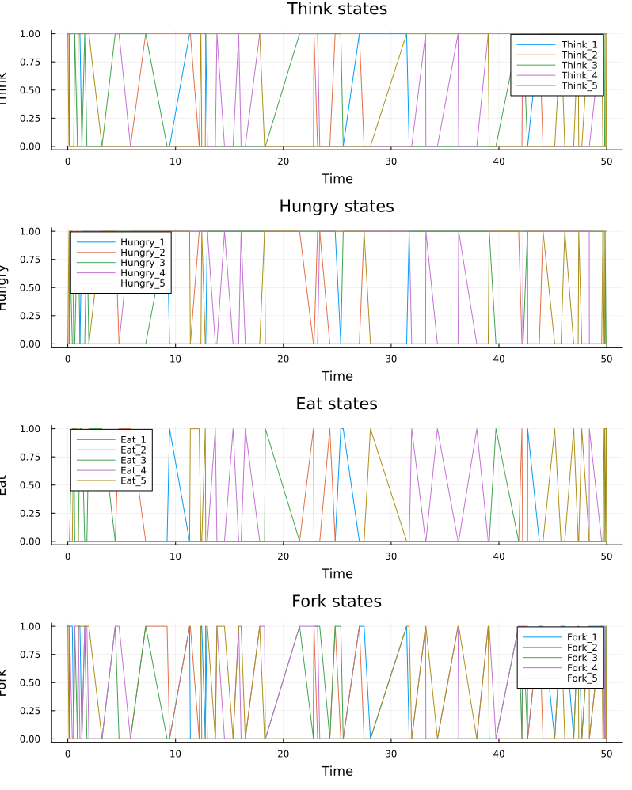{#fig-011 width=90%}

## Построение анимации маркировки

Выполнен `include("scripts/dining_philosophers_animation.jl")`. В терминале появилось сообщение `Could not create decoration from factory! Running with no decorations`, после чего анимация успешно сохранена: `[ Info: Saved animation to ...plots/philosophers_simulation.gif`, `Анимация сохранена в plots/philosophers_simulation.gif` ([рис. @fig-012]).

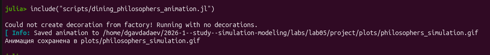{#fig-012 width=85%}

В каталоге `plots` появились файлы `arbiter_simulation.png`, `classic_simulation.png` и `philosophers_simulation.gif` ([рис. @fig-013]).

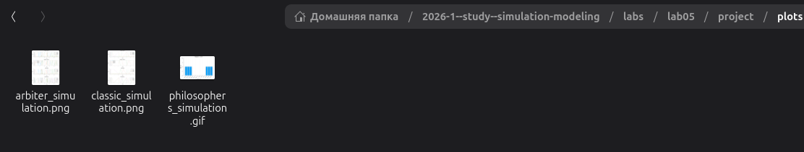{#fig-013 width=70%}

На кадре анимации для момента «Время = 0.0» видно начальное состояние сети для N = 3: позиции `Think_1`, `Think_2`, `Think_3` и `Fork_1`, `Fork_2`, `Fork_3` содержат по одной фишке (значение 1), а позиции `Hungry_1`–`Hungry_3` и `Eat_1`–`Eat_3` пусты (значение 0) — все философы находятся в состоянии «думает», все вилки свободны ([рис. @fig-014]).

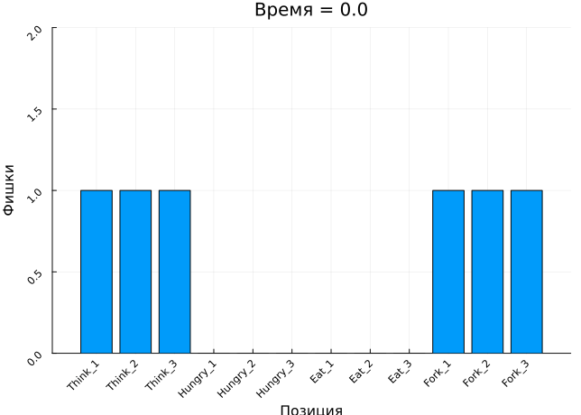{#fig-014 width=70%}

## Формирование итогового отчёта

Выполнен `include("scripts/dining_philosophers_report.jl")`. В терминале появилось сообщение `Отчёт сохранён в plots/final_report.png` ([рис. @fig-015]).

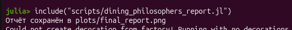{#fig-015 width=85%}

После выполнения в каталоге `plots` появился файл `final_report.png` рядом с ранее созданными `arbiter_simulation.png`, `classic_simulation.png` и `philosophers_simulation.gif` ([рис. @fig-016]).

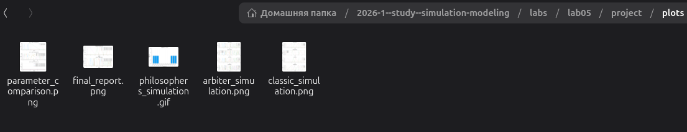{#fig-016 width=70%}

### Анализ итогового сравнительного графика ([рис. @fig-017])

На графике `final_report.png` ([рис. @fig-017]) верхняя панель «Классическая сеть» показывает состояния «ест» (`Eat_1`–`Eat_5`) для N = 5 на интервале `t ∈ [0, 2.5]`. Видно, что только два философа успевают поесть: один — короткий импульс длительностью около 0.2 в районе `t ≈ 0.3–0.5`, другой — более длинный импульс длительностью около 1.0 в районе `t ≈ 0.4–1.4`, после чего все кривые опускаются в 0 и остаются на этом уровне до конца интервала — система входит в тупик, остальные три философа не успевают поесть ни разу. Нижняя панель «Сеть с арбитром» на интервале `t ∈ [0, 50]` показывает множество регулярных треугольных импульсов состояния «ест» для всех пяти философов, равномерно распределённых по всему времени без длительных провалов — арбитр обеспечивает поочерёдный доступ всех философов к ресурсам без блокировок.

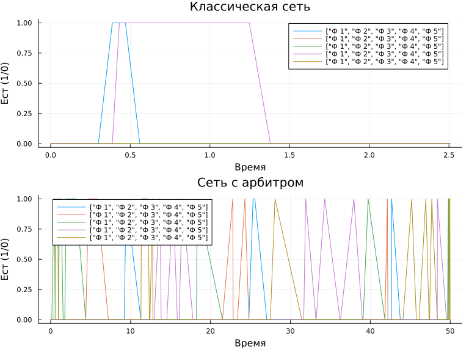{#fig-017 width=90%}

## Литературное программирование

Все скрипты были преобразованы в литературный стиль. Скрипт `dining_philosophers_literate.jl` содержит заголовок «Исследование задачи обедающих философов средствами сетей Петри» и комментарий «В работе рассматриваются две сети Петри для задачи обедающих философов», разделы «Параметры моделирования» (N = 5, tmax = 50.0) и «Рассматривается классическая сеть (без арбитра)» ([рис. @fig-018]).

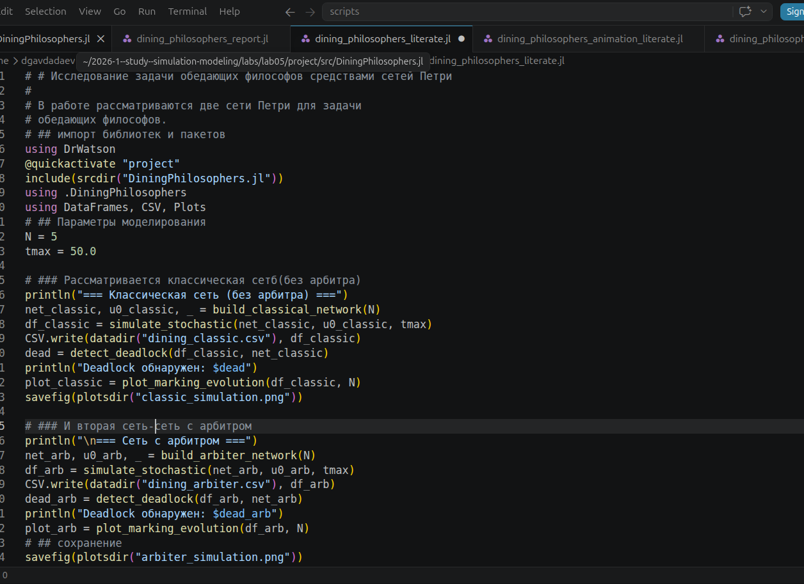{#fig-018 width=85%}

Скрипт `dining_philosophers_animation_literate.jl` содержит заголовок «Анимация изменения маркировки сети Петри» и подзаголовок «Визуализация динамики работы модели обедающих философов», разделы «Параметры моделирования» (N = 3, tmax = 30.0) и «Выполнение моделирования» ([рис. @fig-019]).

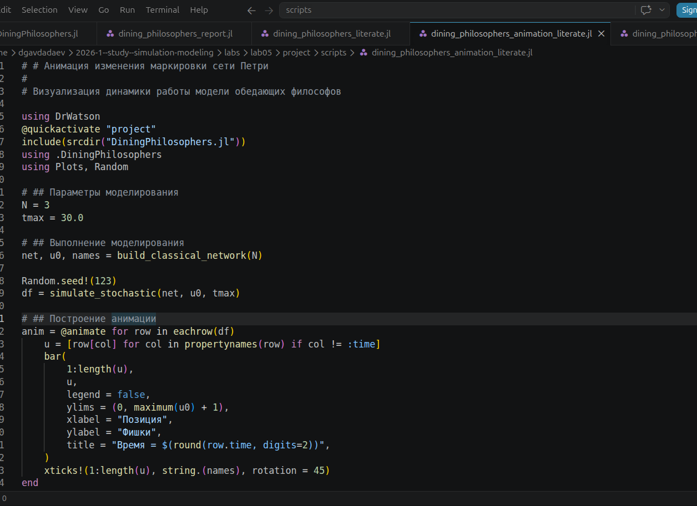{#fig-019 width=85%}

Скрипт `dining_philosophers_parametrized_literate.jl` содержит заголовок «Параметрическое исследование сети Петри» и подзаголовок «Сравнение поведения модели при различном количестве философов», раздел «Набор параметров» с тем же набором `param_sets`, что и в базовом скрипте параметрического исследования ([рис. @fig-020]).

{#fig-020 width=85%}

С помощью команд `Literate.notebook(...)` для всех трёх литературных скриптов (`dining_philosophers_literate.jl`, `dining_philosophers_animation_literate.jl`, `dining_philosophers_parametrized_literate.jl`), а также для скрипта `dining_philosophers_report_literate.jl`, сгенерированы Jupyter Notebook-файлы в каталоге `notebooks` ([рис. @fig-021]).

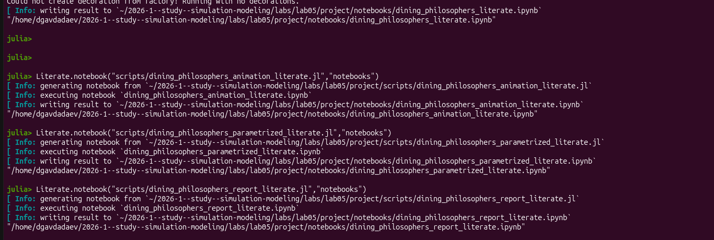{#fig-021 width=85%}

Аналогично, с помощью `Literate.markdown(..., "markdown"; flavor = Literate.QuartoFlavor())` для всех четырёх скриптов сгенерированы Quarto-документы (`.qmd`) в каталоге `markdown` ([рис. @fig-022]).

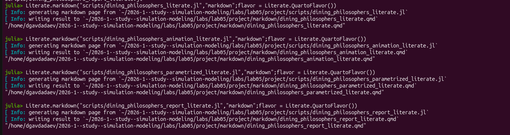{#fig-022 width=85%}

## Jupyter Notebook: анимация

В сгенерированном Jupyter Notebook `dining_philosophers_animation_literate.ipynb` после выполнения ячеек видна таблица результата моделирования: датафрейм размером 4×13 со столбцами `time`, `Think_1`–`Think_3`, `Hungry_1`–`Hungry_3`, `Eat_1`–`Eat_3`, `Fork_1`–`Fork_3` для N = 3. В первой строке (`time = 0.0`) все `Think_i = 1.0` и `Fork_i = 1.0`, остальные столбцы равны 0.0, что соответствует начальному состоянию сети ([рис. @fig-023]).

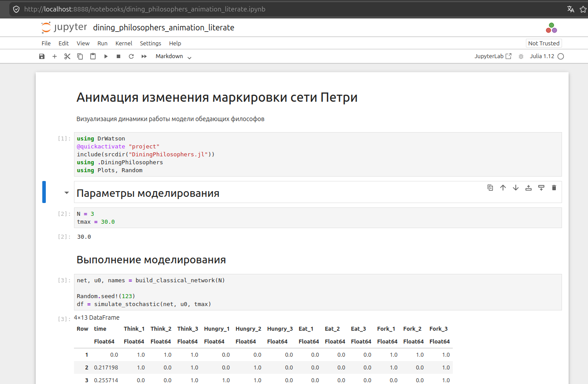{#fig-023 width=85%}

## Jupyter Notebook: базовый эксперимент

В Jupyter Notebook `dining_philosophers_literate.ipynb` отображается заголовок «Исследование задачи обедающих философов средствами сетей Петри» с подзаголовком «В работе рассматриваются две сети Петри для задачи обедающих философов», раздел «Параметры моделирования» с N = 5, tmax = 50.0 и раздел «Рассматривается классическая сеть (без арбитра)» с выводом сообщения о наличии тупика ([рис. @fig-024]).

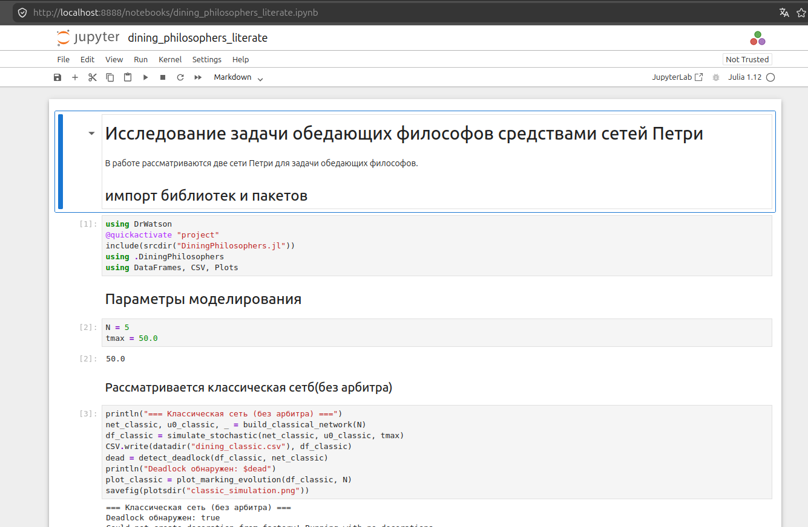{#fig-024 width=85%}

## Jupyter Notebook: параметрическое исследование

В Jupyter Notebook `dining_philosophers_parametrized_literate.ipynb` отображается заголовок «Параметрическое исследование сети Петри» с подзаголовком «Сравнение поведения модели при различном количестве философов», раздел «Набор параметров» с выводом `3-element Vector{@NamedTuple{N::Int64, tmax::Float64}}: (N = 3, tmax = 30.0), (N = 5, tmax = 50.0), (N = 7, tmax = 70.0)` и раздел «Проведение эксперимента» с функцией `run_experiment` ([рис. @fig-025]).

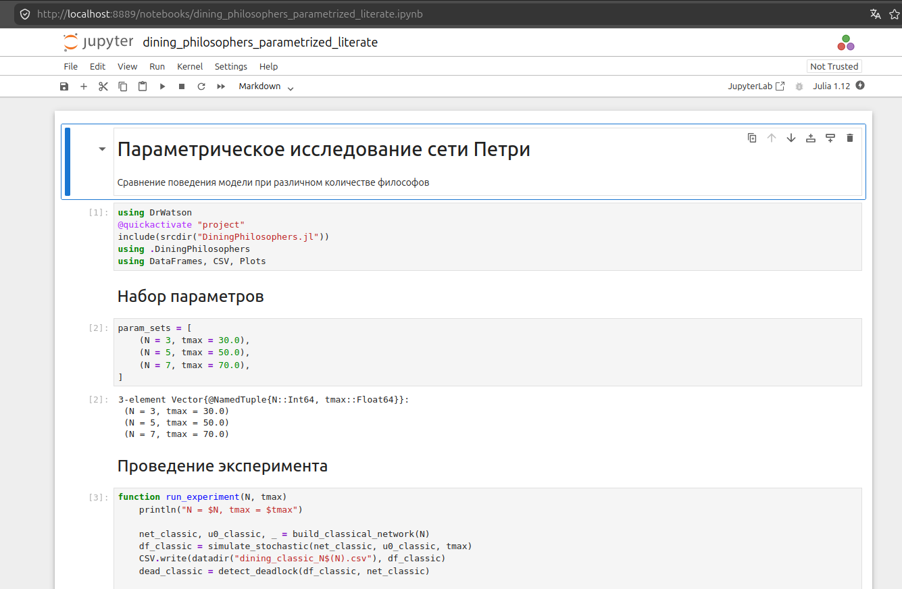{#fig-025 width=85%}

## Jupyter Notebook: формирование отчёта

В Jupyter Notebook `dining_philosophers_report_literate.ipynb` отображается заголовок «Формирование итогового отчёта» с подзаголовком «Построение сравнительных графиков для двух вариантов сети петри», раздел «Загрузка результатов моделирования» с выводом `5-element Vector{Symbol}: :Eat_1, :Eat_2, :Eat_3, :Eat_4, :Eat_5` и раздел «Построение графиков» ([рис. @fig-026]).

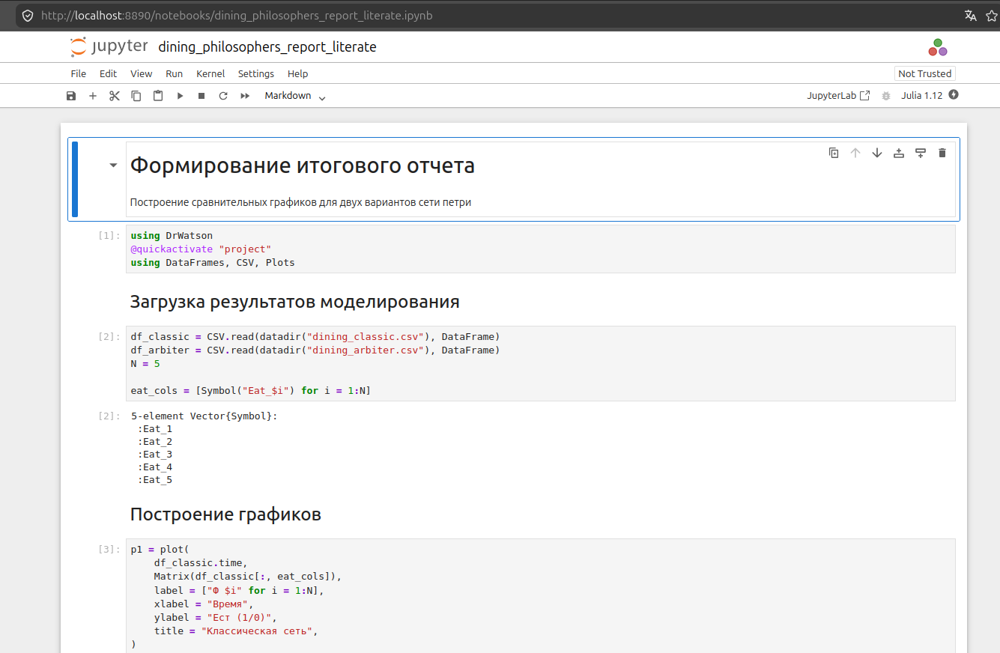{#fig-026 width=85%}

## Quarto-документы (HTML)

Сгенерированный Quarto HTML-документ `dining_philosophers_animation_literate.html` отображает заголовок «Анимация изменения маркировки сети Петри», подзаголовок «Визуализация динамики работы модели обедающих философов» и таблицу датафрейма 4×13 для N = 3 с тем же содержимым, что и в Jupyter Notebook ([рис. @fig-027]).

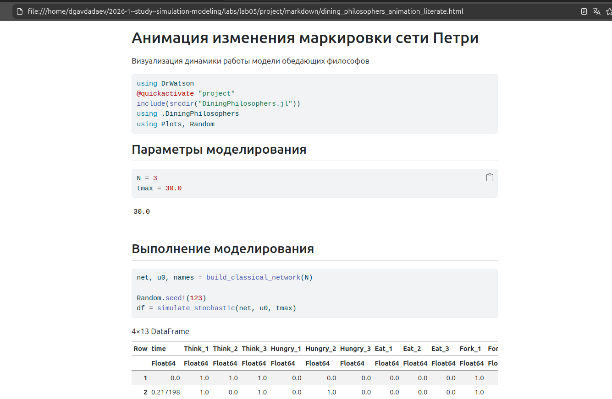{#fig-027 width=85%}

Документ `dining_philosophers_parametrized_literate.html` отображает заголовок «Параметрическое исследование сети Петри», подзаголовок «Сравнение поведения модели при различном количестве философов», набор параметров `param_sets` и начало функции `run_experiment` ([рис. @fig-028]).

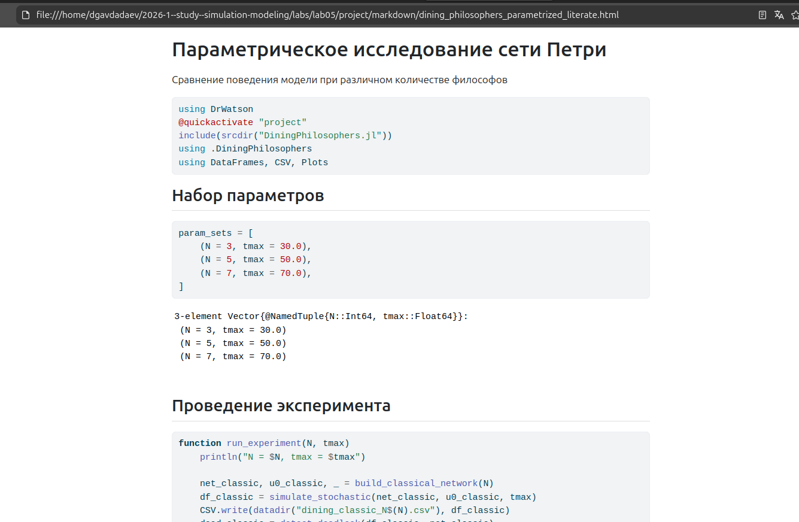{#fig-028 width=85%}

Документ `dining_philosophers_report_literate.html` отображает заголовок «Формирование итогового отчёта», подзаголовок «Построение сравнительных графиков для двух вариантов сети петри», загрузку CSV-файлов `dining_classic.csv` и `dining_arbiter.csv`, список столбцов `Eat_1`–`Eat_5` и начало построения графика `p1` для классической сети ([рис. @fig-029]).

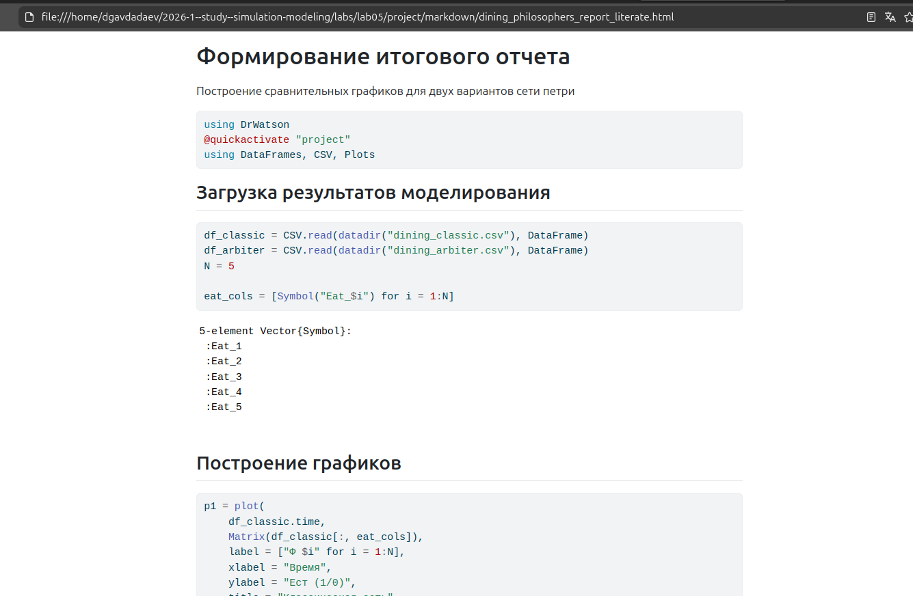{#fig-029 width=85%}

Документ `dining_philosophers_literate.html` отображает заголовок «Исследование задачи обедающих философов средствами сетей Петри», подзаголовок «В работе рассматриваются две сети Петри для задачи обедающих философов», раздел «импорт библиотек и пакетов», раздел «Параметры моделирования» с N = 5, tmax = 50.0 и раздел «Рассматривается классическая сеть (без арбитра)» с кодом построения сети, моделирования, сохранения CSV и проверки тупика ([рис. @fig-030]).

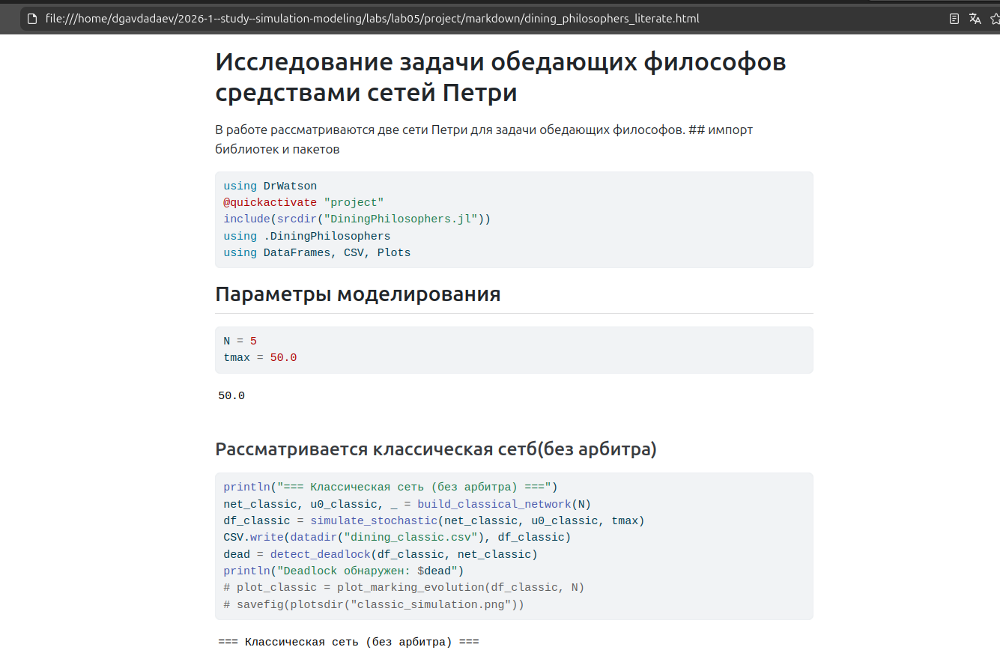{#fig-030 width=85%}

## Параметрическое исследование

Выполнен `include("scripts/dining_philosophers_parametrized_literate.jl")`. Для каждого набора параметров в терминал выводится строка `N = $N, tmax = $tmax`: `N = 3, tmax = 30.0`, `N = 5, tmax = 50.0`, `N = 7, tmax = 70.0`. Результат эксперимента — датафрейм 3×4 со столбцами `N`, `tmax`, `deadlock_classic`, `deadlock_arbiter`. Для всех трёх значений N (3, 5, 7) классическая сеть приходит к тупику (`deadlock_classic = true`), а сеть с арбитром во всех случаях работает без тупика (`deadlock_arbiter = false`). При выполнении возникли два предупреждения о неоднозначности присвоения переменных `N` и `eat_cols` в мягкой области видимости (soft scope), не повлиявшие на результат вычислений ([рис. @fig-031]).

{#fig-031 width=85%}

### Анализ графика параметрического сравнения ([рис. @fig-032])

На графике `parameter_comparison.png` ([рис. @fig-032]) представлены три панели для классической сети при N = 3, N = 5 и N = 7. При N = 3 моделирование останавливается уже к `t ≈ 0.7`: единственный треугольный импульс приёма пищи (`Ф 3`) длительностью около 0.2 — после чего наступает тупик. При N = 5 интервал моделирования увеличивается до `t ≈ 17.5`, видно пять-шесть коротких импульсов состояния «ест» в начале интервала (`t < 5`) и ещё два более длинных импульса (длительностью около 1.5–2.0) около `t ≈ 6.5–8` и `t ≈ 14–16.5`, после чего система останавливается. При N = 7 интервал самый короткий — моделирование останавливается уже к `t ≈ 6.5`, видны лишь два импульса приёма пищи: длительностью около 1.2 в районе `t ≈ 0.6–1.8` и длительностью около 3.0 в районе `t ≈ 2.3–5.3`, после чего сразу наступает тупик. Таким образом увеличение числа философов N в классической сети не увеличивает время до тупика монотонно — для N = 7 тупик наступает заметно быстрее, чем для N = 5, что объясняется возросшей конкуренцией за общий пул вилок.

{#fig-032 width=90%}

# Выводы

Реализована модель сетей Петри для задачи обедающих философов в двух вариантах — классическом и с арбитром, на базе структуры `PetriNet` с матрицей инцидентности. Базовый эксперимент при N = 5 показал, что классическая сеть приходит к тупику примерно к `t ≈ 1.4–2.6` ([рис. @fig-010], [рис. @fig-017]): из пяти философов поесть успевают только два, после чего четыре из пяти вилок (`Fork_1`–`Fork_4`) фиксируются захваченными. Сеть с арбитром на том же интервале `t ∈ [0, 50]` работает без тупика — все пять философов регулярно принимают пищу на протяжении всего времени моделирования ([рис. @fig-011], [рис. @fig-017]). Построена анимация изменения маркировки сети для N = 3, сохранённая в `philosophers_simulation.gif` ([рис. @fig-014]). Параметрическое исследование при N = 3, 5, 7 подтвердило, что классическая сеть приводит к тупику во всех трёх случаях (`deadlock_classic = true`), причём время до тупика составило `t ≈ 0.7` для N = 3, `t ≈ 17.5` для N = 5 и `t ≈ 6.5` для N = 7 ([рис. @fig-031], [рис. @fig-032]), а сеть с арбитром во всех случаях работала без тупика (`deadlock_arbiter = false`). Все скрипты преобразованы в литературный стиль с помощью Literate.jl, сгенерированы Jupyter Notebook и Quarto-документы (HTML) для базового эксперимента, анимации, параметрического исследования и формирования итогового отчёта.









# Список литературы{.unnumbered}

1. Кулябов Д. С., Королькова А. В. Имитационное моделирование. Практикум. — М.: РУДН, 2024.
2. Dijkstra E. W. Hierarchical ordering of sequential processes // Acta Informatica. — 1971.
3. Peterson J. L. Petri net theory and the modeling of systems. — Prentice Hall, 1981.
4. Murata T. Petri nets: Properties, analysis and applications // Proceedings of the IEEE. — 1989.
5. Datseris G., Vahdati A. R., DuBois T. C. Agents.jl: a performant and feature-full agent-based modeling software of minimal code complexity // SIMULATION. — 2022.
