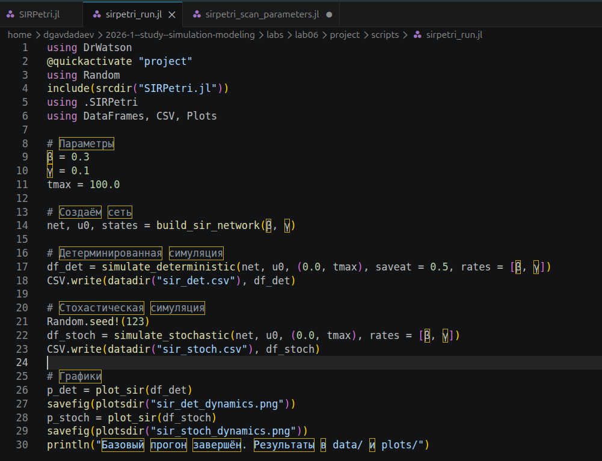
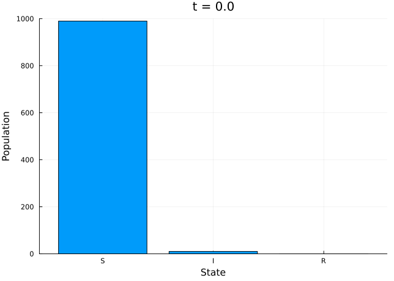
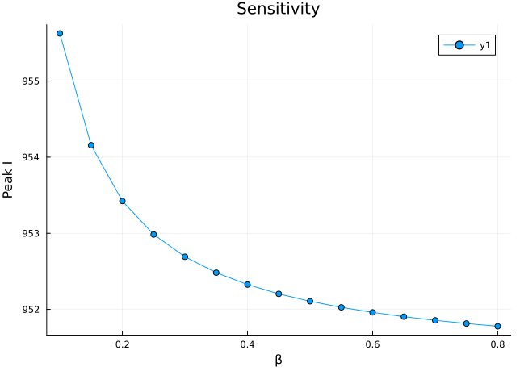
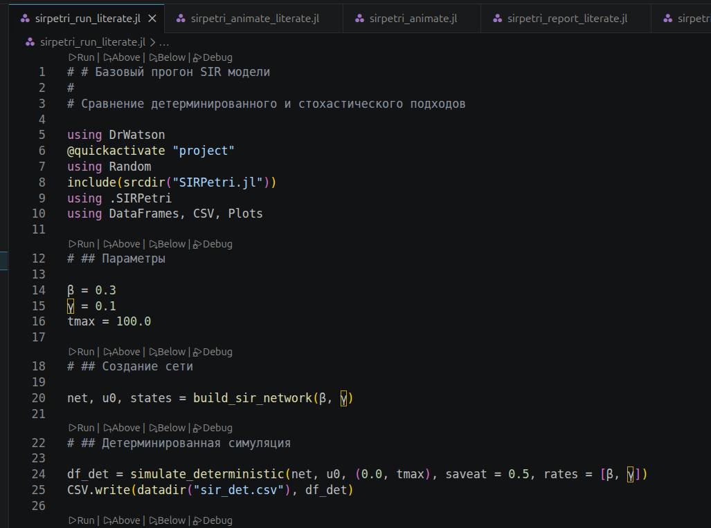

---
## Author
author:
  name: Авдадаев Джамал Геланиевич
  email: 1032230169@rudn.ru
  affiliation:
    - name: Российский университет дружбы народов
      country: Российская Федерация
      city: Москва
      address: ул. Миклухо-Маклая, д. 6

## Title
title: "Лабораторная работа №6"
subtitle: "Имитационное моделирование: реализация основных моделей в подходе сетей Петри"
date: today
date-format: "YYYY-MM-DD"
---

# Информация

## Докладчик

:::::::::::::: {.columns align=center}
::: {.column width="70%"}

  * Авдадаев Джамал Геланиевич
  * Российский университет дружбы народов им. П. Лумумбы
  * [1032230169@rudn.ru](mailto:1032230169@rudn.ru)

:::
::: {.column width="30%"}

:::
::::::::::::::

# Вводная часть

## Цель работы

- Реализовать модель SIR на основе сетей Петри (AlgebraicPetri, Catlab)
- Выполнить детерминированное и стохастическое моделирование, сравнить подходы
- Провести сканирование по β и оформить скрипты в литературном стиле

## Объект и предмет исследования

- **Объект:** модель SIR, представленная как `LabelledPetriNet`
- **Предмет:** сравнение детерминированной и стохастической динамики, влияние β на пик эпидемии

## Математическая постановка

- Переходы сети: **infection** S + I → I + I (β), **recovery** I → R (γ)
- Система ОДУ: $\dfrac{dS}{dt} = -\beta S I,\ \dfrac{dI}{dt} = \beta S I - \gamma I,\ \dfrac{dR}{dt} = \gamma I$
- $R_0 = \beta S_0 / \gamma$: при $R_0 > 1$ эпидемия развивается
- Детерминированный подход — Tsit5; стохастический — алгоритм Гиллеспи (SSA)

## Используемые инструменты

- Julia 1.12.6, DrWatson v2.19.1
- `AlgebraicPetri v0.10.0`, `Catlab v0.17.6`, `OrdinaryDiffEq v6.107.0`, `Plots v1.41.6`
- `DataFrames`, `CSV`, `Random`, `Literate`

# Реализация модели

## Модуль SIRPetri.jl

{width=85%}

- `LabelledPetriNet`: позиции [:S, :I, :R], переходы infection и recovery
- Начальная маркировка: S = 990, I = 10, R = 0
- Функции: `simulate_deterministic`, `simulate_stochastic`, `plot_sir`, `to_graphviz_sir`

## Базовый скрипт: sirpetri_run.jl

{width=85%}

- β = 0.3, γ = 0.1, tmax = 100.0
- Детерминированная (`saveat = 0.5`) → `sir_det.csv`
- Стохастическая (`Random.seed!(123)`) → `sir_stoch.csv`

# Базовый эксперимент (β = 0.3, γ = 0.1)

## Детерминированная динамика

{width=80%}

- S падает с 1000 до 0 уже к t ≈ 5
- I выходит на пик ≈ 940 почти сразу (t ≈ 1), убывает к 0 к t ≈ 75
- R₀ = 0.3·990/0.1 = 2970 — стремительное распространение

## Стохастическая динамика

{width=80%}

- Пик I (~1000) достигается позже, около t ≈ 7
- I спадает до нуля примерно к t ≈ 65
- Заметны флуктуации на нисходящей ветви (алгоритм Гиллеспи, N = 1000)

# Сканирование параметра β

## Скрипт sirpetri_scan_parameters.jl

{width=85%}

- β ∈ 0.1:0.05:0.8, γ = 0.1, tmax = 100.0
- Для каждого β: `peak_I = maximum(df.I)`, `final_R = df.R[end]`
- Результат → `data/sir_scan.csv`

## Результаты сканирования

{width=80%}

- Final R ≈ 1000 при всех β ∈ [0.1, 0.8]
- Peak I убывает: от ≈ 955.6 (β = 0.1) до ≈ 951.9 (β = 0.8)
- При любом β R₀ ≫ 1, эпидемия охватывает всю популяцию

# Анимация и сравнение подходов

## GIF-анимация динамики SIR

{width=70%}

- Скрипт `sirpetri_animate.jl`, `saveat = 0.2`
- Покадровая столбчатая диаграмма S, I, R, ylim = (0, 1000)

## Сравнение детерминированного и стохастического подходов

{width=80%}

- Детерминированная I: пик ≈ 940 уже при t = 0, экспоненциальный спад к 0 к t ≈ 75
- Стохастическая I: рост от 0 до ≈ 200 к t = 100
- При seed = 123 стохастическая реализация — «медленная» эпидемия

## График чувствительности

{width=80%}

- Peak I монотонно убывает с ростом β: 955.6 → 951.9
- «Локоть» в районе β ≈ 0.2, далее почти плато
- Рост β ускоряет прохождение пика, но мало снижает его величину

# Литературное программирование

## Literate-скрипты и чистый код

{width=85%}

- 4 скрипта переведены в литературный стиль (Literate.jl)
- `Literate.script()` → чистые `.jl`-файлы без разметки
- `Literate.notebook()` → 4 Jupyter Notebook
- `Literate.markdown(...; flavor = QuartoFlavor())` → 4 Quarto-документа

## Jupyter Notebook: результаты сканирования

{width=85%}

- `df_scan`: 15×3 DataFrame (β, peak_I, final_R)
- β = 0.1 → peak_I = 955.626, final_R = 999.954
- β = 0.3 → peak_I = 952.691, final_R = 999.955

# Заключение и выводы

## Итоги работы

- Реализован модуль `SIRPetri.jl` с `LabelledPetriNet` (переходы infection, recovery)
- Детерминированный режим: пик I ≈ 940 при t ≈ 1, S → 0 к t ≈ 5
- Стохастический режим (seed 123): пик I ≈ 1000 при t ≈ 7, завершение к t ≈ 65
- Сканирование β ∈ [0.1, 0.8]: final_R ≈ 999.955 во всём диапазоне, Peak I убывает 955.6 → 951.9

## Освоенные навыки

- Построение `LabelledPetriNet` средствами AlgebraicPetri и Catlab
- Детерминированное (Tsit5) и стохастическое (Гиллеспи) моделирование SIR
- Параметрическое сканирование и анализ чувствительности
- Литературное программирование: Literate.jl → чистый код, Jupyter Notebook, Quarto
