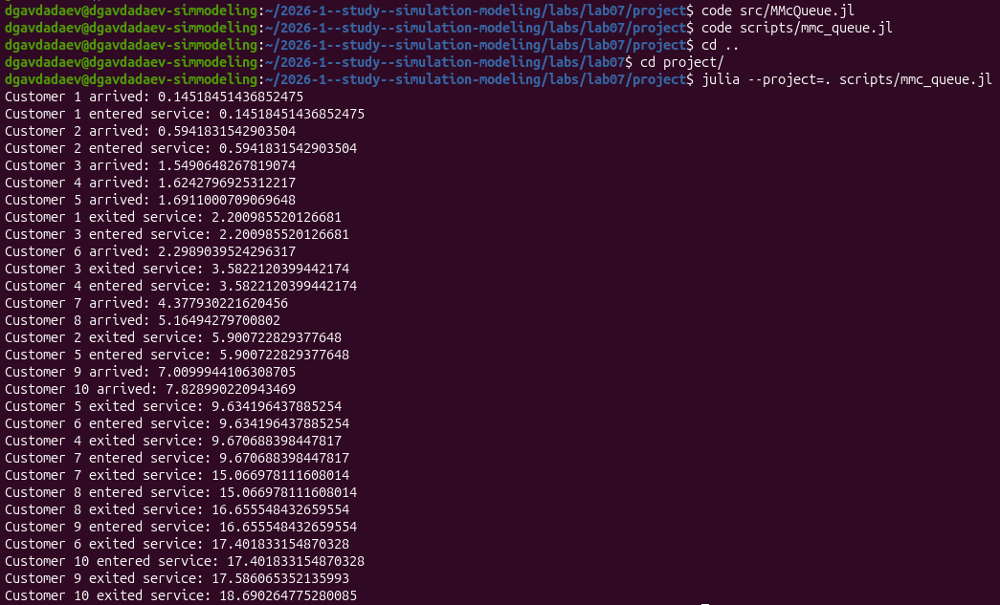
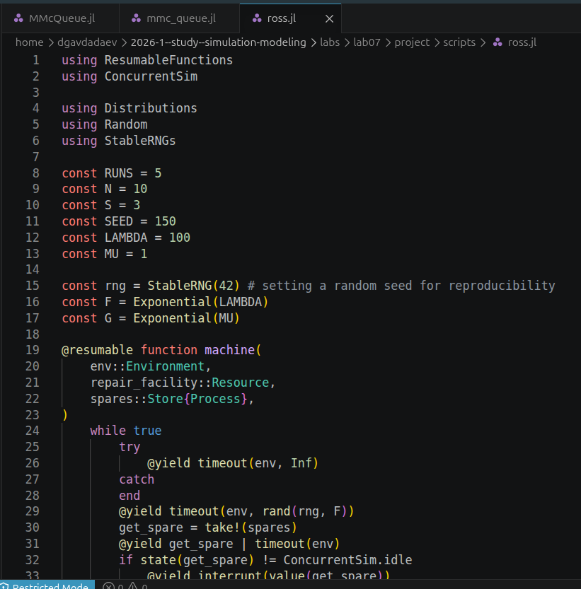
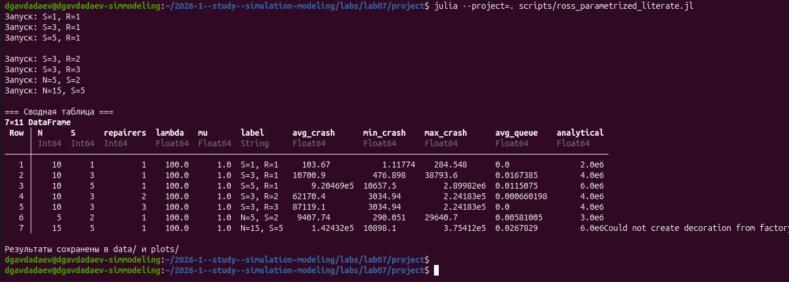
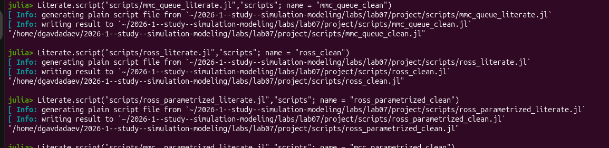
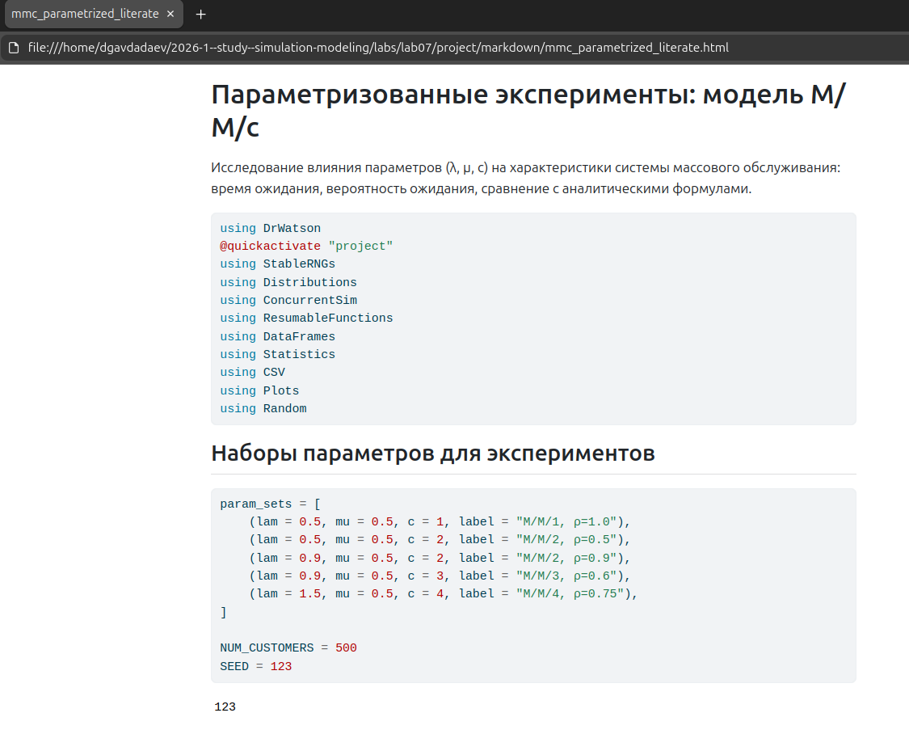
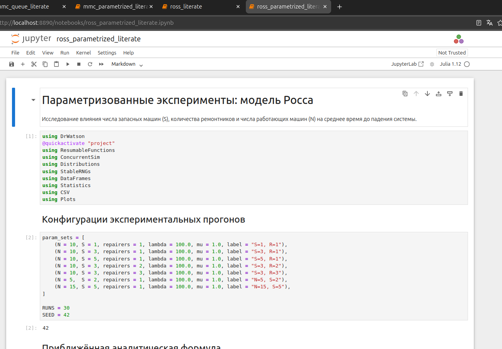

---
## Author
author:
  name: Авдадаев Джамал Геланиевич
  email: 1032230169@rudn.ru
  affiliation:
    - name: Российский университет дружбы народов
      country: Российская Федерация
      city: Москва
      address: ул. Миклухо-Маклая, д. 6

## Title
title: "Лабораторная работа №7"
subtitle: "Дискретно-событийное моделирование: M/M/c и модель Росса"
date: today
date-format: "YYYY-MM-DD"
---

# Информация

## Докладчик

:::::::::::::: {.columns align=center}
::: {.column width="70%"}

  * Авдадаев Джамал Геланиевич
  * Российский университет дружбы народов им. П. Лумумбы
  * [1032230169@rudn.ru](mailto:1032230169@rudn.ru)

:::
::: {.column width="30%"}

:::
::::::::::::::

# Вводная часть

## Цель работы

Освоить дискретно-событийный подход к моделированию СМО на Julia с использованием ConcurrentSim и ResumableFunctions.

**Что сделано:**

- Реализована модель M/M/c с визуализацией и параметрическим исследованием
- Реализована модель Росса с мониторингом очереди и числа машин
- Скрипты оформлены в литературном стиле через Literate.jl
- Сгенерированы чистый код, Jupyter Notebook и Quarto-документация

## Объект и предмет исследования

- **Объект:** системы массового обслуживания (СМО)
- **Предмет:** модель M/M/c и модель Росса (система с резервом и ремонтом)

## Математическая постановка: M/M/c

Загрузка системы: ρ = λ / (c·μ). Условие стационарности: ρ < 1.

Вероятность ожидания (формула Эрланга C):

$$P(\text{ожидание}) = \frac{\frac{(c\rho)^c}{c!(1-\rho)} P_0}{\frac{(c\rho)^c}{c!(1-\rho)} P_0 + 1}$$

Формулы Литтла: $L = \lambda W$, $L_q = \lambda W_q$.

## Используемые инструменты

| Пакет | Назначение |
|---|---|
| `ConcurrentSim` | Дискретно-событийное моделирование |
| `ResumableFunctions` | Корутины для процессов |
| `Distributions` | Exp(λ), Exp(μ) |
| `StableRNGs` | Воспроизводимость |
| `DrWatson` | Управление проектом |
| `Literate` | Литературное программирование |

# Настройка окружения

## Инициализация проекта и установка пакетов

:::::::::::::: {.columns align=center}
::: {.column width="50%"}

{width=100%}

:::
::: {.column width="50%"}

{width=100%}

:::
::::::::::::::

- Julia 1.12.6 (2026-04-09), DrWatson v2.19.1
- ConcurrentSim v1.5.1, ResumableFunctions v1.0.6, StableRNGs v1.0.4

# Базовая модель M/M/c

## Код модели: MMcQueue.jl и mmc_queue.jl

:::::::::::::: {.columns align=center}
::: {.column width="50%"}

{width=100%}

:::
::: {.column width="50%"}

{width=100%}

:::
::::::::::::::

- Корутина `customer`: прибытие → `@yield request` → обслуживание → `@yield unlock`
- `StableRNG(123)` для воспроизводимости

## Запуск и DrWatson-версия

:::::::::::::: {.columns align=center}
::: {.column width="50%"}

{width=100%}

:::
::: {.column width="50%"}

{width=100%}

:::
::::::::::::::

- Среднее время ожидания: **5.9009**, среднее обслуживание: **1.9636**
- Результаты сохранены в `data/mmc_results.csv`

## Графики M/M/2 (λ=0.9, μ=0.5, c=2, 1000 заявок)

{width=85%}

- Пик гистограммы ожидания у нуля (≈260 заявок без очереди), хвост до 28
- Среднее ожидание растёт до ~8.6 на 250-м клиенте, затем стабилизируется на уровне 6–7

# Базовая модель Росса

## Код модели Росса

:::::::::::::: {.columns align=center}
::: {.column width="50%"}

{width=100%}

:::
::: {.column width="50%"}

![DrWatson-версия: machine_counts=[5,10,20,30], repairers=2](image/Снимок экрана от 2026-06-14 17-41-35.png){width=100%}

:::
::::::::::::::

- Корутина `machine`: работа → отказ → `take!(spares)` → ремонт → возврат в пул
- Мониторинг: `repair_queue_log` и `working_log`

## Результаты модели Росса

:::::::::::::: {.columns align=center}
::: {.column width="50%"}

{width=100%}

:::
::: {.column width="50%"}

{width=100%}

:::
::::::::::::::

- Время до краша падает в 1500 раз при увеличении N с 5 до 30
- Средняя очередь на ремонт при N=30: 0.028

## Графики динамики модели Росса

{width=85%}

- N=5: система работает ~9×10⁵ единиц, колебания между 5 и 7 машинами
- N=30: падение за ~200 единиц; аналитическая оценка (~4×10⁶) даёт верхнюю границу

# Параметрическое исследование

## Скрипт mmc_parametrized_literate.jl

{width=85%}

- ρ = λ / (c·μ) варьируется от 0.5 до 1.0
- Цель: верификация формулы Эрланга через симуляцию

## Результаты параметрического исследования M/M/c

{width=85%}

- M/M/1 ρ=1.0: avg_wait = **19.20**, Pwait = **0.926** (нестационарна)
- M/M/2 ρ=0.5: avg_wait = **0.609**, Pwait = **0.308**

## Графики параметрического исследования M/M/c

{width=85%}

- Столбец M/M/1 ρ=1.0 доминирует по времени ожидания (~19 единиц)
- Все точки «аналитика vs симуляция» лежат вдоль диагонали → модель верна

## Скрипт ross_parametrized_literate.jl и результаты

:::::::::::::: {.columns align=center}
::: {.column width="50%"}

{width=100%}

:::
::: {.column width="50%"}

{width=100%}

:::
::::::::::::::

- S=1, R=1 → avg_crash = **103.67** (мало резерва, быстрый крах)
- S=5, R=1 → avg_crash = **920469** (большой резерв — главный фактор)

## Графики параметрического исследования Росса

{width=85%}

- Переход S=1→S=5 увеличивает время работы в ~8900 раз; R=1→R=3 — в ~8 раз
- Средняя очередь максимальна при N=15, S=5 ≈ 0.026

# Литературное программирование

## Литературные скрипты в VS Code

:::::::::::::: {.columns align=center}
::: {.column width="50%"}

{width=100%}

:::
::: {.column width="50%"}

{width=100%}

:::
::::::::::::::

- Комментарии `# #` → заголовки H1, `# ##` → H2 в Quarto и Jupyter
- Результаты литературных скриптов совпадают с DrWatson-версиями

## Генерация артефактов через Literate.jl

{width=85%}

- `Literate.script(...)` → чистые `.jl`-файлы без комментариев-заголовков
- `Literate.notebook(...)` → `.ipynb` (ошибка при генерации ross_parametrized)

## Quarto-документация в браузере

:::::::::::::: {.columns align=center}
::: {.column width="50%"}

{width=100%}

:::
::: {.column width="50%"}

{width=100%}

:::
::::::::::::::

- Все четыре HTML-файла открыты в браузере и содержат подсвеченный код

## Jupyter Notebooks

:::::::::::::: {.columns align=center}
::: {.column width="50%"}

{width=100%}

:::
::: {.column width="50%"}

{width=100%}

:::
::::::::::::::

- Все четыре notebook выполнены: mmc_queue, mmc_parametrized, ross, ross_parametrized
- Результаты воспроизводимы: значения совпадают с терминальными прогонами

# Итоги

## Основные результаты

1. **M/M/2 (λ=0.9, μ=0.5):** среднее ожидание 5.90, 26% заявок обслуживаются без очереди
2. **Параметрическое исследование M/M/c:** нестационарность при ρ=1.0 подтверждена (avg_wait = 19.20); формула Эрланга верифицирована симуляцией
3. **Модель Росса:** время до краша убывает в 1500 раз при N от 5 до 30; увеличение резерва S в 5× раз эффективнее добавления 3 ремонтников
4. **Литературное программирование:** из 4 скриптов сгенерированы clean-код, 4 HTML-документа и 4 Jupyter Notebook

## Освоенные навыки

- Корутины и DES на Julia: ConcurrentSim + ResumableFunctions
- Воспроизводимые эксперименты: DrWatson + StableRNGs
- Параметрическое сканирование с DataFrames и Plots
- Литературное программирование: Literate.jl + Quarto
- Верификация симуляций аналитическими формулами (Эрланг, оценка Росса)
