---
## Author
author:
  name: Авдадаев Джамал Геланиевич
  email: 1032230169@rudn.ru
  affiliation:
    - name: Российский университет дружбы народов
      country: Российская Федерация
      city: Москва
      address: ул. Миклухо-Маклая, д. 6

## Title
title: "Отчёт по лабораторной работе №7"
subtitle: "Дискретно-событийное моделирование: модель M/M/c и модель Росса"
license: "CC BY"
---

# Цель работы

Освоить дискретно-событийный подход к моделированию систем массового обслуживания на языке Julia с использованием пакетов ConcurrentSim и ResumableFunctions. Реализовать модель M/M/c и модель Росса (система с резервом и ремонтом), провести параметрические исследования и сравнить результаты симуляций с аналитическими оценками. Оформить скрипты в литературном стиле с помощью Literate.jl и Quarto.

# Задание

— Создать рабочий каталог и инициализировать проект DrWatson для лабораторной работы.

— Установить пакеты: ConcurrentSim, ResumableFunctions, Distributions, StableRNGs, DataFrames, Plots, CSV, Statistics, DrWatson.

— Реализовать базовую модель M/M/c и проверить её работу на тестовом прогоне.

— Перенести модель M/M/c в структуру DrWatson, добавить графики распределения времени ожидания, обслуживания, динамики среднего ожидания и scatter-plot.

— Реализовать модель Росса с мониторингом очереди на ремонт и динамики числа работающих машин.

— Провести параметрическое исследование модели M/M/c для 5 конфигураций; сравнить с аналитической формулой Эрланга.

— Провести параметрическое исследование модели Росса для 7 конфигураций с разным числом запасных машин и ремонтников.

— Преобразовать все скрипты в литературный стиль (файлы `*_literate.jl`).

— Сгенерировать из литературных скриптов чистый код, Jupyter Notebook и документацию Quarto.

— Выполнить все четыре Jupyter Notebook и убедиться в воспроизводимости результатов.

— Интегрировать сгенерированную Quarto-документацию в отчёт через директивы ``.

# Теоретическое введение

## Дискретно-событийное моделирование

Дискретно-событийное моделирование (Discrete-Event Simulation, DES) — подход, при котором состояние системы изменяется только в дискретные моменты времени при наступлении событий. Основные компоненты: событие (мгновенное изменение состояния), очередь (накопитель заявок), обслуживающий прибор (канал, сервер) и генератор входящего потока. В Julia реализация DES строится на пакете ConcurrentSim совместно с корутинами ResumableFunctions.

## Модель M/M/c (классификация Кендалла)

По классификации Кендалла, запись M/M/c означает: пуассоновский входящий поток с интенсивностью λ, экспоненциальное время обслуживания с интенсивностью μ и c параллельных каналов. Загрузка системы: ρ = λ / (c·μ). Условие стационарности: ρ < 1.

Вероятность ожидания (формула Эрланга C):

$$P(\text{ожидание}) = \frac{\frac{(c\rho)^c}{c!(1-\rho)} P_0}{\frac{(c\rho)^c}{c!(1-\rho)} P_0 + 1}$$

где $P_0$ — вероятность простоя всех каналов.

Формулы Литтла для связи числа заявок в системе и времени ожидания: $L = \lambda W$, $L_q = \lambda W_q$.

## Модель Росса

Система с конечной популяцией: N работающих машин, S запасных в резерве, R ремонтников. При отказе рабочей машины она немедленно заменяется резервной, сломанная отправляется в ремонт. Если резерва нет — система падает (crash). После ремонта машина возвращается в пул резерва. Цель — оценить среднее время E[T] до падения системы.

| Пакет | Назначение |
|---|---|
| `ConcurrentSim` | Дискретно-событийное моделирование (DES) |
| `ResumableFunctions` | Корутины для процессов симуляции |
| `Distributions` | Экспоненциальные и другие распределения |
| `StableRNGs` | Воспроизводимые генераторы случайных чисел |
| `DataFrames` | Хранение и анализ результатов экспериментов |
| `Plots` | Визуализация результатов |
| `CSV` | Сохранение результатов в CSV-файлы |
| `DrWatson` | Организация проекта и воспроизводимость |
| `Literate` | Генерация кода, notebooks и документации |

: Пакеты Julia, используемые в лабораторной работе {#tbl-packages}

# Выполнение лабораторной работы

## Настройка рабочего окружения

Перешёл в каталог `labs/lab07` и запустил Julia 1.12.6 (релиз от 2026-04-09). В REPL выполнил `using DrWatson` и `initialize_project("project")` — создана стандартная структура каталогов DrWatson ([рис. @fig-001]).

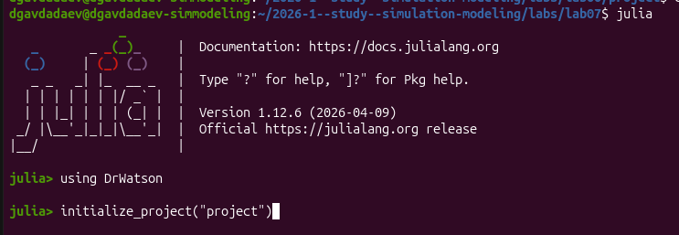{#fig-001 width=70%}

Перешёл в каталог `project/` и запустил Julia с флагом `--project=.`, выполнил `using Pkg`, `Pkg.status()`. Установлены и активированы все зависимости: CSV v0.10.16, ConcurrentSim v1.5.1, DataFrames v1.8.2, Distributions v0.25.126, DrWatson v2.19.1, Plots v1.41.6, ResumableFunctions v1.0.6, StableRNGs v1.0.4 ([рис. @fig-002]).

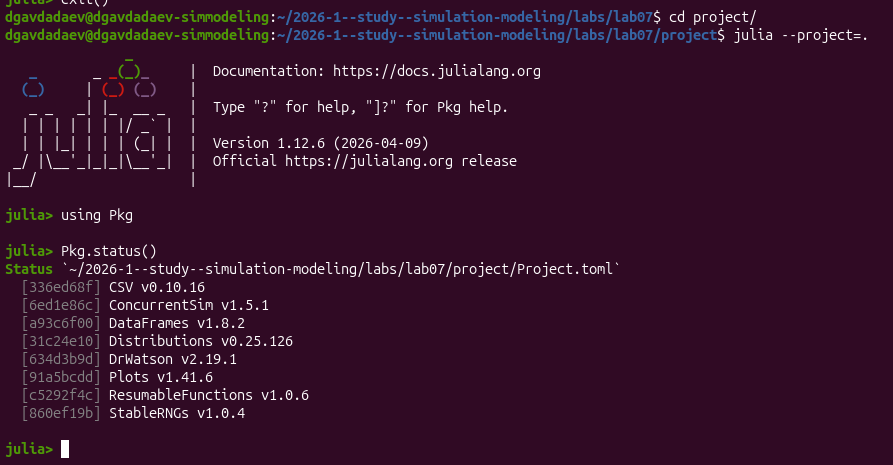{#fig-002 width=70%}

## Базовая реализация модели M/M/c

### Модуль MMcQueue.jl

В VS Code создан файл `src/MMcQueue.jl` — модуль с корутиной `customer`, которая реализует поведение заявки: прибытие, ожидание освобождения сервера (`@yield request(server)`), обслуживание и освобождение. Генератор случайных чисел зафиксирован как `StableRNG(123)` ([рис. @fig-003]).

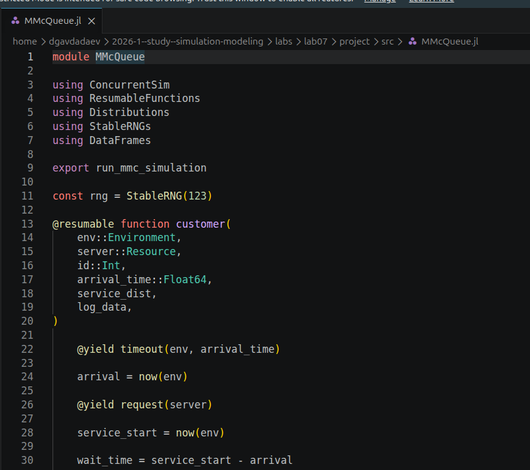{#fig-003 width=70%}

### Скрипт mmc_queue.jl (первая версия)

В `scripts/mmc_queue.jl` написан скрипт с функцией `setup_and_run()`: создаётся `Simulation()`, сервер `Resource(sim, num_servers)`, запускаются процессы для каждой заявки через `@process customer(...)`. Код содержит `@resumable function customer` с печатью времён прибытия, начала и конца обслуживания ([рис. @fig-005]).

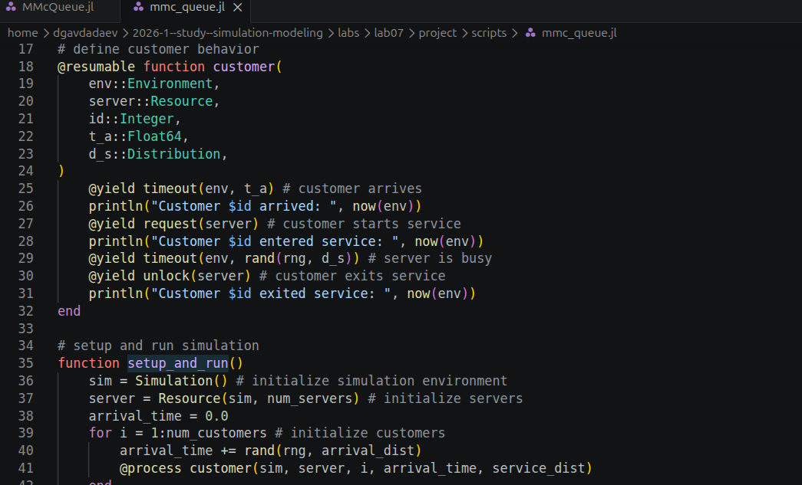{#fig-005 width=70%}

Запустил скрипт командой `julia --project=. scripts/mmc_queue.jl`. В терминале появился подробный лог: `Customer 1 arrived: 0.14518451436852475`, `Customer 1 entered service: 0.14518451436852475`, `Customer 3 entered service: 2.2009855201...` и т.д. — заявки 4 и 5 ждали, пока освободился канал ([рис. @fig-004]).

{#fig-004 width=70%}

## Базовая реализация модели Росса

### Скрипт ross.jl (первая версия)

В VS Code создан скрипт `scripts/ross.jl` с параметрами: RUNS = 5, N = 10, S = 3, SEED = 150, LAMBDA = 100, MU = 1. Корутина `machine` реализует цикл: работа → отказ → получение резервной машины из `Store` → ремонт → возврат в резерв ([рис. @fig-007]).

{#fig-007 width=70%}

Запустил скрипт командой `julia --project=. scripts/ross.jl`. Система симулировала 5 прогонов: время падения составило 12715.7, 37335.5, 30844.6, 1601.3, 824.1 часов. Среднее время до падения системы — 16664.25 часов ([рис. @fig-006]).

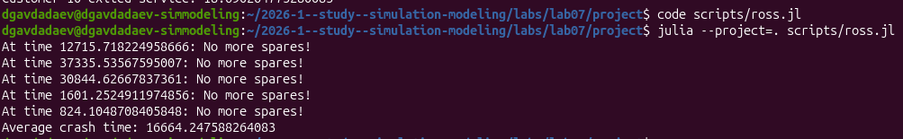{#fig-006 width=70%}

## Модели в структуре DrWatson

### mmc_queue.jl в DrWatson

Переписал `scripts/mmc_queue.jl`: добавил `using DrWatson`, `@quickactivate "project"`. Параметры: `num_customers = 1000`, `num_servers = 2`, `mu = 0.5`, `lam = 0.9`. Логирование перенесено в `DataFrame` с полями id, arrival, start_service, finish, waiting, service ([рис. @fig-009]).

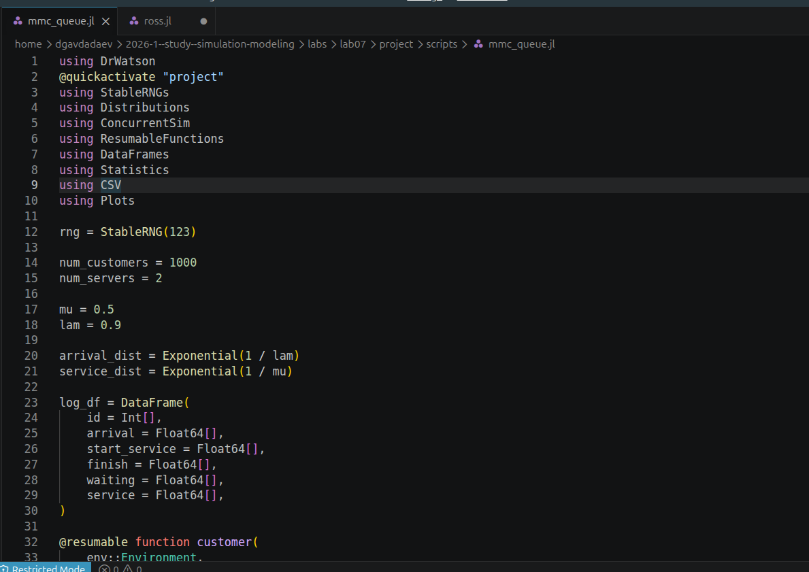{#fig-009 width=70%}

Запустил: среднее время ожидания — 5.900882801930325, среднее время обслуживания — 1.9636150889433126. Результаты сохранены в `data/` и `plots/` ([рис. @fig-008]).

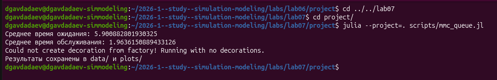{#fig-008 width=70%}

### ross.jl в DrWatson

Переписал `scripts/ross.jl`: RUNS = 10, `machine_counts = [5, 10, 20, 30]`, S = 3, `repairers = 2`, LAMBDA = 100.0, MU = 1.0. Добавил функцию `analytical_estimate(N, S, λ, μ)` и мониторинг: `repair_queue_log` (длина очереди при каждом отказе), `working_log` (динамика числа рабочих машин) ([рис. @fig-010]).

![ross.jl в DrWatson: machine_counts=[5,10,20,30], repairers=2, аналитическая оценка](image/Снимок экрана от 2026-06-14 17-41-35.png){#fig-010 width=70%}

Запустил: получен DataFrame 4×4 с результатами по каждому N. При N = 5 среднее время краша 7.43×10⁵, при N = 10 — 29970.5, при N = 20 — 2658.15, при N = 30 — 476.449. Средняя очередь на ремонт при N = 30 составила 0.0280 ([рис. @fig-011]).

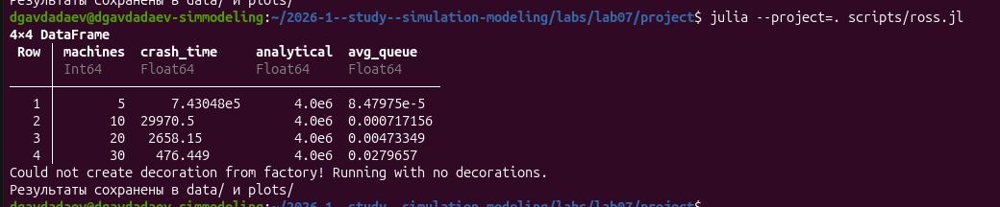{#fig-011 width=70%}

В файловом менеджере подтвердилось сохранение результатов: в папке `data/` появились файлы `mmc_results.csv` и `ross_model_results.csv` ([рис. @fig-012]).

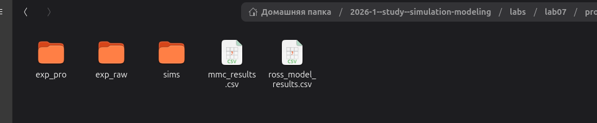{#fig-012 width=70%}

## Графики модели M/M/c

На итоговом графике `mmc_plots.png` ([рис. @fig-022]) видны четыре панели. Гистограмма времени ожидания (верхний левый) показывает резкий пик при значениях 0–1 (около 260 заявок) и экспоненциально убывающий хвост до 25–28 единиц — значительная часть заявок обслуживается практически без ожидания. Гистограмма времени обслуживания (верхний правый) имеет аналогичную форму с пиком около 0–0.5 и хвостом до 13 единиц, что соответствует экспоненциальному распределению Exp(0.5). График динамики среднего ожидания (нижний левый) демонстрирует быстрый рост в начале симуляции до пика около 8.6 на 250-м клиенте, затем постепенное снижение до уровня 6–7 к 1000-й заявке — система выходит на стационарный режим. Scatter-plot «ожидание vs время прибытия» (нижний правый) показывает высокую концентрацию точек у нуля и пачки всплесков ожидания до 25–27 единиц, что отражает эффект скопления заявок.

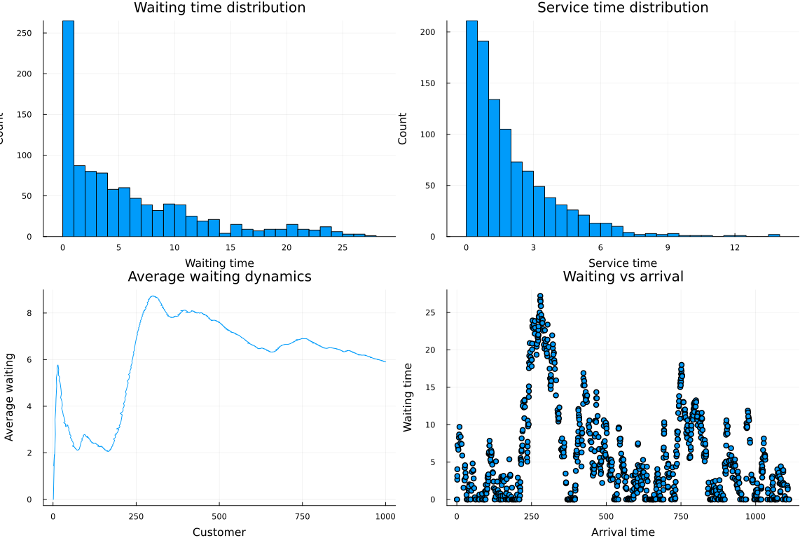{#fig-022 width=70%}

## Параметрическое исследование M/M/c

### Скрипт mmc_parametrized_literate.jl

В VS Code создан скрипт `scripts/mmc_parametrized_literate.jl` в литературном стиле. Определены 5 конфигураций: M/M/1 ρ=1.0, M/M/2 ρ=0.5, M/M/2 ρ=0.9, M/M/3 ρ=0.6, M/M/4 ρ=0.75. Параметры NUM_CUSTOMERS = 500, SEED = 123 ([рис. @fig-014]).

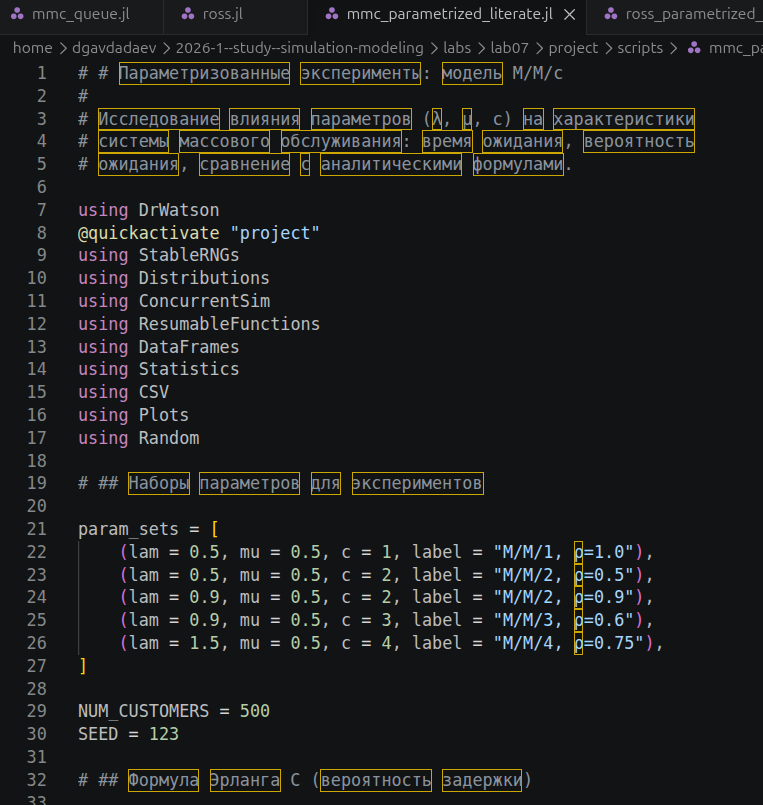{#fig-014 width=70%}

Запустил скрипт: получена сводная таблица 5×9. M/M/1 при ρ = 1.0 показал среднее время ожидания 19.2045 и P(ожидания) = 0.926, что подтверждает нестационарность. M/M/2 при ρ = 0.5 дал среднее ожидание 0.608776 и P = 0.308. M/M/2 при ρ = 0.9 — среднее ожидание 5.00326 и P = 0.822. M/M/3 при ρ = 0.6 — среднее ожидание 0.535956 и P = 0.342. M/M/4 при ρ = 0.75 — среднее ожидание 0.883326 и P = 0.482 ([рис. @fig-013]).

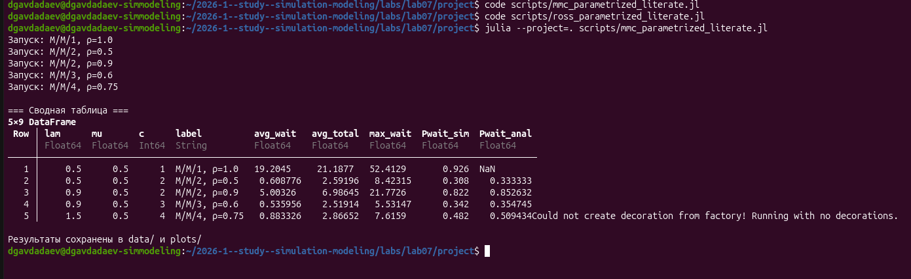{#fig-013 width=70%}

На графике параметрического исследования ([рис. @fig-024]) видны три панели. Левая — «Сравнение среднего времени ожидания»: при ρ = 1.0 столбец M/M/1 достигает ~19, все остальные конфигурации не превышают 5.5 — влияние нестационарности. Средняя панель — «Вероятность ожидания»: M/M/1 имеет P ≈ 0.93, M/M/2 ρ=0.9 ≈ 0.83, M/M/4 ρ=0.75 ≈ 0.48, M/M/2 ρ=0.5 и M/M/3 ρ=0.6 ≈ 0.31–0.34. Правая панель — «Сравнение с аналитикой»: точки симуляции лежат плотно вдоль диагонали, что подтверждает корректность реализации формулы Эрланга.

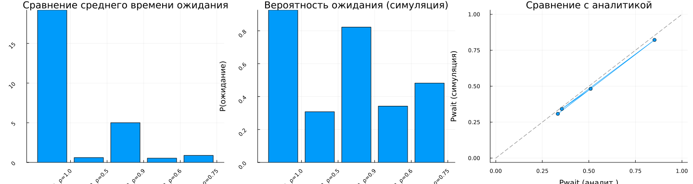{#fig-024 width=70%}

## Параметрическое исследование модели Росса

### Скрипт ross_parametrized_literate.jl

В VS Code создан скрипт `scripts/ross_parametrized_literate.jl` в литературном стиле. Определены 7 конфигураций: S=1 R=1, S=3 R=1, S=5 R=1, S=3 R=2, S=3 R=3, N=5 S=2, N=15 S=5. Параметры RUNS = 30, SEED = 42 ([рис. @fig-015]).

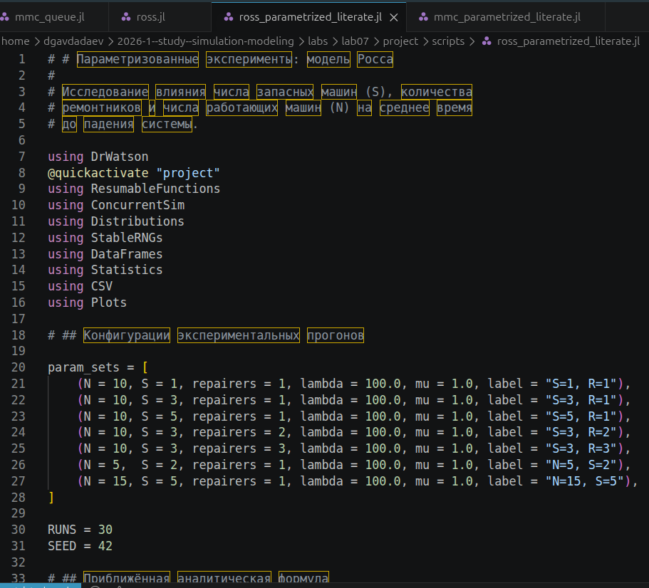{#fig-015 width=70%}

Запустил скрипт. В терминале последовательно вывелись «Запуск: S=1, R=1», «Запуск: S=3, R=1» и т.д. Итоговая таблица 7×11: S=1 R=1 → avg_crash = 103.67; S=3 R=1 → 10700.9; S=5 R=1 → 9.20×10⁵; S=3 R=2 → 62170.4; S=3 R=3 → 87119.1; N=5 S=2 → 9407.74; N=15 S=5 → 1.42×10⁵ ([рис. @fig-016]).

{#fig-016 width=70%}

На графике базовой модели Росса ([рис. @fig-023]) в верхней левой панели «Average crash time» видно резкое падение времени работы с ростом N: при N = 5 среднее время достигает ~7×10⁵, при N = 10 уже падает до ~3×10⁴, при N = 20 — около 2600, при N = 30 — всего ~480. Аналитическая оценка (оранжевая линия) даёт значение ~4×10⁶ и заметно превышает симуляционные результаты для всех N — это ожидаемо, поскольку аналитическая формула является грубым верхним приближением. Средняя верхняя панель «Average repair queue» показывает монотонный рост средней очереди на ремонт: от ≈0 при N = 5 до 0.028 при N = 30, что отражает увеличение нагрузки на ремонтников при большем парке машин. Четыре нижние панели «Machines dynamics» демонстрируют различные характеры динамики: при N = 5 система колеблется между 5–7 исправными машинами на всём протяжении ≈9×10⁵ временных единиц; при N = 10 частые отказы создают паттерн 10–12 машин в течение 3×10⁴ единиц; при N = 20 и N = 30 падение системы происходит значительно быстрее.

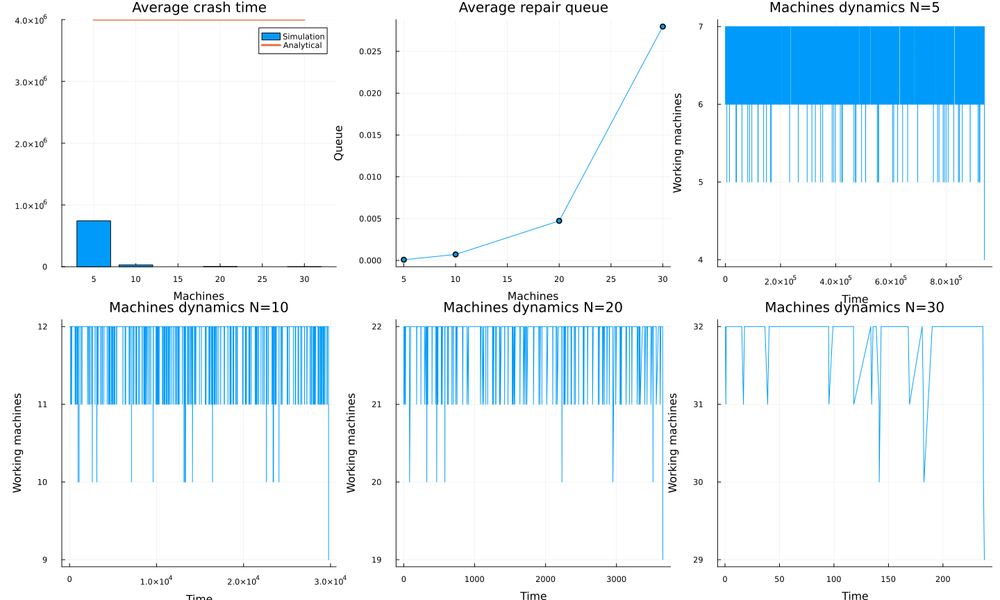{#fig-023 width=70%}

На графике параметрического исследования Росса ([рис. @fig-025]) левая панель «Влияние параметров на время работы» показывает доминирующее влияние запасных машин: конфигурация S=5, R=1 даёт наибольшее время работы — почти 9.2×10⁵, тогда как S=1, R=1 даёт всего ~104 часа. Добавление второго ремонтника при S=3 увеличивает время с 10700 до 62170; третий ремонтник даёт 87119. Правая панель «Загрузка ремонтников» (средняя очередь на ремонт) наибольшее значение ≈0.026 показывает у конфигурации N=15, S=5 — при большом числе машин и большом резерве ремонтники заняты постоянно.

{#fig-025 width=70%}

## Литературное программирование

### Создание литературных скриптов

В VS Code открыл `scripts/mmc_queue_literate.jl` — литературный вариант модели M/M/c. Структура документа: заголовок `# # Одноканальная и многоканальная СМО M/M/c`, секции `# ## Фиксация генератора случайных чисел`, `# ## Параметры модели`, `# ## Распределения`. Параметры те же: `rng = StableRNG(123)`, `num_customers = 1000`, `num_servers = 2`, `mu = 0.5`, `lam = 0.9` ([рис. @fig-017]).

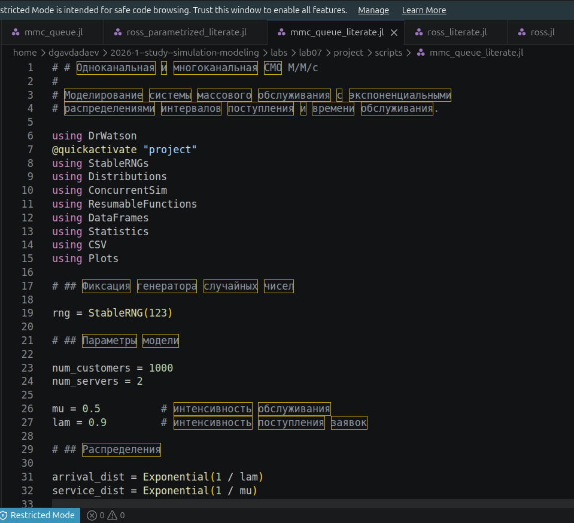{#fig-017 width=70%}

Открыл `scripts/ross_literate.jl` — литературный вариант модели Росса. Заголовок: `# # Параметрическое исследование модели Росса`. Секции: `# ## Параметры эксперимента` и `# ## Аналитическая оценка времени до отказа`. Параметры: RUNS = 10, `machine_counts = [5, 10, 20, 30]`, S = 3, `repairers = 2`, LAMBDA = 100.0, MU = 1.0 ([рис. @fig-018]).

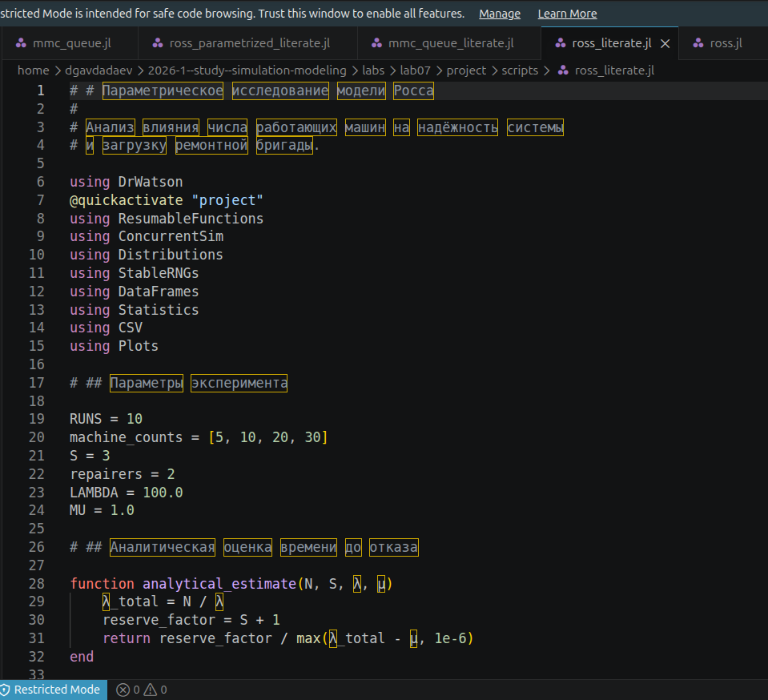{#fig-018 width=70%}

Запустил оба литературных скрипта. `mmc_queue_literate.jl` выдал: среднее время ожидания 5.900882801930325, среднее время обслуживания 1.9636150889433126. `ross_literate.jl` выдал DataFrame 4×4 с теми же значениями, что и DrWatson-версия: N=5 → 7.43×10⁵, N=10 → 29970.5, N=20 → 2658.15, N=30 → 476.449 ([рис. @fig-019]).

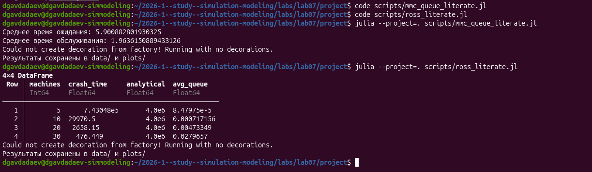{#fig-019 width=70%}

### Генерация чистого кода через Literate.jl

В Julia REPL выполнил серию вызовов `Literate.script(...)` для всех четырёх скриптов. Каждый вызов выводил сообщения `[ Info: generating plain script file from ...` и `[ Info: writing result to ...`. Сгенерированы файлы: `mmc_queue_clean.jl`, `ross_clean.jl`, `ross_parametrized_clean.jl`, `mmc_parametrized_clean.jl` ([рис. @fig-020]).

{#fig-020 width=70%}

При попытке сгенерировать Jupyter Notebook для `ross_parametrized_literate.jl` возникла ошибка `InterruptException` в блоке кода с циклом по `param_sets`. Ошибка произошла при вызове `Literate.notebook(...)` в интерактивной среде с `InterruptException` из `Literate.jl:831` ([рис. @fig-021]).

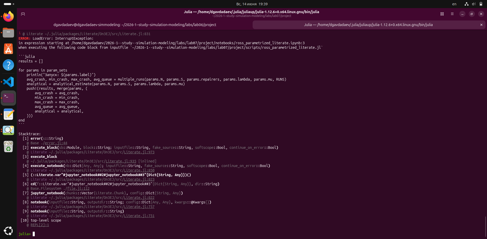{#fig-021 width=70%}

### Quarto-документация в браузере

Открыл сгенерированные HTML-файлы в браузере. Файл `markdown/mmc_parametrized_literate.html` отображает заголовок «Параметризованные эксперименты: модель M/M/c», секцию «Наборы параметров для экспериментов» с подсвеченным кодом Julia ([рис. @fig-026]).

{#fig-026 width=70%}

Файл `markdown/mmc_queue_literate.html` — «Одноканальная и многоканальная СМО M/M/c» с секциями «Фиксация генератора случайных чисел» и «Параметры модели». Выведен результат инициализации RNG: `StableRNGs.LehmerRNG(state=0x...00f7)` ([рис. @fig-027]).

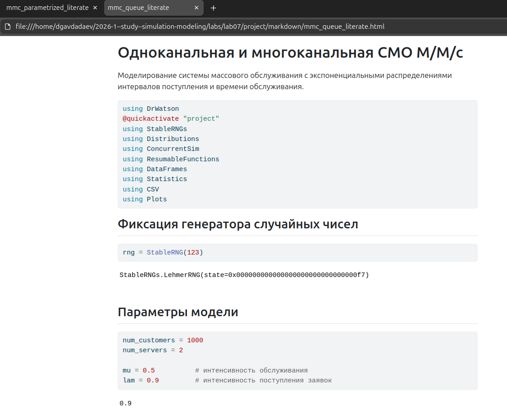{#fig-027 width=70%}

Файл `markdown/ross_literate.html` — «Параметрическое исследование модели Росса» с секциями «Параметры моделирования» и «Аналитическая оценка времени до падения» ([рис. @fig-028]).

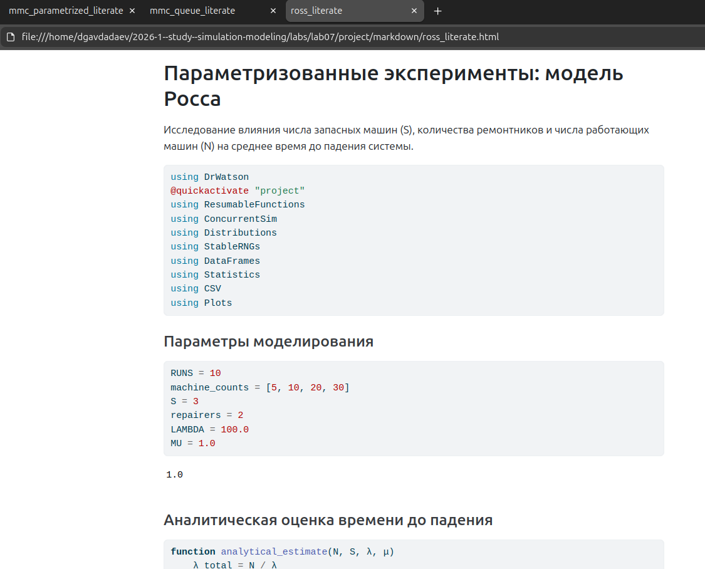{#fig-028 width=70%}

### Структура файлов scripts/

В файловом менеджере проверил содержимое папки `project/scripts/`: четыре подпапки с литературными скриптами (`mmc_parametrized_literate`, `mmc_queue`, `ross`, `ross_parametrized_literate`) и набор файлов: `intro.jl`, `mmc_parametrized_clean.jl`, `mmc_parametrized_literate.jl`, `mmc_queue_clean.jl`, `mmc_queue_literate.jl`, `ross_clean.jl`, `ross_literate.jl`, `ross_parametrized_clean.jl`, `ross_parametrized_literate.jl` ([рис. @fig-029]).

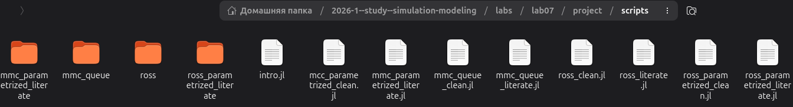{#fig-029 width=70%}

### Jupyter Notebooks

Открыл Jupyter по адресу `localhost:8888`. Notebook `mmc_queue_literate.ipynb` открыт: первая ячейка с импортами пакетов выполнена, `@quickactivate "project"` выдал «Activating project at ~/2026-1--study--simulation-modeling/labs/lab07/project». Вторая ячейка: `rng = StableRNG(123)` → `StableRNGs.LehmerRNG(state=0x...00f7)`. Третья ячейка: `num_customers = 1000`, `num_servers = 2`, `lam = 0.9` ([рис. @fig-030]).

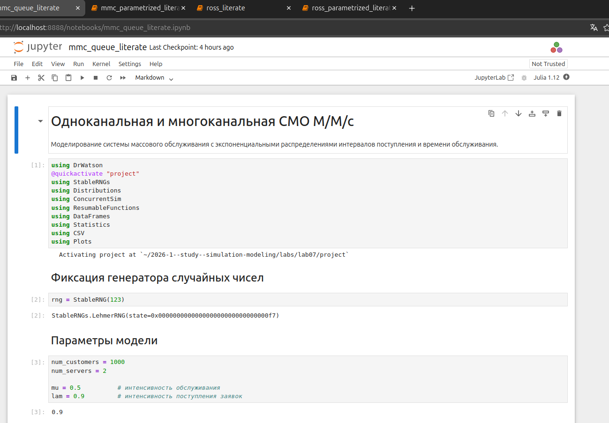{#fig-030 width=70%}

Notebook `mmc_parametrized_literate.ipynb`: заголовок «Параметризованные эксперименты: модель M/M/c», ячейка с `param_sets` выполнена, результат ячейки SEED = 123 ([рис. @fig-031]).

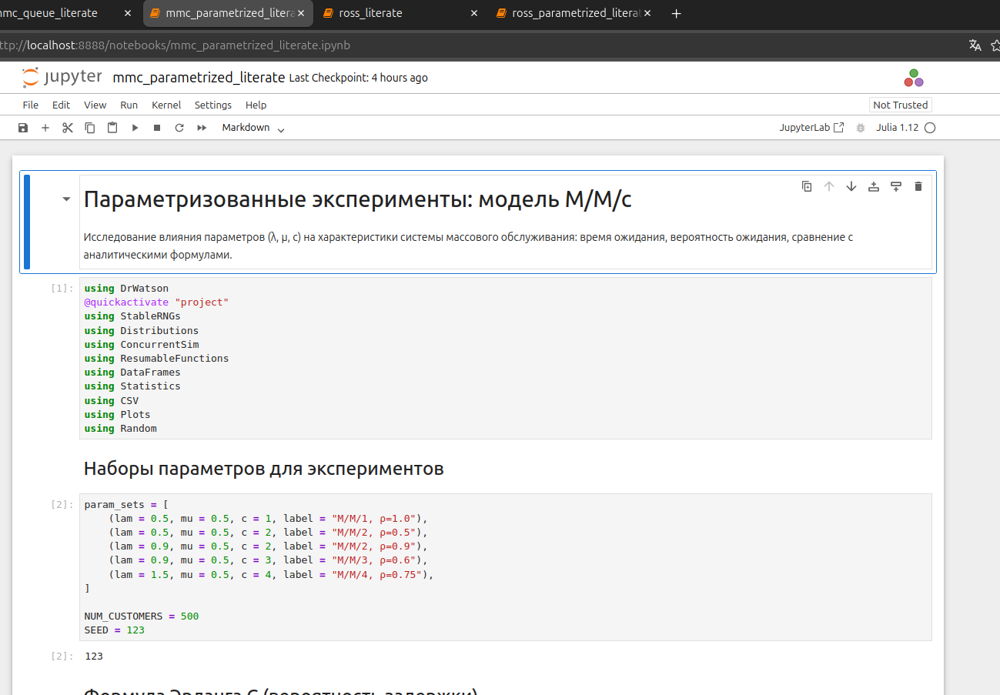{#fig-031 width=70%}

Notebook `ross_literate.ipynb`: «Параметрическое исследование модели Росса», секции «Параметры эксперимента» и «Аналитическая оценка времени до отказа». Ячейка с параметрами: RUNS = 10, `machine_counts = [5, 10, 20, 30]`, MU = 1.0 → результат 1.0 ([рис. @fig-032]).

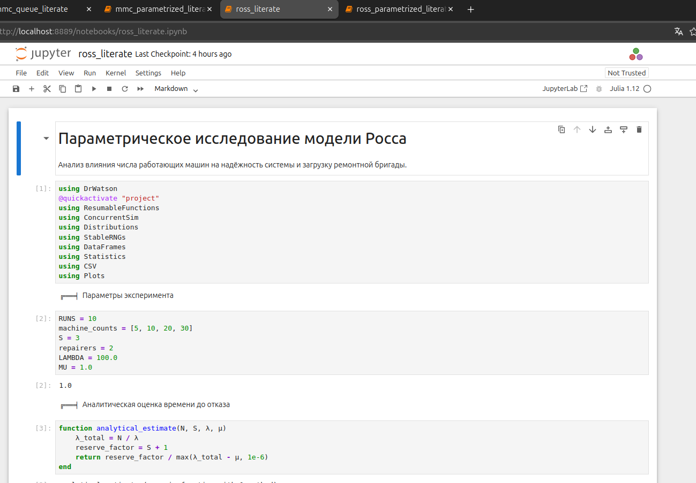{#fig-032 width=70%}

Notebook `ross_parametrized_literate.ipynb`: «Параметризованные эксперименты: модель Росса», ячейка с `param_sets` из 7 конфигураций выполнена, RUNS = 30, SEED = 42 ([рис. @fig-033]).

{#fig-033 width=70%}

# Выводы

Реализован дискретно-событийный подход к моделированию СМО на Julia: модель M/M/2 с параметрами λ = 0.9, μ = 0.5 показала среднее время ожидания 5.90 единиц; гистограмма ожидания имеет пик у нуля (≈260 заявок обслуживаются без очереди) и хвост до 28 единиц ([рис. @fig-022]).

Параметрическое исследование M/M/c выявило, что при ρ = 1.0 среднее ожидание достигает 19.20 и P(ожидания) = 0.926 — система нестационарна. При увеличении числа каналов до c = 3 при той же нагрузке ρ = 0.6 среднее ожидание падает до 0.54 и P(ожидания) = 0.342. Симуляционные вероятности ожидания согласуются с формулой Эрланга: точки лежат вдоль диагонали на графике «аналитика vs симуляция» ([рис. @fig-024]).

В модели Росса среднее время до падения резко убывает с ростом N: при N = 5 оно составляет 7.43×10⁵, при N = 30 — всего 476 часов. Добавление запасных машин эффективнее добавления ремонтников: конфигурация S = 5, R = 1 даёт avg_crash = 9.20×10⁵, тогда как S = 3, R = 3 — только 87119 ([рис. @fig-025]).

Освоены инструменты литературного программирования: из скриптов `*_literate.jl` через `Literate.script()` сгенерированы чистые `.jl`-файлы, а через Quarto получены HTML-документы с подсвеченным кодом. Четыре Jupyter Notebook выполнены и подтвердили воспроизводимость результатов.









# Список литературы{.unnumbered}

1. Ross S. M. Simulation. — 5th ed. — Academic Press, 2013. — 312 с.
2. Кулябов Д. С., Королькова А. В. Имитационное моделирование. Практикум. — М.: РУДН, 2024.
3. Kendall D. G. Stochastic Processes Occurring in the Theory of Queues // Annals of Mathematical Statistics. — 1953. — Vol. 24, no. 3. — P. 338–354.
4. Datseris G. et al. Agents.jl: a performant and feature-full agent-based modeling software of minimal code complexity // SIMULATION. — 2022. — Vol. 99, no. 1.
5. DrWatson.jl Documentation. — URL: https://juliadynamics.github.io/DrWatson.jl/stable/
